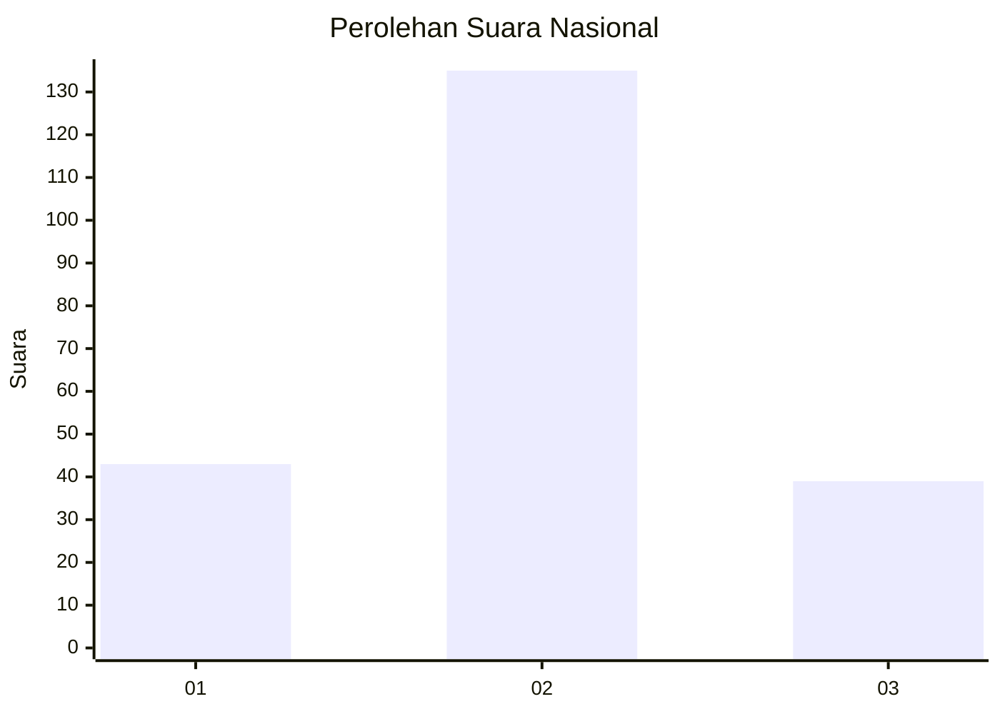
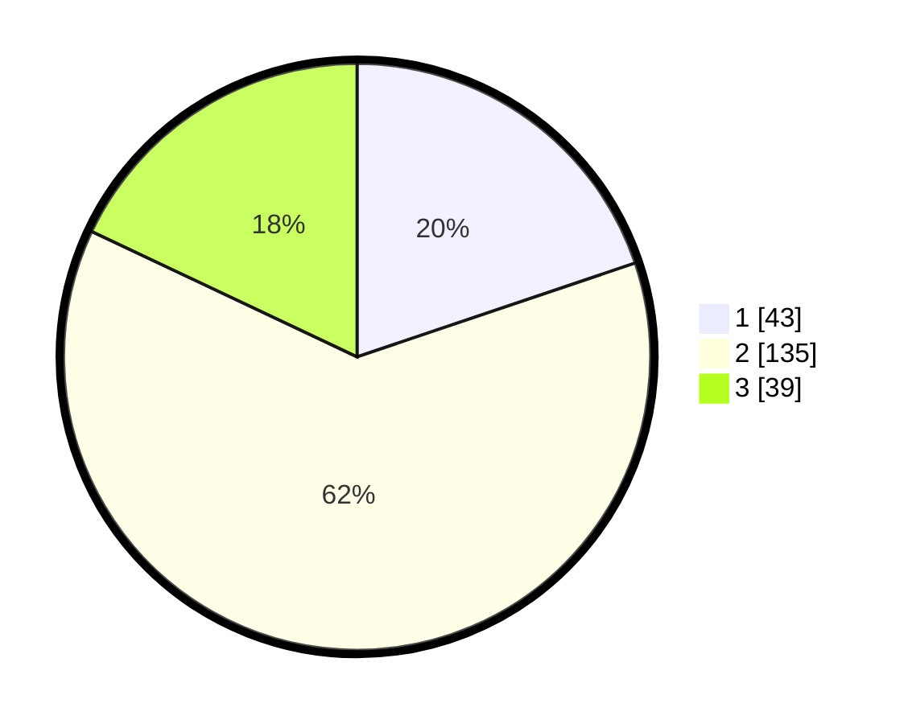

# Hasil

## Grafik

## Tabel

| No. | Nama Paslon    | Suara | Suara (raw) | Persentase |
|:--- |:-------------- | -----:| -----------:| ----------:|
| 1   | ANIES MUHAIMIN | 43    | [43][p-1]   | 19,82      |
| 2   | PRABOWO GIBRAN | 135   | [135][p-2]  | 62,21      |
| 3   | GANJAR MAHFUD  | 39    | [39][p-3]   | 17,97      |

[p-1]: https://github.com/gigit-pemilu/pemilu-2024/blob/main/pilpres/hitung-suara/sub/34-di-yogyakarta/sub/03-gunungkidul/sub/01-wonosari/sub/2005-karangtengah/sub/019-tps/sub/paslon-1.txt
[p-2]: https://github.com/gigit-pemilu/pemilu-2024/blob/main/pilpres/hitung-suara/sub/34-di-yogyakarta/sub/03-gunungkidul/sub/01-wonosari/sub/2005-karangtengah/sub/019-tps/sub/paslon-2.txt
[p-3]: https://github.com/gigit-pemilu/pemilu-2024/blob/main/pilpres/hitung-suara/sub/34-di-yogyakarta/sub/03-gunungkidul/sub/01-wonosari/sub/2005-karangtengah/sub/019-tps/sub/paslon-3.txt

## Foto C Plano

https://sirekap-obj-formc.kpu.go.id/8b72/pemilu/ppwp/34/03/01/20/05/3403012005019-20240217-084004--058d9d5e-8b98-44be-9dc7-2c52f40434af.jpg

https://sirekap-obj-formc.kpu.go.id/8b72/pemilu/ppwp/34/03/01/20/05/3403012005019-20240217-084416--94b61bf6-87fe-4f0b-9998-7c01dbef7117.jpg

https://sirekap-obj-formc.kpu.go.id/8b72/pemilu/ppwp/34/03/01/20/05/3403012005019-20240217-103323--6e3f843c-136d-4909-bc76-2a724260888b.jpg

## Metadata

| Key        | Value               |
| ---------- | ------------------- |
| Time Stamp | 2024-02-19 06:16:00 |

