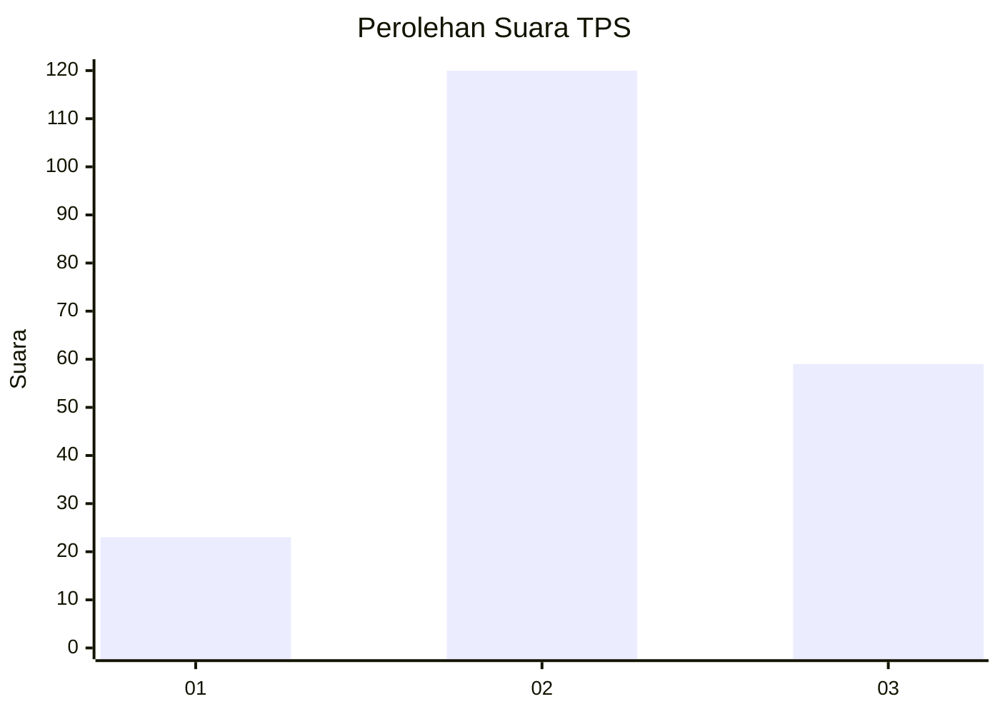
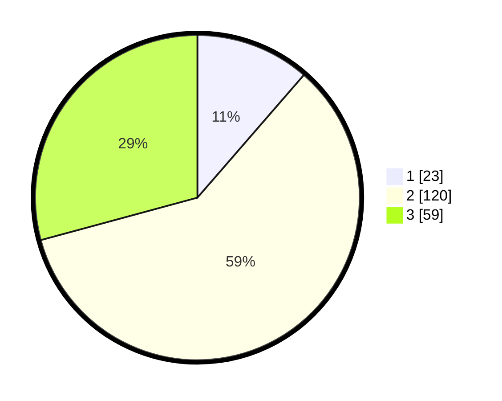

# Hasil

## Grafik

## Tabel

| No. | Nama Paslon    | Suara | Suara (raw) | Persentase |
|:--- |:-------------- | -----:| -----------:| ----------:|
| 1   | ANIES MUHAIMIN | 23    | [23][p-1]   | 11,39      |
| 2   | PRABOWO GIBRAN | 120   | [120][p-2]  | 59,41      |
| 3   | GANJAR MAHFUD  | 59    | [59][p-3]   | 29,21      |

[p-1]: https://github.com/gigit-pemilu/pemilu-2024-34-di-yogyakarta/blob/main/pilpres/hitung-suara/sub/34-di-yogyakarta/sub/03-gunungkidul/sub/01-wonosari/sub/2005-karangtengah/sub/020-tps/sub/paslon-1.txt
[p-2]: https://github.com/gigit-pemilu/pemilu-2024-34-di-yogyakarta/blob/main/pilpres/hitung-suara/sub/34-di-yogyakarta/sub/03-gunungkidul/sub/01-wonosari/sub/2005-karangtengah/sub/020-tps/sub/paslon-2.txt
[p-3]: https://github.com/gigit-pemilu/pemilu-2024-34-di-yogyakarta/blob/main/pilpres/hitung-suara/sub/34-di-yogyakarta/sub/03-gunungkidul/sub/01-wonosari/sub/2005-karangtengah/sub/020-tps/sub/paslon-3.txt

## Foto C Plano

https://sirekap-obj-formc.kpu.go.id/245c/pemilu/ppwp/34/03/01/20/05/3403012005020-20240216-182002--f5ad434a-0fe9-4029-96c7-6cc0b840dcf1.jpg

https://sirekap-obj-formc.kpu.go.id/245c/pemilu/ppwp/34/03/01/20/05/3403012005020-20240216-182741--937cf35f-64f0-465e-8f33-6f8f8fd2227f.jpg

https://sirekap-obj-formc.kpu.go.id/245c/pemilu/ppwp/34/03/01/20/05/3403012005020-20240216-190554--1b62206d-fa43-4e46-b829-e66a11742bbb.jpg

## Metadata

| Key        | Value               |
| ---------- | ------------------- |
| Time Stamp | 2024-02-16 21:01:00 |

