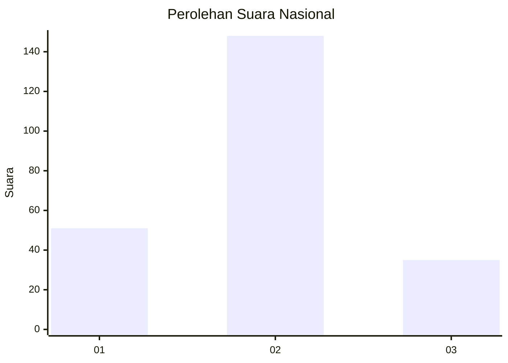
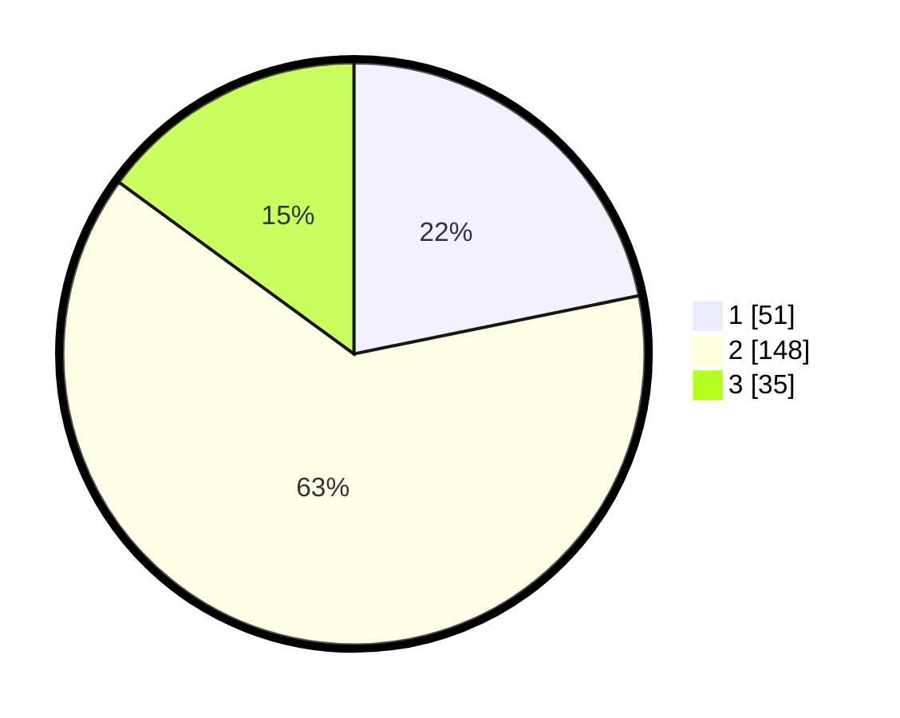

# Hasil

## Grafik

## Tabel

| No. | Nama Paslon    | Suara | Suara (raw) | Persentase |
|:--- |:-------------- | -----:| -----------:| ----------:|
| 1   | ANIES MUHAIMIN | 51    | [51][p-1]   | 21,79      |
| 2   | PRABOWO GIBRAN | 148   | [148][p-2]  | 63,25      |
| 3   | GANJAR MAHFUD  | 35    | [35][p-3]   | 14,96      |

[p-1]: https://github.com/gigit-pemilu/pemilu-2024/blob/main/pilpres/hitung-suara/sub/34-di-yogyakarta/sub/03-gunungkidul/sub/01-wonosari/sub/2005-karangtengah/sub/022-tps/sub/paslon-1.txt
[p-2]: https://github.com/gigit-pemilu/pemilu-2024/blob/main/pilpres/hitung-suara/sub/34-di-yogyakarta/sub/03-gunungkidul/sub/01-wonosari/sub/2005-karangtengah/sub/022-tps/sub/paslon-2.txt
[p-3]: https://github.com/gigit-pemilu/pemilu-2024/blob/main/pilpres/hitung-suara/sub/34-di-yogyakarta/sub/03-gunungkidul/sub/01-wonosari/sub/2005-karangtengah/sub/022-tps/sub/paslon-3.txt

## Foto C Plano

https://sirekap-obj-formc.kpu.go.id/63f8/pemilu/ppwp/34/03/01/20/05/3403012005022-20240215-011534--2641a42b-07ef-4160-9a69-cae7d2152f02.jpg

https://sirekap-obj-formc.kpu.go.id/63f8/pemilu/ppwp/34/03/01/20/05/3403012005022-20240215-003311--3b0e1c77-598a-490f-9ef7-ecc2f12bda2e.jpg

https://sirekap-obj-formc.kpu.go.id/63f8/pemilu/ppwp/34/03/01/20/05/3403012005022-20240215-014105--dfba2803-f80f-43d6-8667-4bdab6207278.jpg

## Metadata

| Key        | Value               |
| ---------- | ------------------- |
| Time Stamp | 2024-02-17 19:30:00 |

