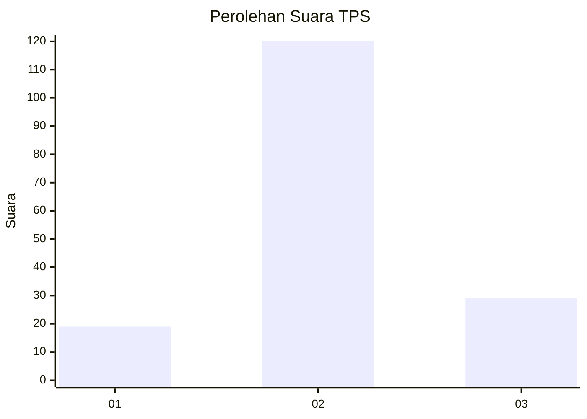
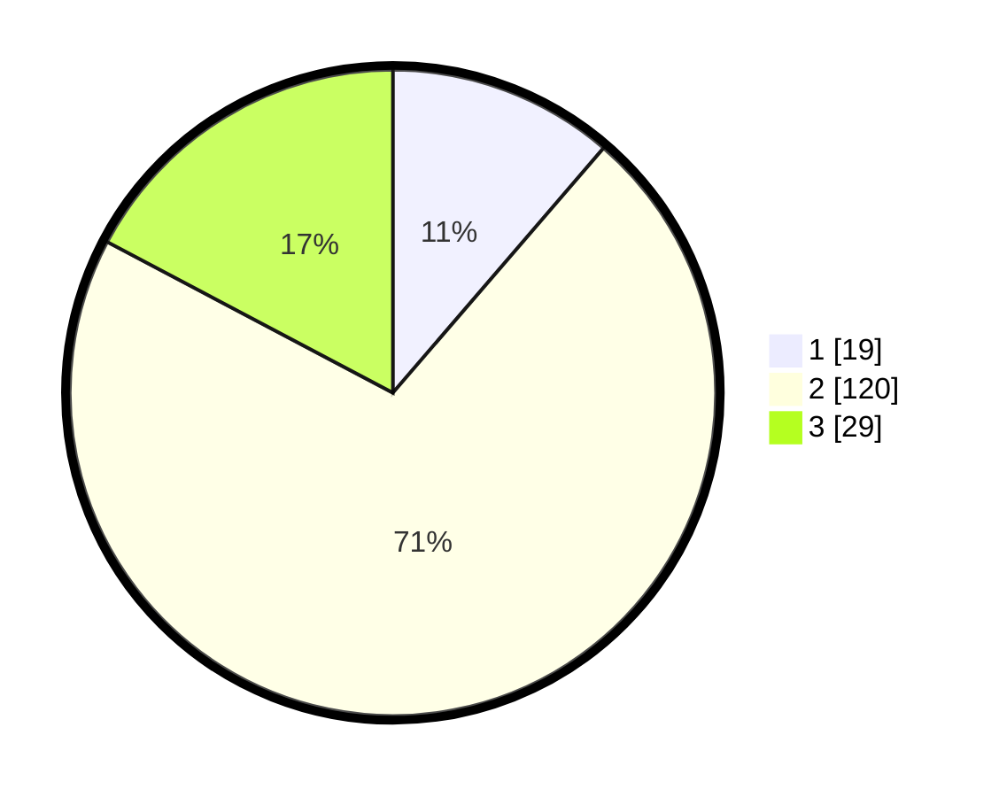

# Hasil

## Grafik

## Tabel

| No. | Nama Paslon    | Suara | Suara (raw) | Persentase |
|:--- |:-------------- | -----:| -----------:| ----------:|
| 1   | ANIES MUHAIMIN | 19    | [19][p-1]   | 11,31      |
| 2   | PRABOWO GIBRAN | 120   | [120][p-2]  | 71,43      |
| 3   | GANJAR MAHFUD  | 29    | [29][p-3]   | 17,26      |

[p-1]: https://github.com/gigit-pemilu/pemilu-2024-34-di-yogyakarta/blob/main/pilpres/hitung-suara/sub/34-di-yogyakarta/sub/03-gunungkidul/sub/01-wonosari/sub/2006-selang/sub/006-tps/sub/paslon-1.txt
[p-2]: https://github.com/gigit-pemilu/pemilu-2024-34-di-yogyakarta/blob/main/pilpres/hitung-suara/sub/34-di-yogyakarta/sub/03-gunungkidul/sub/01-wonosari/sub/2006-selang/sub/006-tps/sub/paslon-2.txt
[p-3]: https://github.com/gigit-pemilu/pemilu-2024-34-di-yogyakarta/blob/main/pilpres/hitung-suara/sub/34-di-yogyakarta/sub/03-gunungkidul/sub/01-wonosari/sub/2006-selang/sub/006-tps/sub/paslon-3.txt

## Foto C Plano

https://sirekap-obj-formc.kpu.go.id/0ae1/pemilu/ppwp/34/03/01/20/06/3403012006006-20240215-025115--5f8c61c4-c012-4773-81ec-40b30b813865.jpg

https://sirekap-obj-formc.kpu.go.id/0ae1/pemilu/ppwp/34/03/01/20/06/3403012006006-20240215-025432--1985d075-81fd-4c12-8829-1b852d7b3fa8.jpg

https://sirekap-obj-formc.kpu.go.id/0ae1/pemilu/ppwp/34/03/01/20/06/3403012006006-20240215-030615--478a078e-e5cb-4c7b-abc1-4d017bddc8a9.jpg

## Metadata

| Key        | Value               |
| ---------- | ------------------- |
| Time Stamp | 2024-02-17 19:30:00 |

