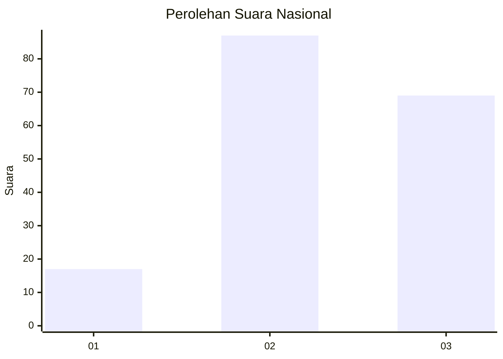
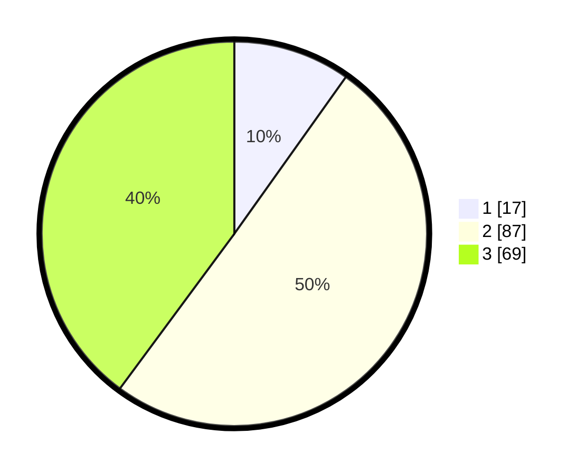

# Hasil

## Grafik

## Tabel

| No. | Nama Paslon    | Suara | Suara (raw) | Persentase |
|:--- |:-------------- | -----:| -----------:| ----------:|
| 1   | ANIES MUHAIMIN | 17    | [17][p-1]   | 9,83       |
| 2   | PRABOWO GIBRAN | 87    | [87][p-2]   | 50,29      |
| 3   | GANJAR MAHFUD  | 69    | [69][p-3]   | 39,88      |

[p-1]: https://github.com/gigit-pemilu/pemilu-2024/blob/main/pilpres/hitung-suara/sub/34-di-yogyakarta/sub/03-gunungkidul/sub/01-wonosari/sub/2006-selang/sub/012-tps/sub/paslon-1.txt
[p-2]: https://github.com/gigit-pemilu/pemilu-2024/blob/main/pilpres/hitung-suara/sub/34-di-yogyakarta/sub/03-gunungkidul/sub/01-wonosari/sub/2006-selang/sub/012-tps/sub/paslon-2.txt
[p-3]: https://github.com/gigit-pemilu/pemilu-2024/blob/main/pilpres/hitung-suara/sub/34-di-yogyakarta/sub/03-gunungkidul/sub/01-wonosari/sub/2006-selang/sub/012-tps/sub/paslon-3.txt

## Foto C Plano

https://sirekap-obj-formc.kpu.go.id/e7a6/pemilu/ppwp/34/03/01/20/06/3403012006012-20240214-234349--fc5116b1-3380-4739-8ca4-b656c9dd8289.jpg

https://sirekap-obj-formc.kpu.go.id/e7a6/pemilu/ppwp/34/03/01/20/06/3403012006012-20240214-234510--e45b03c0-db59-47f0-83f6-b73867e5e767.jpg

https://sirekap-obj-formc.kpu.go.id/e7a6/pemilu/ppwp/34/03/01/20/06/3403012006012-20240214-234858--88583da2-5be3-47da-a64f-bd5bace5e428.jpg

## Metadata

| Key        | Value               |
| ---------- | ------------------- |
| Time Stamp | 2024-02-17 19:30:00 |

