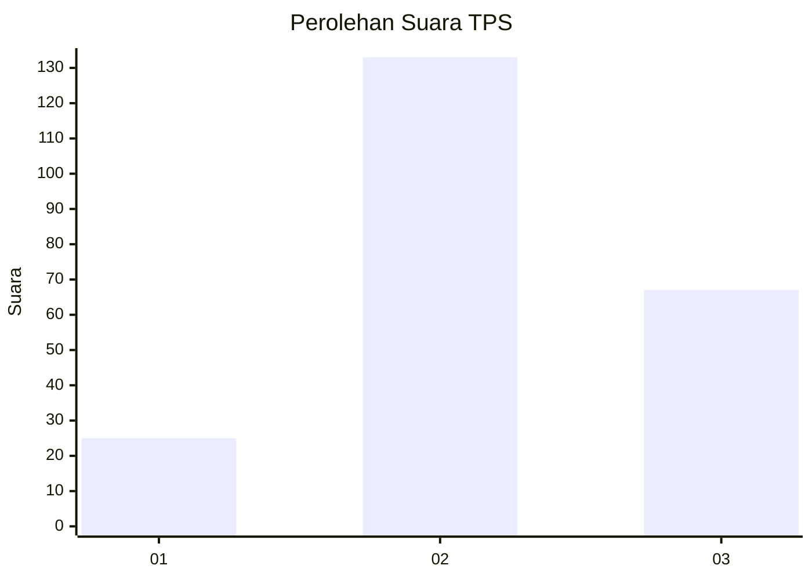
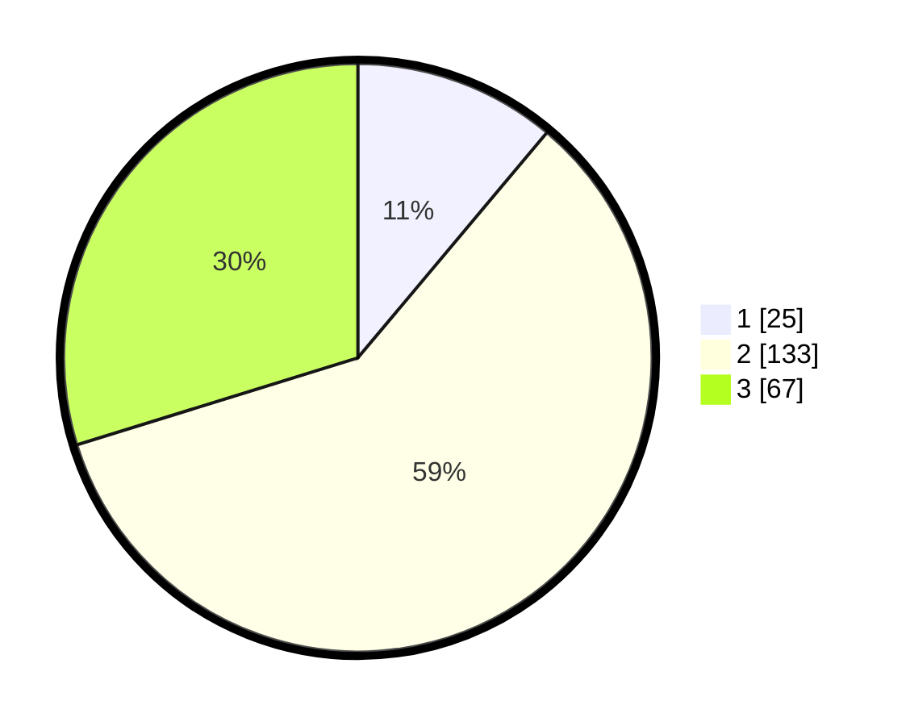

# Hasil

## Grafik

## Tabel

| No. | Nama Paslon    | Suara | Suara (raw) | Persentase |
|:--- |:-------------- | -----:| -----------:| ----------:|
| 1   | ANIES MUHAIMIN | 25    | [25][p-1]   | 11,11      |
| 2   | PRABOWO GIBRAN | 133   | [133][p-2]  | 59,11      |
| 3   | GANJAR MAHFUD  | 67    | [67][p-3]   | 29,78      |

[p-1]: https://github.com/gigit-pemilu/pemilu-2024-34-di-yogyakarta/blob/main/pilpres/hitung-suara/sub/34-di-yogyakarta/sub/03-gunungkidul/sub/01-wonosari/sub/2007-baleharjo/sub/002-tps/sub/paslon-1.txt
[p-2]: https://github.com/gigit-pemilu/pemilu-2024-34-di-yogyakarta/blob/main/pilpres/hitung-suara/sub/34-di-yogyakarta/sub/03-gunungkidul/sub/01-wonosari/sub/2007-baleharjo/sub/002-tps/sub/paslon-2.txt
[p-3]: https://github.com/gigit-pemilu/pemilu-2024-34-di-yogyakarta/blob/main/pilpres/hitung-suara/sub/34-di-yogyakarta/sub/03-gunungkidul/sub/01-wonosari/sub/2007-baleharjo/sub/002-tps/sub/paslon-3.txt

## Foto C Plano

https://sirekap-obj-formc.kpu.go.id/16ee/pemilu/ppwp/34/03/01/20/07/3403012007002-20240215-214000--5a9ef971-9137-416e-bbae-3ae95fc100b3.jpg

https://sirekap-obj-formc.kpu.go.id/16ee/pemilu/ppwp/34/03/01/20/07/3403012007002-20240215-214003--a939e5ea-6d14-47fc-b362-14efaf4a2001.jpg

https://sirekap-obj-formc.kpu.go.id/16ee/pemilu/ppwp/34/03/01/20/07/3403012007002-20240215-214002--a3c480f3-a502-4fce-bc41-944ae8554bca.jpg

## Metadata

| Key        | Value               |
| ---------- | ------------------- |
| Time Stamp | 2024-02-15 22:00:27 |

## DATA PEMILIH TETAP

Jumlah pemilih dalam DPT: **251**.
 * L: **105**.
 * P: **146**.

## DATA PENGGUNA HAK PILIH

Jumlah pengguna hak pilih dalam DPT: **192**.
 * L: **84**.
 * P: **108**.

Jumlah pengguna hak pilih dalam DPTb: **27**.
 * L: **1**.
 * P: **26**.

Jumlah pengguna hak pilih dalam DPK: **7**.
 * L: **4**.
 * P: **3**.

Jumlah pengguna hak pilih: **226**.
 * L: **89**.
 * P: **137**.

## JUMLAH SUARA SAH DAN TIDAK SAH

JUMLAH SELURUH SUARA SAH: **225**.

JUMLAH SUARA TIDAK SAH: **1**.

JUMLAH SELURUH SUARA SAH DAN SUARA TIDAK SAH: **226**.

