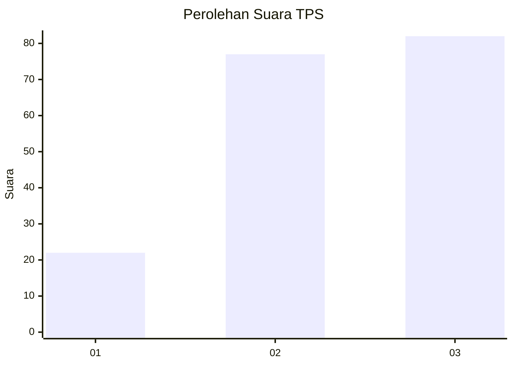
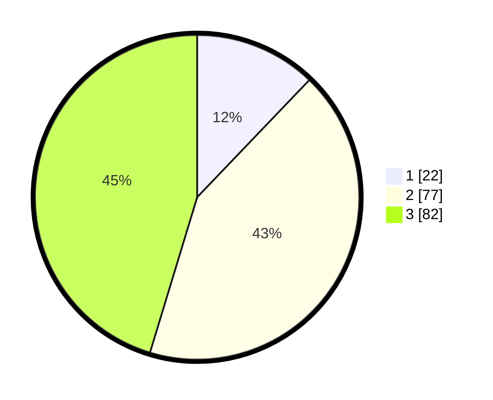

# Hasil

## Grafik

## Tabel

| No. | Nama Paslon    | Suara | Suara (raw) | Persentase |
|:--- |:-------------- | -----:| -----------:| ----------:|
| 1   | ANIES MUHAIMIN | 22    | [22][p-1]   | 12,15      |
| 2   | PRABOWO GIBRAN | 77    | [77][p-2]   | 42,54      |
| 3   | GANJAR MAHFUD  | 82    | [82][p-3]   | 45,30      |

[p-1]: https://github.com/gigit-pemilu/pemilu-2024-34-di-yogyakarta/blob/main/pilpres/hitung-suara/sub/34-di-yogyakarta/sub/03-gunungkidul/sub/01-wonosari/sub/2007-baleharjo/sub/004-tps/sub/paslon-1.txt
[p-2]: https://github.com/gigit-pemilu/pemilu-2024-34-di-yogyakarta/blob/main/pilpres/hitung-suara/sub/34-di-yogyakarta/sub/03-gunungkidul/sub/01-wonosari/sub/2007-baleharjo/sub/004-tps/sub/paslon-2.txt
[p-3]: https://github.com/gigit-pemilu/pemilu-2024-34-di-yogyakarta/blob/main/pilpres/hitung-suara/sub/34-di-yogyakarta/sub/03-gunungkidul/sub/01-wonosari/sub/2007-baleharjo/sub/004-tps/sub/paslon-3.txt

## Foto C Plano

https://sirekap-obj-formc.kpu.go.id/4be2/pemilu/ppwp/34/03/01/20/07/3403012007004-20240215-153811--b397f45b-3da8-4be1-9840-db8d3a55b2e4.jpg

https://sirekap-obj-formc.kpu.go.id/4be2/pemilu/ppwp/34/03/01/20/07/3403012007004-20240215-051619--714209e0-4d8b-4a12-8f20-ac202a948b25.jpg

https://sirekap-obj-formc.kpu.go.id/4be2/pemilu/ppwp/34/03/01/20/07/3403012007004-20240215-051818--e84eb0ac-bd9a-4385-993b-5af89739d27a.jpg

## Metadata

| Key        | Value               |
| ---------- | ------------------- |
| Time Stamp | 2024-02-15 17:30:25 |

## DATA PEMILIH TETAP

Jumlah pemilih dalam DPT: **196**.
 * L: **93**.
 * P: **103**.

## DATA PENGGUNA HAK PILIH

Jumlah pengguna hak pilih dalam DPT: **172**.
 * L: **82**.
 * P: **90**.

Jumlah pengguna hak pilih dalam DPTb: **10**.
 * L: **1**.
 * P: **9**.

Jumlah pengguna hak pilih dalam DPK: **2**.
 * L: **0**.
 * P: **2**.

Jumlah pengguna hak pilih: **184**.
 * L: **83**.
 * P: **101**.

## JUMLAH SUARA SAH DAN TIDAK SAH

JUMLAH SELURUH SUARA SAH: **181**.

JUMLAH SUARA TIDAK SAH: **3**.

JUMLAH SELURUH SUARA SAH DAN SUARA TIDAK SAH: **184**.

