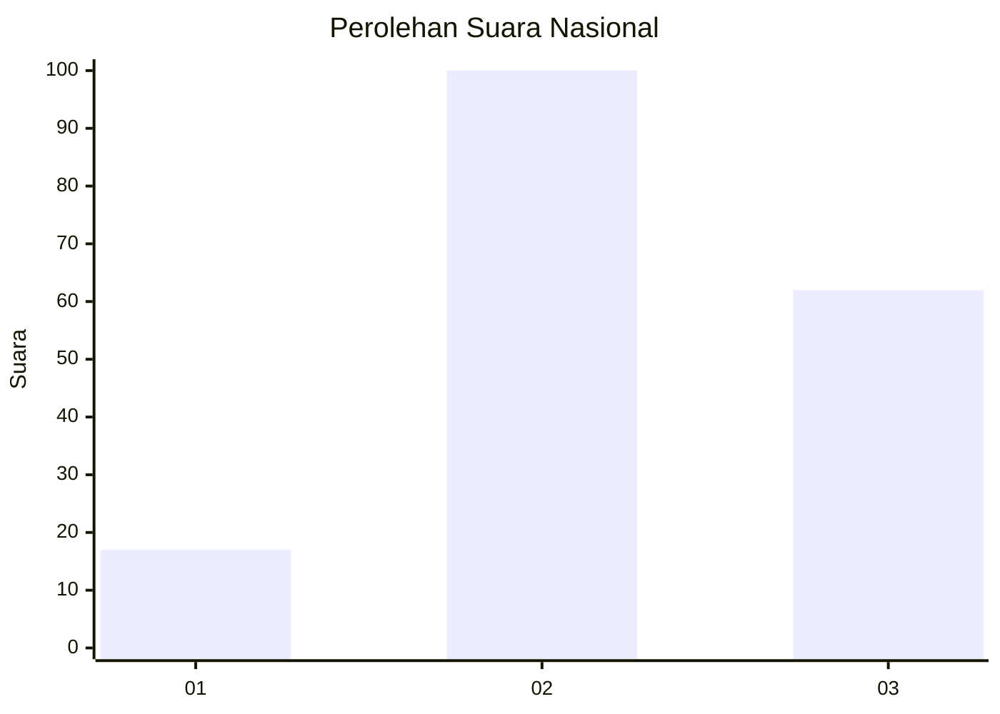
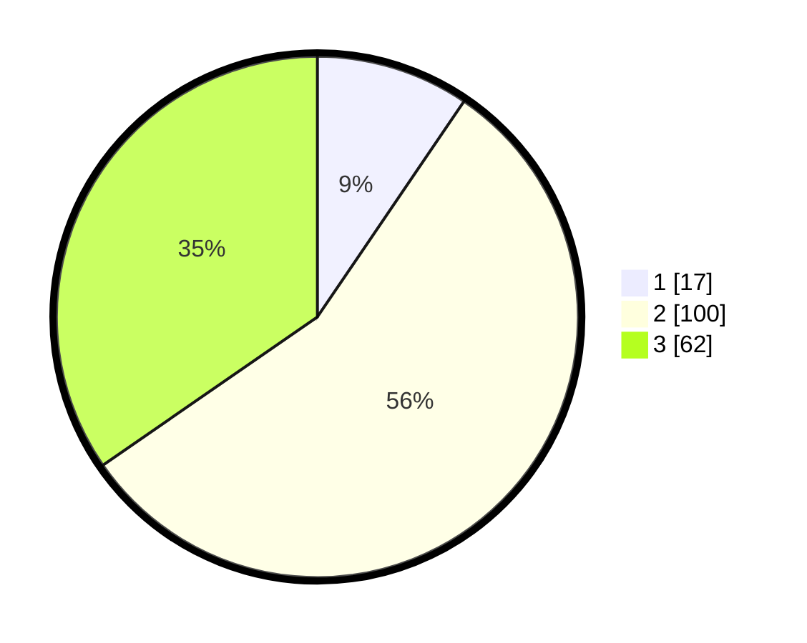

# Hasil

## Grafik

## Tabel

| No. | Nama Paslon    | Suara | Suara (raw) | Persentase |
|:--- |:-------------- | -----:| -----------:| ----------:|
| 1   | ANIES MUHAIMIN | 17    | [17][p-1]   | 9,50       |
| 2   | PRABOWO GIBRAN | 100   | [100][p-2]  | 55,87      |
| 3   | GANJAR MAHFUD  | 62    | [62][p-3]   | 34,64      |

[p-1]: https://github.com/gigit-pemilu/pemilu-2024/blob/main/pilpres/hitung-suara/sub/34-di-yogyakarta/sub/03-gunungkidul/sub/01-wonosari/sub/2007-baleharjo/sub/005-tps/sub/paslon-1.txt
[p-2]: https://github.com/gigit-pemilu/pemilu-2024/blob/main/pilpres/hitung-suara/sub/34-di-yogyakarta/sub/03-gunungkidul/sub/01-wonosari/sub/2007-baleharjo/sub/005-tps/sub/paslon-2.txt
[p-3]: https://github.com/gigit-pemilu/pemilu-2024/blob/main/pilpres/hitung-suara/sub/34-di-yogyakarta/sub/03-gunungkidul/sub/01-wonosari/sub/2007-baleharjo/sub/005-tps/sub/paslon-3.txt

## Foto C Plano

https://sirekap-obj-formc.kpu.go.id/980a/pemilu/ppwp/34/03/01/20/07/3403012007005-20240216-071159--30b09959-4709-4c32-a9e2-f2fae7759ab3.jpg

https://sirekap-obj-formc.kpu.go.id/980a/pemilu/ppwp/34/03/01/20/07/3403012007005-20240216-064807--2906a428-b65f-491d-9609-1e3c29c8d6af.jpg

https://sirekap-obj-formc.kpu.go.id/980a/pemilu/ppwp/34/03/01/20/07/3403012007005-20240216-064801--245646b6-afec-4949-bdc9-35c9ba585982.jpg

## Metadata

| Key        | Value               |
| ---------- | ------------------- |
| Time Stamp | 2024-02-17 10:30:03 |

## DATA PEMILIH TETAP

Jumlah pemilih dalam DPT: **201**.
 * L: **92**.
 * P: **109**.

## DATA PENGGUNA HAK PILIH

Jumlah pengguna hak pilih dalam DPT: **168**.
 * L: **75**.
 * P: **93**.

Jumlah pengguna hak pilih dalam DPTb: **13**.
 * L: **0**.
 * P: **13**.

Jumlah pengguna hak pilih dalam DPK: **0**.
 * L: **0**.
 * P: **0**.

Jumlah pengguna hak pilih: **181**.
 * L: **75**.
 * P: **106**.

## JUMLAH SUARA SAH DAN TIDAK SAH

JUMLAH SELURUH SUARA SAH: **179**.

JUMLAH SUARA TIDAK SAH: **2**.

JUMLAH SELURUH SUARA SAH DAN SUARA TIDAK SAH: **181**.

