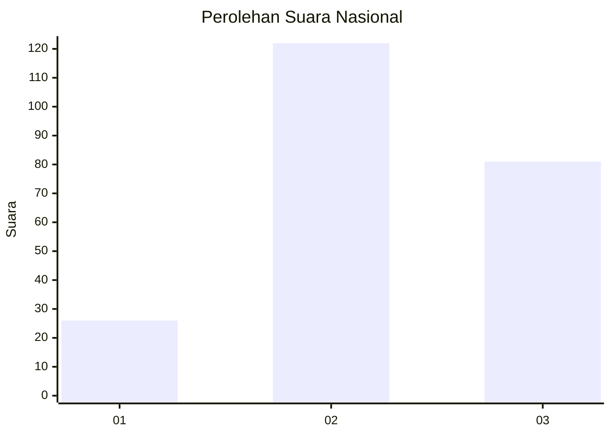
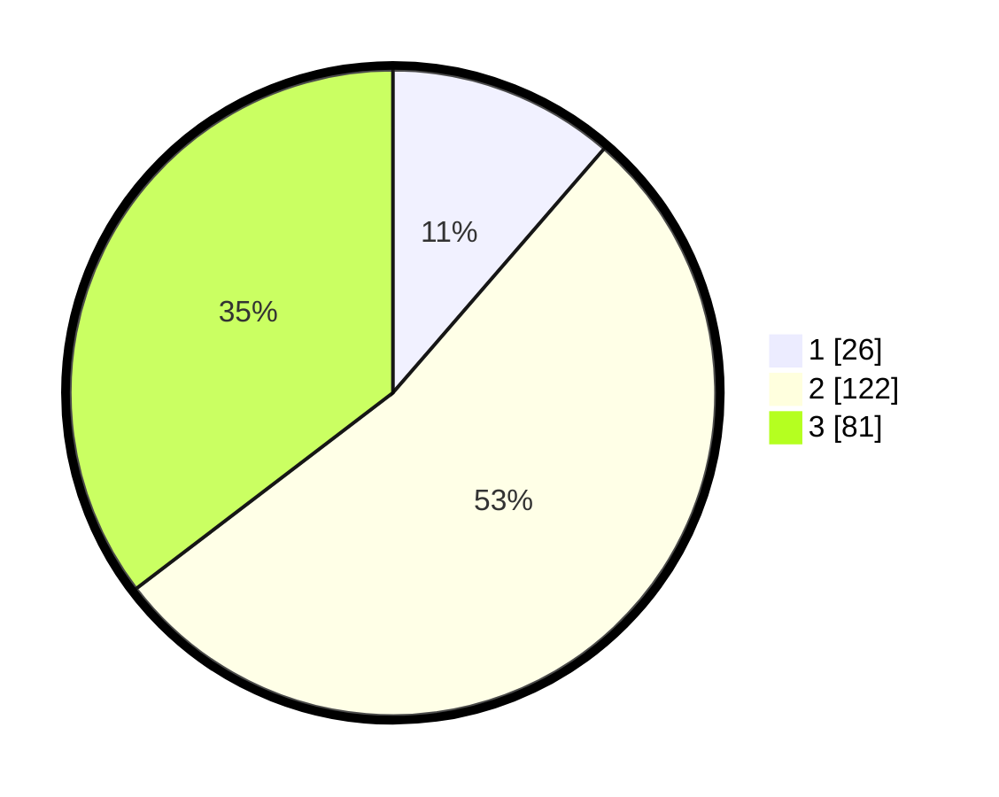

# Hasil

## Grafik

## Tabel

| No. | Nama Paslon    | Suara | Suara (raw) | Persentase |
|:--- |:-------------- | -----:| -----------:| ----------:|
| 1   | ANIES MUHAIMIN | 26    | [26][p-1]   | 11,35      |
| 2   | PRABOWO GIBRAN | 122   | [122][p-2]  | 53,28      |
| 3   | GANJAR MAHFUD  | 81    | [81][p-3]   | 35,37      |

[p-1]: https://github.com/gigit-pemilu/pemilu-2024/blob/main/pilpres/hitung-suara/sub/34-di-yogyakarta/sub/03-gunungkidul/sub/01-wonosari/sub/2007-baleharjo/sub/006-tps/sub/paslon-1.txt
[p-2]: https://github.com/gigit-pemilu/pemilu-2024/blob/main/pilpres/hitung-suara/sub/34-di-yogyakarta/sub/03-gunungkidul/sub/01-wonosari/sub/2007-baleharjo/sub/006-tps/sub/paslon-2.txt
[p-3]: https://github.com/gigit-pemilu/pemilu-2024/blob/main/pilpres/hitung-suara/sub/34-di-yogyakarta/sub/03-gunungkidul/sub/01-wonosari/sub/2007-baleharjo/sub/006-tps/sub/paslon-3.txt

## Foto C Plano

https://sirekap-obj-formc.kpu.go.id/2483/pemilu/ppwp/34/03/01/20/07/3403012007006-20240216-061810--bdb2bec5-8658-494a-aa94-ac176df9dbdd.jpg

https://sirekap-obj-formc.kpu.go.id/2483/pemilu/ppwp/34/03/01/20/07/3403012007006-20240216-061819--cf82c568-a4bb-4024-a474-f0af162afee5.jpg

https://sirekap-obj-formc.kpu.go.id/2483/pemilu/ppwp/34/03/01/20/07/3403012007006-20240216-061814--9745150d-0307-418d-9a32-b94c40909a90.jpg

## Metadata

| Key        | Value               |
| ---------- | ------------------- |
| Time Stamp | 2024-02-17 10:30:03 |

## DATA PEMILIH TETAP

Jumlah pemilih dalam DPT: **252**.
 * L: **126**.
 * P: **126**.

## DATA PENGGUNA HAK PILIH

Jumlah pengguna hak pilih dalam DPT: **217**.
 * L: **102**.
 * P: **115**.

Jumlah pengguna hak pilih dalam DPTb: **11**.
 * L: **0**.
 * P: **11**.

Jumlah pengguna hak pilih dalam DPK: **1**.
 * L: **0**.
 * P: **1**.

Jumlah pengguna hak pilih: **229**.
 * L: **102**.
 * P: **127**.

## JUMLAH SUARA SAH DAN TIDAK SAH

JUMLAH SELURUH SUARA SAH: **229**.

JUMLAH SUARA TIDAK SAH: **0**.

JUMLAH SELURUH SUARA SAH DAN SUARA TIDAK SAH: **229**.

