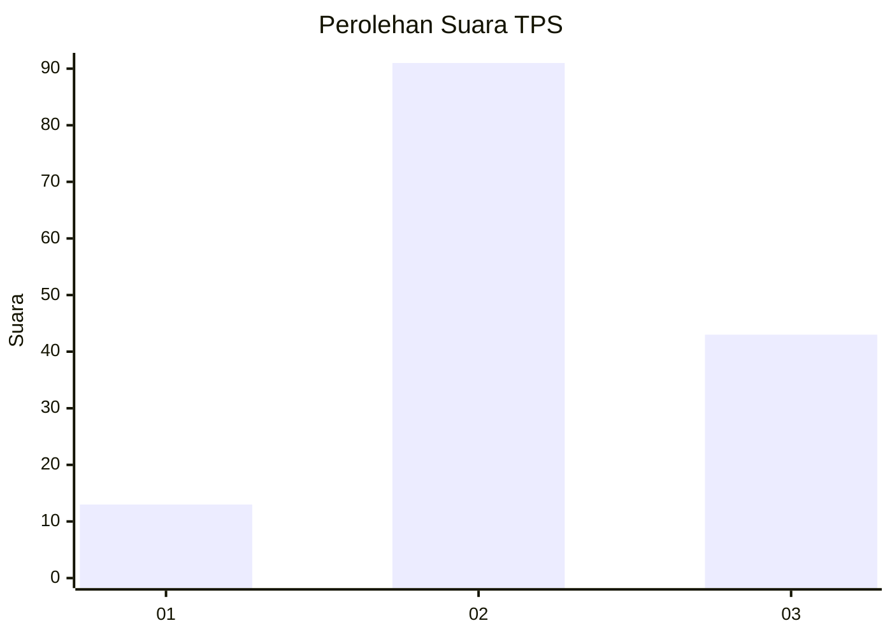
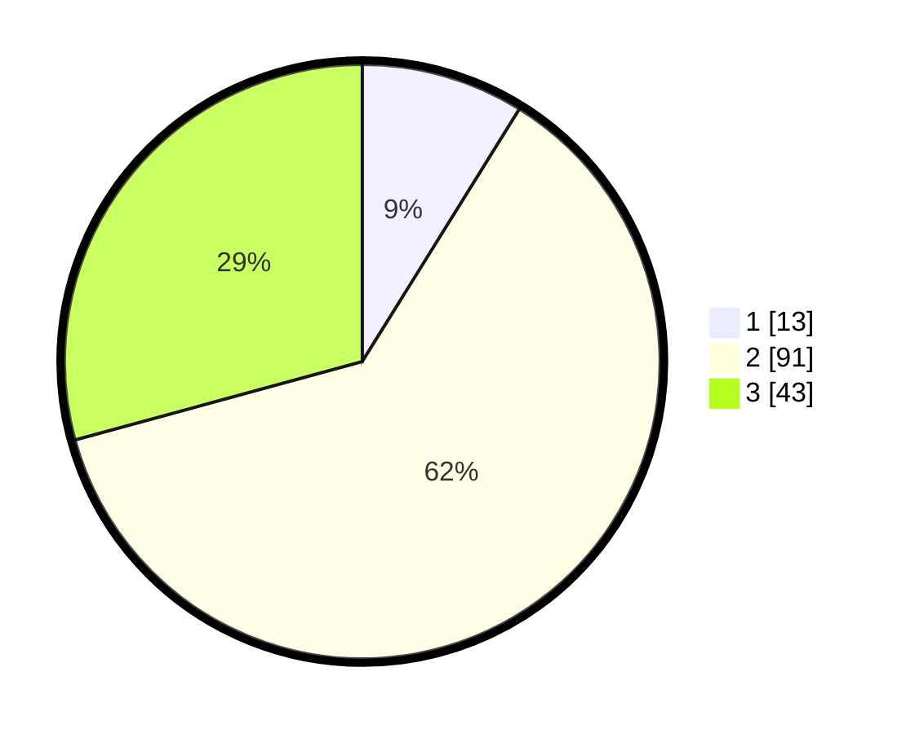

# Hasil

## Grafik

## Tabel

| No. | Nama Paslon    | Suara | Suara (raw) | Persentase |
|:--- |:-------------- | -----:| -----------:| ----------:|
| 1   | ANIES MUHAIMIN | 13    | [13][p-1]   | 8,84       |
| 2   | PRABOWO GIBRAN | 91    | [91][p-2]   | 61,90      |
| 3   | GANJAR MAHFUD  | 43    | [43][p-3]   | 29,25      |

[p-1]: https://github.com/gigit-pemilu/pemilu-2024-34-di-yogyakarta/blob/main/pilpres/hitung-suara/sub/34-di-yogyakarta/sub/03-gunungkidul/sub/01-wonosari/sub/2007-baleharjo/sub/008-tps/sub/paslon-1.txt
[p-2]: https://github.com/gigit-pemilu/pemilu-2024-34-di-yogyakarta/blob/main/pilpres/hitung-suara/sub/34-di-yogyakarta/sub/03-gunungkidul/sub/01-wonosari/sub/2007-baleharjo/sub/008-tps/sub/paslon-2.txt
[p-3]: https://github.com/gigit-pemilu/pemilu-2024-34-di-yogyakarta/blob/main/pilpres/hitung-suara/sub/34-di-yogyakarta/sub/03-gunungkidul/sub/01-wonosari/sub/2007-baleharjo/sub/008-tps/sub/paslon-3.txt

## Foto C Plano

https://sirekap-obj-formc.kpu.go.id/0fb2/pemilu/ppwp/34/03/01/20/07/3403012007008-20240216-132247--4c1aed1f-d63b-43f0-96e8-a1838809e898.jpg

https://sirekap-obj-formc.kpu.go.id/0fb2/pemilu/ppwp/34/03/01/20/07/3403012007008-20240216-132249--008eb8bb-592e-476c-a212-f48e51a26400.jpg

https://sirekap-obj-formc.kpu.go.id/0fb2/pemilu/ppwp/34/03/01/20/07/3403012007008-20240216-132248--0069d826-c9d8-41ce-97c3-bc894c613acc.jpg

## Metadata

| Key        | Value               |
| ---------- | ------------------- |
| Time Stamp | 2024-02-17 10:30:03 |

## DATA PEMILIH TETAP

Jumlah pemilih dalam DPT: **156**.
 * L: **79**.
 * P: **77**.

## DATA PENGGUNA HAK PILIH

Jumlah pengguna hak pilih dalam DPT: **138**.
 * L: **68**.
 * P: **70**.

Jumlah pengguna hak pilih dalam DPTb: **8**.
 * L: **7**.
 * P: **1**.

Jumlah pengguna hak pilih dalam DPK: **2**.
 * L: **1**.
 * P: **1**.

Jumlah pengguna hak pilih: **148**.
 * L: **76**.
 * P: **72**.

## JUMLAH SUARA SAH DAN TIDAK SAH

JUMLAH SELURUH SUARA SAH: **147**.

JUMLAH SUARA TIDAK SAH: **1**.

JUMLAH SELURUH SUARA SAH DAN SUARA TIDAK SAH: **148**.

