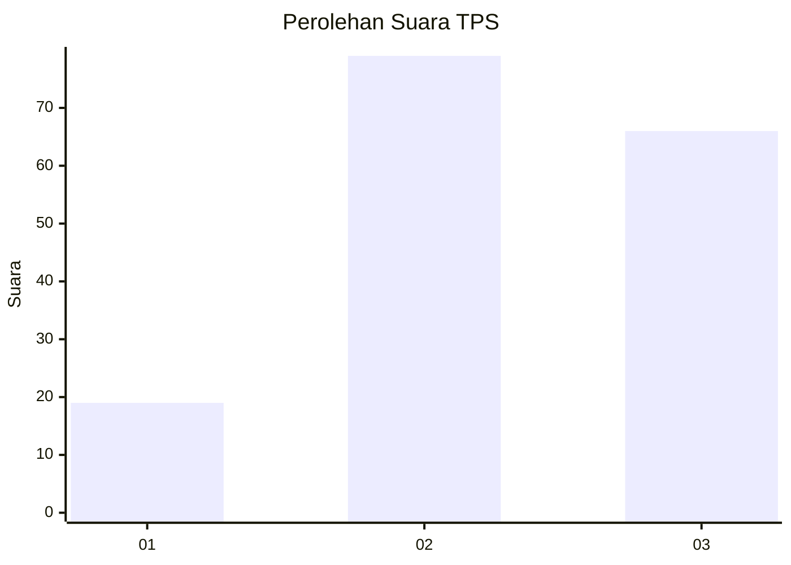
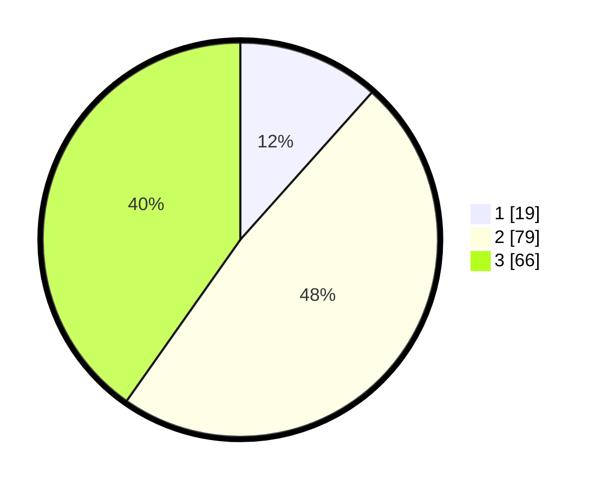

# Hasil

## Grafik

## Tabel

| No. | Nama Paslon    | Suara | Suara (raw) | Persentase |
|:--- |:-------------- | -----:| -----------:| ----------:|
| 1   | ANIES MUHAIMIN | 19    | [19][p-1]   | 11,59      |
| 2   | PRABOWO GIBRAN | 79    | [79][p-2]   | 48,17      |
| 3   | GANJAR MAHFUD  | 66    | [66][p-3]   | 40,24      |

[p-1]: https://github.com/gigit-pemilu/pemilu-2024-34-di-yogyakarta/blob/main/pilpres/hitung-suara/sub/34-di-yogyakarta/sub/03-gunungkidul/sub/01-wonosari/sub/2007-baleharjo/sub/010-tps/sub/paslon-1.txt
[p-2]: https://github.com/gigit-pemilu/pemilu-2024-34-di-yogyakarta/blob/main/pilpres/hitung-suara/sub/34-di-yogyakarta/sub/03-gunungkidul/sub/01-wonosari/sub/2007-baleharjo/sub/010-tps/sub/paslon-2.txt
[p-3]: https://github.com/gigit-pemilu/pemilu-2024-34-di-yogyakarta/blob/main/pilpres/hitung-suara/sub/34-di-yogyakarta/sub/03-gunungkidul/sub/01-wonosari/sub/2007-baleharjo/sub/010-tps/sub/paslon-3.txt

## Foto C Plano

https://sirekap-obj-formc.kpu.go.id/1d98/pemilu/ppwp/34/03/01/20/07/3403012007010-20240216-135129--6a282d59-a4fe-4e53-9ce1-ea140fa33dd2.jpg

https://sirekap-obj-formc.kpu.go.id/1d98/pemilu/ppwp/34/03/01/20/07/3403012007010-20240216-135130--1e248bce-a18b-4128-951c-013ce6fadbb9.jpg

https://sirekap-obj-formc.kpu.go.id/1d98/pemilu/ppwp/34/03/01/20/07/3403012007010-20240216-135130--c7d2f63a-3722-4cb2-a4c1-24e345087ecc.jpg

## Metadata

| Key        | Value               |
| ---------- | ------------------- |
| Time Stamp | 2024-02-17 10:30:03 |

## DATA PEMILIH TETAP

Jumlah pemilih dalam DPT: **179**.
 * L: **88**.
 * P: **91**.

## DATA PENGGUNA HAK PILIH

Jumlah pengguna hak pilih dalam DPT: **155**.
 * L: **74**.
 * P: **81**.

Jumlah pengguna hak pilih dalam DPTb: **10**.
 * L: **0**.
 * P: **10**.

Jumlah pengguna hak pilih dalam DPK: **1**.
 * L: **0**.
 * P: **1**.

Jumlah pengguna hak pilih: **166**.
 * L: **74**.
 * P: **92**.

## JUMLAH SUARA SAH DAN TIDAK SAH

JUMLAH SELURUH SUARA SAH: **164**.

JUMLAH SUARA TIDAK SAH: **2**.

JUMLAH SELURUH SUARA SAH DAN SUARA TIDAK SAH: **166**.

