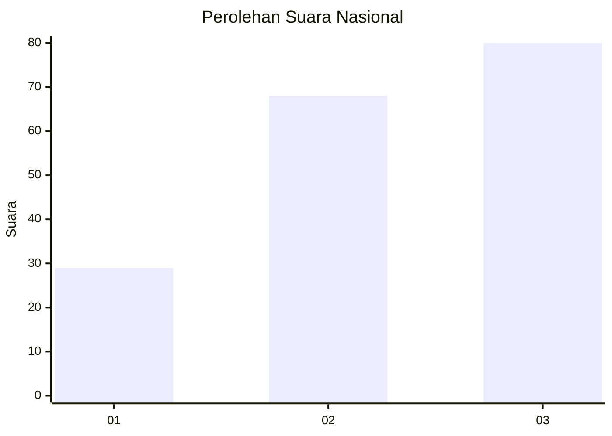
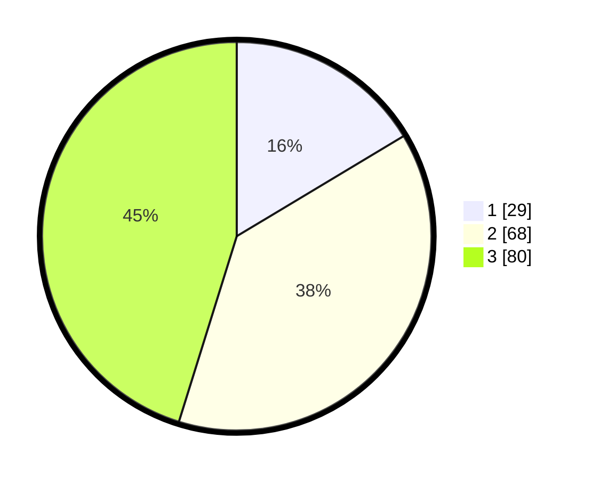

# Hasil

## Grafik

## Tabel

| No. | Nama Paslon    | Suara | Suara (raw) | Persentase |
|:--- |:-------------- | -----:| -----------:| ----------:|
| 1   | ANIES MUHAIMIN | 29    | [29][p-1]   | 16,38      |
| 2   | PRABOWO GIBRAN | 68    | [68][p-2]   | 38,42      |
| 3   | GANJAR MAHFUD  | 80    | [80][p-3]   | 45,20      |

[p-1]: https://github.com/gigit-pemilu/pemilu-2024/blob/main/pilpres/hitung-suara/sub/34-di-yogyakarta/sub/03-gunungkidul/sub/01-wonosari/sub/2007-baleharjo/sub/016-tps/sub/paslon-1.txt
[p-2]: https://github.com/gigit-pemilu/pemilu-2024/blob/main/pilpres/hitung-suara/sub/34-di-yogyakarta/sub/03-gunungkidul/sub/01-wonosari/sub/2007-baleharjo/sub/016-tps/sub/paslon-2.txt
[p-3]: https://github.com/gigit-pemilu/pemilu-2024/blob/main/pilpres/hitung-suara/sub/34-di-yogyakarta/sub/03-gunungkidul/sub/01-wonosari/sub/2007-baleharjo/sub/016-tps/sub/paslon-3.txt

## Foto C Plano

https://sirekap-obj-formc.kpu.go.id/7159/pemilu/ppwp/34/03/01/20/07/3403012007016-20240214-222140--3c581ed5-0132-4948-8653-58851bfd053a.jpg

https://sirekap-obj-formc.kpu.go.id/7159/pemilu/ppwp/34/03/01/20/07/3403012007016-20240214-210953--c74e92bc-c0b2-4e4f-b9e3-503a49fa85a9.jpg

https://sirekap-obj-formc.kpu.go.id/7159/pemilu/ppwp/34/03/01/20/07/3403012007016-20240214-222916--50d7003f-6075-4e33-99b4-b8f3ad6dede3.jpg

## Metadata

| Key        | Value               |
| ---------- | ------------------- |
| Time Stamp | 2024-02-15 00:41:44 |

