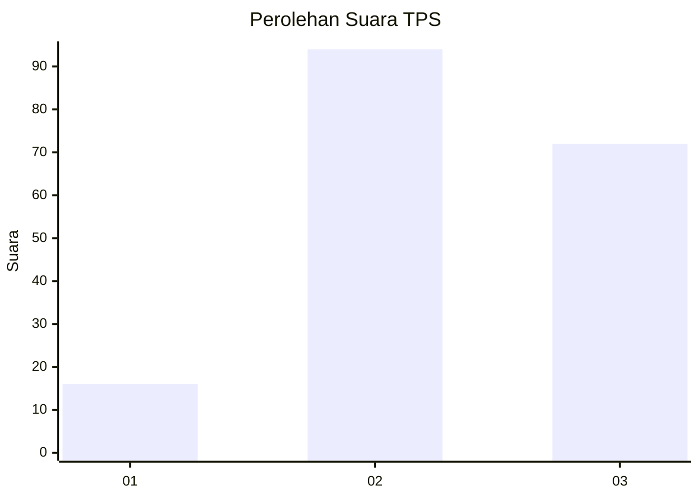
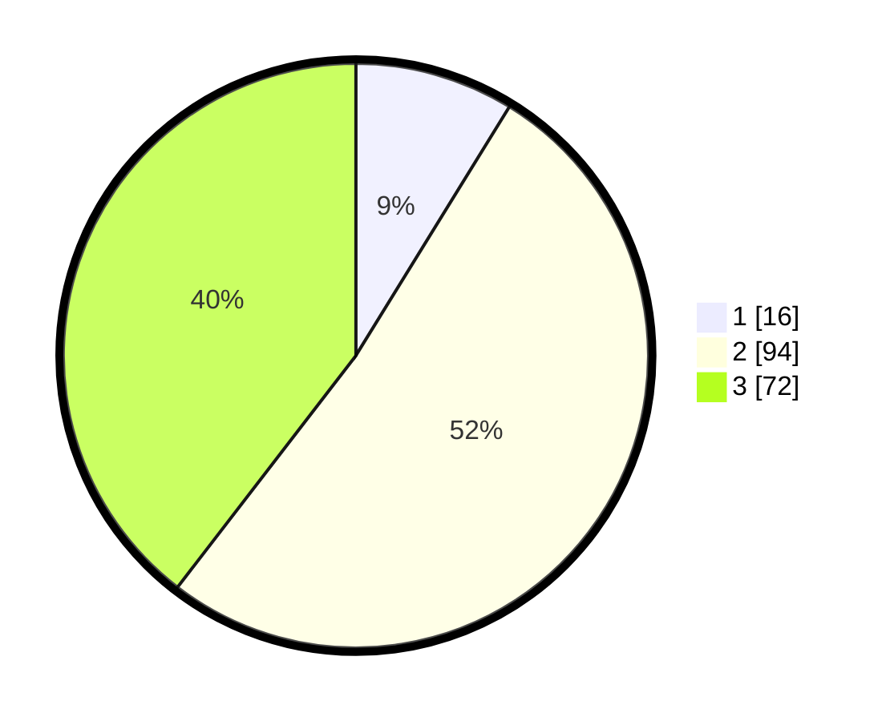

# Hasil

## Grafik

## Tabel

| No. | Nama Paslon    | Suara | Suara (raw) | Persentase |
|:--- |:-------------- | -----:| -----------:| ----------:|
| 1   | ANIES MUHAIMIN | 16    | [16][p-1]   | 8,79       |
| 2   | PRABOWO GIBRAN | 94    | [94][p-2]   | 51,65      |
| 3   | GANJAR MAHFUD  | 72    | [72][p-3]   | 39,56      |

[p-1]: https://github.com/gigit-pemilu/pemilu-2024-34-di-yogyakarta/blob/main/pilpres/hitung-suara/sub/34-di-yogyakarta/sub/03-gunungkidul/sub/01-wonosari/sub/2007-baleharjo/sub/901-tps/sub/paslon-1.txt
[p-2]: https://github.com/gigit-pemilu/pemilu-2024-34-di-yogyakarta/blob/main/pilpres/hitung-suara/sub/34-di-yogyakarta/sub/03-gunungkidul/sub/01-wonosari/sub/2007-baleharjo/sub/901-tps/sub/paslon-2.txt
[p-3]: https://github.com/gigit-pemilu/pemilu-2024-34-di-yogyakarta/blob/main/pilpres/hitung-suara/sub/34-di-yogyakarta/sub/03-gunungkidul/sub/01-wonosari/sub/2007-baleharjo/sub/901-tps/sub/paslon-3.txt

## Foto C Plano

https://sirekap-obj-formc.kpu.go.id/4b3e/pemilu/ppwp/34/03/01/20/07/3403012007901-20240217-083727--56320c47-d2dd-4dd1-b0ba-fa8eb81c9adb.jpg

https://sirekap-obj-formc.kpu.go.id/4b3e/pemilu/ppwp/34/03/01/20/07/3403012007901-20240217-083728--3e6a8579-caed-4339-83cf-e1c2d1895e0f.jpg

https://sirekap-obj-formc.kpu.go.id/4b3e/pemilu/ppwp/34/03/01/20/07/3403012007901-20240217-083727--dff8e47b-a8be-4396-8b60-ca91c318140b.jpg

## Metadata

| Key        | Value               |
| ---------- | ------------------- |
| Time Stamp | 2024-02-17 10:30:03 |

## DATA PEMILIH TETAP

Jumlah pemilih dalam DPT: **180**.
 * L: **177**.
 * P: **3**.

## DATA PENGGUNA HAK PILIH

Jumlah pengguna hak pilih dalam DPT: **108**.
 * L: **105**.
 * P: **3**.

Jumlah pengguna hak pilih dalam DPTb: **76**.
 * L: **75**.
 * P: **1**.

Jumlah pengguna hak pilih dalam DPK: **0**.
 * L: **0**.
 * P: **0**.

Jumlah pengguna hak pilih: **184**.
 * L: **180**.
 * P: **4**.

## JUMLAH SUARA SAH DAN TIDAK SAH

JUMLAH SELURUH SUARA SAH: **182**.

JUMLAH SUARA TIDAK SAH: **2**.

JUMLAH SELURUH SUARA SAH DAN SUARA TIDAK SAH: **184**.

