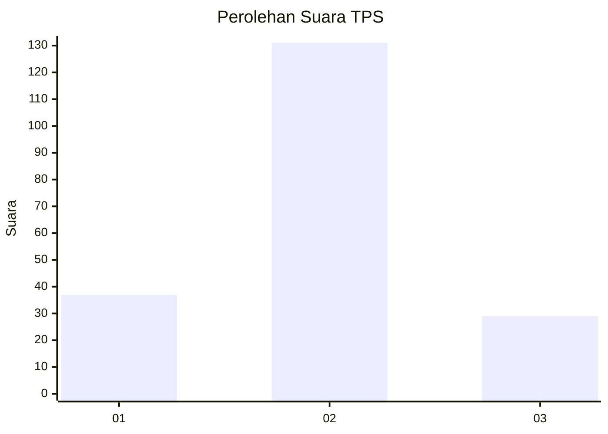
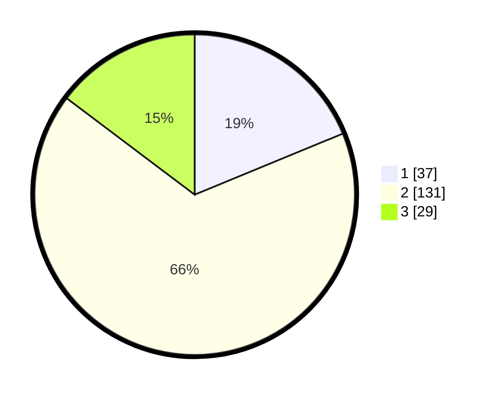

# Hasil

## Grafik

## Tabel

| No. | Nama Paslon    | Suara | Suara (raw) | Persentase |
|:--- |:-------------- | -----:| -----------:| ----------:|
| 1   | ANIES MUHAIMIN | 37    | [37][p-1]   | 18,78      |
| 2   | PRABOWO GIBRAN | 131   | [131][p-2]  | 66,50      |
| 3   | GANJAR MAHFUD  | 29    | [29][p-3]   | 14,72      |

[p-1]: https://github.com/gigit-pemilu/pemilu-2024-34-di-yogyakarta/blob/main/pilpres/hitung-suara/sub/34-di-yogyakarta/sub/03-gunungkidul/sub/01-wonosari/sub/2008-siraman/sub/007-tps/sub/paslon-1.txt
[p-2]: https://github.com/gigit-pemilu/pemilu-2024-34-di-yogyakarta/blob/main/pilpres/hitung-suara/sub/34-di-yogyakarta/sub/03-gunungkidul/sub/01-wonosari/sub/2008-siraman/sub/007-tps/sub/paslon-2.txt
[p-3]: https://github.com/gigit-pemilu/pemilu-2024-34-di-yogyakarta/blob/main/pilpres/hitung-suara/sub/34-di-yogyakarta/sub/03-gunungkidul/sub/01-wonosari/sub/2008-siraman/sub/007-tps/sub/paslon-3.txt

## Foto C Plano

https://sirekap-obj-formc.kpu.go.id/031b/pemilu/ppwp/34/03/01/20/08/3403012008007-20240216-170504--b7bbd474-7bda-43a1-8344-c71db047faf4.jpg

https://sirekap-obj-formc.kpu.go.id/031b/pemilu/ppwp/34/03/01/20/08/3403012008007-20240216-170505--55fbf01c-a76e-4ab2-baee-b78a9db7cb19.jpg

https://sirekap-obj-formc.kpu.go.id/031b/pemilu/ppwp/34/03/01/20/08/3403012008007-20240216-170505--5145471d-8c28-459e-a14d-b1af0443c93a.jpg

## Metadata

| Key        | Value               |
| ---------- | ------------------- |
| Time Stamp | 2024-02-17 10:30:03 |

## DATA PEMILIH TETAP

Jumlah pemilih dalam DPT: **232**.
 * L: **105**.
 * P: **127**.

## DATA PENGGUNA HAK PILIH

Jumlah pengguna hak pilih dalam DPT: **184**.
 * L: **81**.
 * P: **103**.

Jumlah pengguna hak pilih dalam DPTb: **15**.
 * L: **6**.
 * P: **9**.

Jumlah pengguna hak pilih dalam DPK: **4**.
 * L: **3**.
 * P: **1**.

Jumlah pengguna hak pilih: **203**.
 * L: **90**.
 * P: **113**.

## JUMLAH SUARA SAH DAN TIDAK SAH

JUMLAH SELURUH SUARA SAH: **197**.

JUMLAH SUARA TIDAK SAH: **6**.

JUMLAH SELURUH SUARA SAH DAN SUARA TIDAK SAH: **203**.

