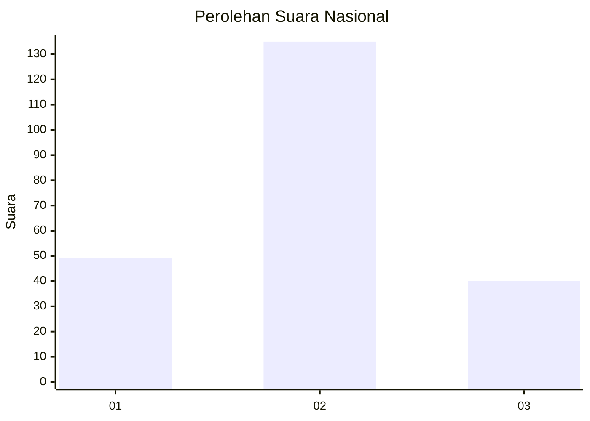
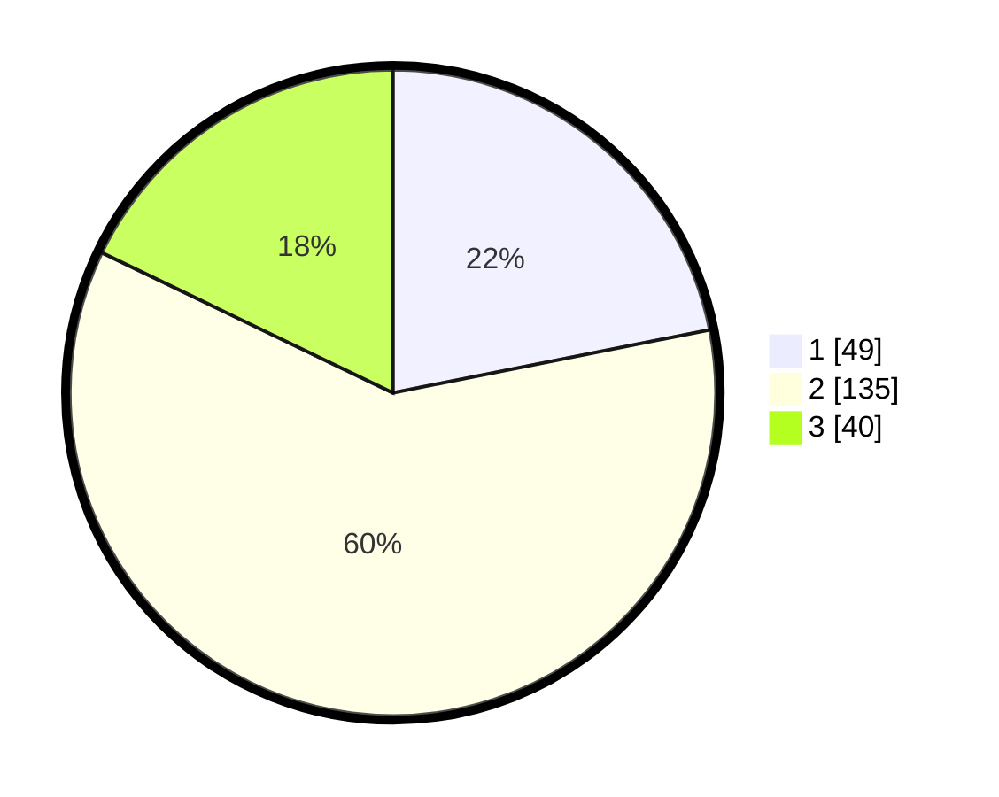

# Hasil

## Grafik

## Tabel

| No. | Nama Paslon    | Suara | Suara (raw) | Persentase |
|:--- |:-------------- | -----:| -----------:| ----------:|
| 1   | ANIES MUHAIMIN | 49    | [49][p-1]   | 21,88      |
| 2   | PRABOWO GIBRAN | 135   | [135][p-2]  | 60,27      |
| 3   | GANJAR MAHFUD  | 40    | [40][p-3]   | 17,86      |

[p-1]: https://github.com/gigit-pemilu/pemilu-2024/blob/main/pilpres/hitung-suara/sub/34-di-yogyakarta/sub/03-gunungkidul/sub/01-wonosari/sub/2008-siraman/sub/008-tps/sub/paslon-1.txt
[p-2]: https://github.com/gigit-pemilu/pemilu-2024/blob/main/pilpres/hitung-suara/sub/34-di-yogyakarta/sub/03-gunungkidul/sub/01-wonosari/sub/2008-siraman/sub/008-tps/sub/paslon-2.txt
[p-3]: https://github.com/gigit-pemilu/pemilu-2024/blob/main/pilpres/hitung-suara/sub/34-di-yogyakarta/sub/03-gunungkidul/sub/01-wonosari/sub/2008-siraman/sub/008-tps/sub/paslon-3.txt

## Foto C Plano

https://sirekap-obj-formc.kpu.go.id/abe3/pemilu/ppwp/34/03/01/20/08/3403012008008-20240216-192402--8c4797ce-b861-4a61-beab-6e6bec1ba62b.jpg

https://sirekap-obj-formc.kpu.go.id/abe3/pemilu/ppwp/34/03/01/20/08/3403012008008-20240216-192404--cdcef2b4-bd34-4fcb-87b6-d23af88c690d.jpg

https://sirekap-obj-formc.kpu.go.id/abe3/pemilu/ppwp/34/03/01/20/08/3403012008008-20240216-192403--0223b27e-2be3-478c-b091-0045f6144951.jpg

## Metadata

| Key        | Value               |
| ---------- | ------------------- |
| Time Stamp | 2024-02-17 10:30:03 |

## DATA PEMILIH TETAP

Jumlah pemilih dalam DPT: **253**.
 * L: **123**.
 * P: **130**.

## DATA PENGGUNA HAK PILIH

Jumlah pengguna hak pilih dalam DPT: **211**.
 * L: **101**.
 * P: **110**.

Jumlah pengguna hak pilih dalam DPTb: **15**.
 * L: **6**.
 * P: **9**.

Jumlah pengguna hak pilih dalam DPK: **2**.
 * L: **1**.
 * P: **1**.

Jumlah pengguna hak pilih: **228**.
 * L: **108**.
 * P: **120**.

## JUMLAH SUARA SAH DAN TIDAK SAH

JUMLAH SELURUH SUARA SAH: **224**.

JUMLAH SUARA TIDAK SAH: **4**.

JUMLAH SELURUH SUARA SAH DAN SUARA TIDAK SAH: **228**.

