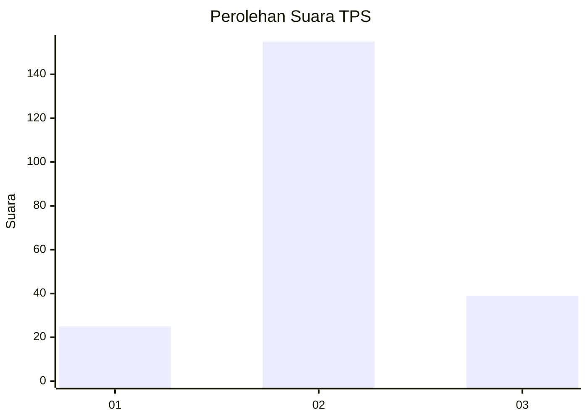
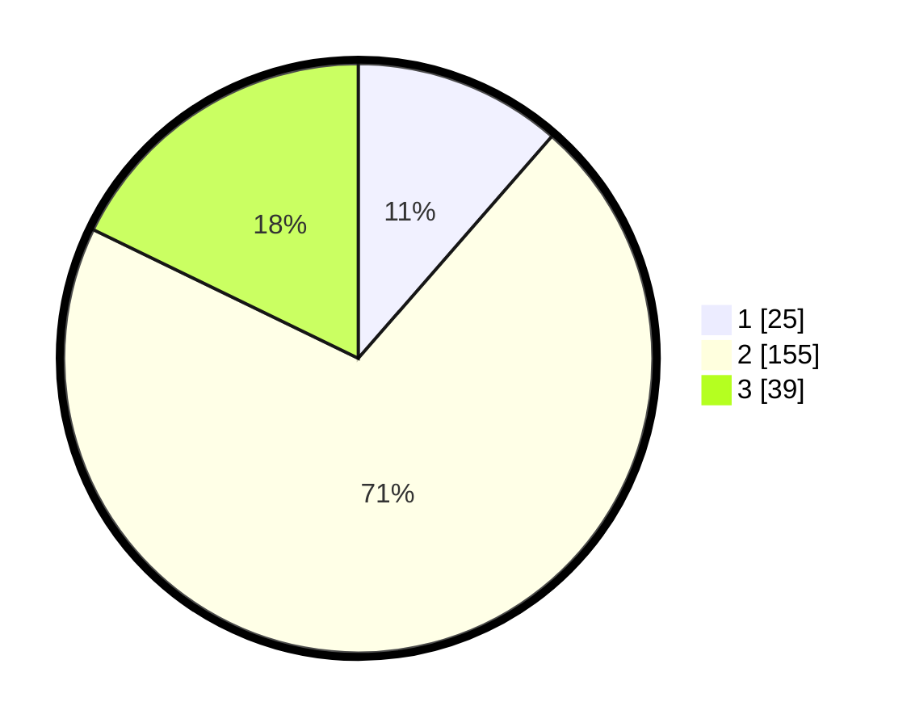

# Hasil

## Grafik

## Tabel

| No. | Nama Paslon    | Suara | Suara (raw) | Persentase |
|:--- |:-------------- | -----:| -----------:| ----------:|
| 1   | ANIES MUHAIMIN | 25    | [25][p-1]   | 11,42      |
| 2   | PRABOWO GIBRAN | 155   | [155][p-2]  | 70,78      |
| 3   | GANJAR MAHFUD  | 39    | [39][p-3]   | 17,81      |

[p-1]: https://github.com/gigit-pemilu/pemilu-2024-34-di-yogyakarta/blob/main/pilpres/hitung-suara/sub/34-di-yogyakarta/sub/03-gunungkidul/sub/01-wonosari/sub/2008-siraman/sub/010-tps/sub/paslon-1.txt
[p-2]: https://github.com/gigit-pemilu/pemilu-2024-34-di-yogyakarta/blob/main/pilpres/hitung-suara/sub/34-di-yogyakarta/sub/03-gunungkidul/sub/01-wonosari/sub/2008-siraman/sub/010-tps/sub/paslon-2.txt
[p-3]: https://github.com/gigit-pemilu/pemilu-2024-34-di-yogyakarta/blob/main/pilpres/hitung-suara/sub/34-di-yogyakarta/sub/03-gunungkidul/sub/01-wonosari/sub/2008-siraman/sub/010-tps/sub/paslon-3.txt

## Foto C Plano

https://sirekap-obj-formc.kpu.go.id/a39d/pemilu/ppwp/34/03/01/20/08/3403012008010-20240214-190050--3f97372c-b30f-43f5-a21d-6c7eaa61abff.jpg

https://sirekap-obj-formc.kpu.go.id/a39d/pemilu/ppwp/34/03/01/20/08/3403012008010-20240214-185821--8876b5cf-8ec2-4e52-8498-d10b35732fc4.jpg

https://sirekap-obj-formc.kpu.go.id/a39d/pemilu/ppwp/34/03/01/20/08/3403012008010-20240217-100827--9e052b37-1f15-4ef5-8d0b-770e4ae9338d.jpg

## Metadata

| Key        | Value               |
| ---------- | ------------------- |
| Time Stamp | 2024-02-17 19:30:00 |

