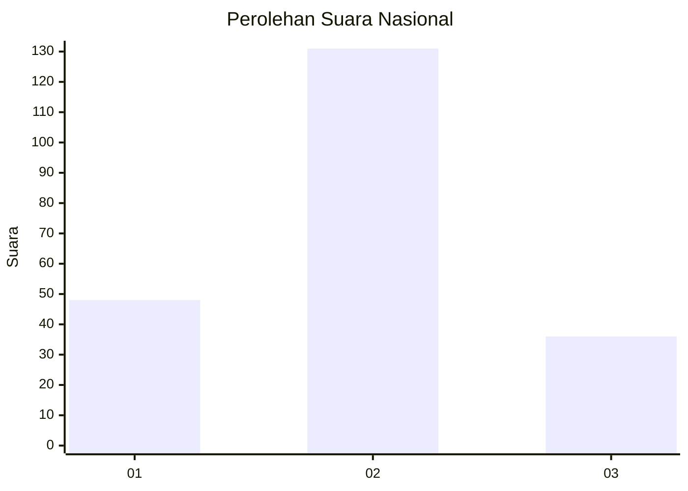

# Hasil

## Grafik

## Tabel

| No. | Nama Paslon    | Suara | Suara (raw) | Persentase |
|:--- |:-------------- | -----:| -----------:| ----------:|
| 1   | ANIES MUHAIMIN | 48    | [48][p-1]   | 22,33      |
| 2   | PRABOWO GIBRAN | 131   | [131][p-2]  | 60,93      |
| 3   | GANJAR MAHFUD  | 36    | [36][p-3]   | 16,74      |

[p-1]: https://github.com/gigit-pemilu/pemilu-2024/blob/main/pilpres/hitung-suara/sub/34-di-yogyakarta/sub/03-gunungkidul/sub/01-wonosari/sub/2009-pulutan/sub/008-tps/sub/paslon-1.txt
[p-2]: https://github.com/gigit-pemilu/pemilu-2024/blob/main/pilpres/hitung-suara/sub/34-di-yogyakarta/sub/03-gunungkidul/sub/01-wonosari/sub/2009-pulutan/sub/008-tps/sub/paslon-2.txt
[p-3]: https://github.com/gigit-pemilu/pemilu-2024/blob/main/pilpres/hitung-suara/sub/34-di-yogyakarta/sub/03-gunungkidul/sub/01-wonosari/sub/2009-pulutan/sub/008-tps/sub/paslon-3.txt

## Foto C Plano

https://sirekap-obj-formc.kpu.go.id/df51/pemilu/ppwp/34/03/01/20/09/3403012009008-20240214-221250--77854a49-c549-4c88-a6e3-e018fbecb64e.jpg

https://sirekap-obj-formc.kpu.go.id/df51/pemilu/ppwp/34/03/01/20/09/3403012009008-20240214-221403--a6c1c992-08e9-4b68-8ff8-c6fe5efa2d91.jpg

https://sirekap-obj-formc.kpu.go.id/df51/pemilu/ppwp/34/03/01/20/09/3403012009008-20240214-221950--3a965ace-fb6e-42cd-a73b-ccc86cd746d9.jpg

## Metadata

| Key        | Value               |
| ---------- | ------------------- |
| Time Stamp | 2024-02-17 19:30:00 |

