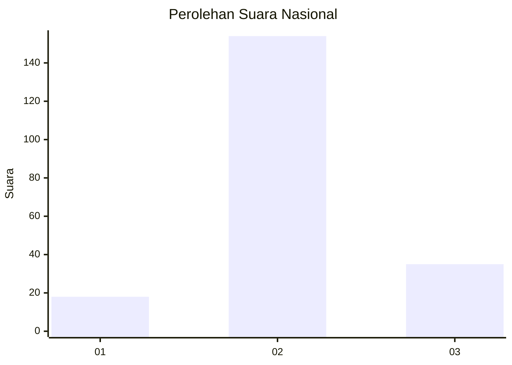
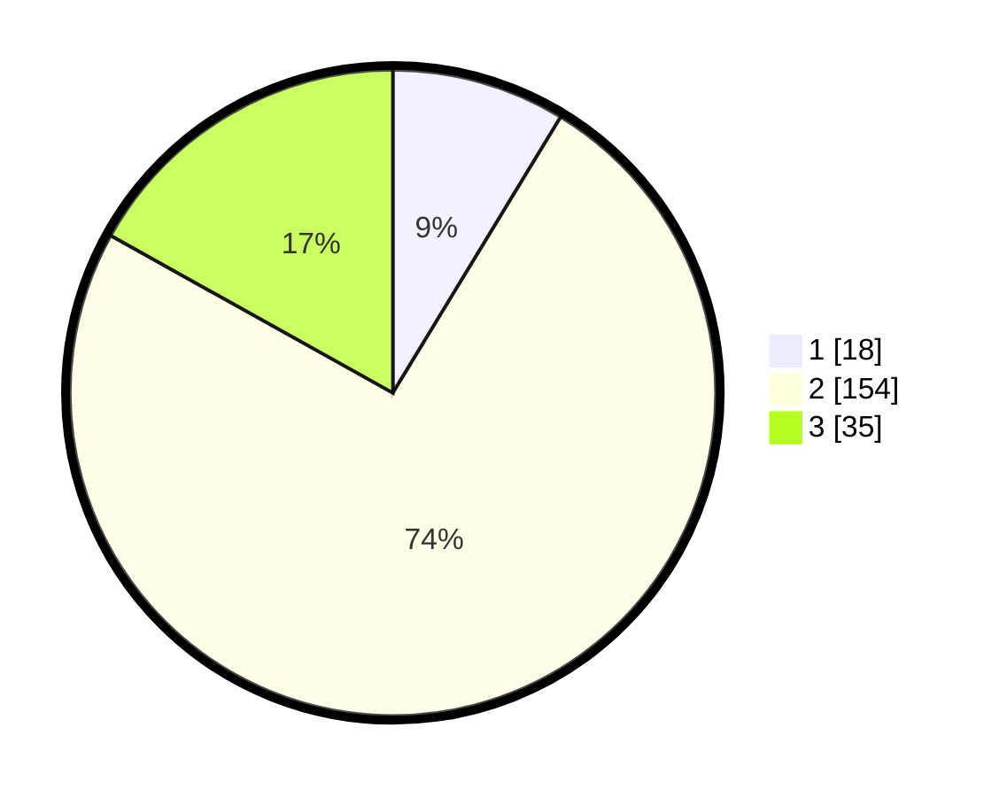

# Hasil

## Grafik

## Tabel

| No. | Nama Paslon    | Suara | Suara (raw) | Persentase |
|:--- |:-------------- | -----:| -----------:| ----------:|
| 1   | ANIES MUHAIMIN | 18    | [18][p-1]   | 8,70       |
| 2   | PRABOWO GIBRAN | 154   | [154][p-2]  | 74,40      |
| 3   | GANJAR MAHFUD  | 35    | [35][p-3]   | 16,91      |

[p-1]: https://github.com/gigit-pemilu/pemilu-2024/blob/main/pilpres/hitung-suara/sub/34-di-yogyakarta/sub/03-gunungkidul/sub/01-wonosari/sub/2012-mulo/sub/001-tps/sub/paslon-1.txt
[p-2]: https://github.com/gigit-pemilu/pemilu-2024/blob/main/pilpres/hitung-suara/sub/34-di-yogyakarta/sub/03-gunungkidul/sub/01-wonosari/sub/2012-mulo/sub/001-tps/sub/paslon-2.txt
[p-3]: https://github.com/gigit-pemilu/pemilu-2024/blob/main/pilpres/hitung-suara/sub/34-di-yogyakarta/sub/03-gunungkidul/sub/01-wonosari/sub/2012-mulo/sub/001-tps/sub/paslon-3.txt

## Foto C Plano

https://sirekap-obj-formc.kpu.go.id/d870/pemilu/ppwp/34/03/01/20/12/3403012012001-20240214-223352--2613ee82-aeb1-488b-b4f5-a8001b5ab708.jpg

https://sirekap-obj-formc.kpu.go.id/d870/pemilu/ppwp/34/03/01/20/12/3403012012001-20240214-223435--53bb1cde-bc6d-432a-abfa-788094ed5215.jpg

https://sirekap-obj-formc.kpu.go.id/d870/pemilu/ppwp/34/03/01/20/12/3403012012001-20240214-223548--221e8910-869a-4ac8-afe0-31f219642a18.jpg

## Metadata

| Key        | Value               |
| ---------- | ------------------- |
| Time Stamp | 2024-02-15 15:00:29 |

