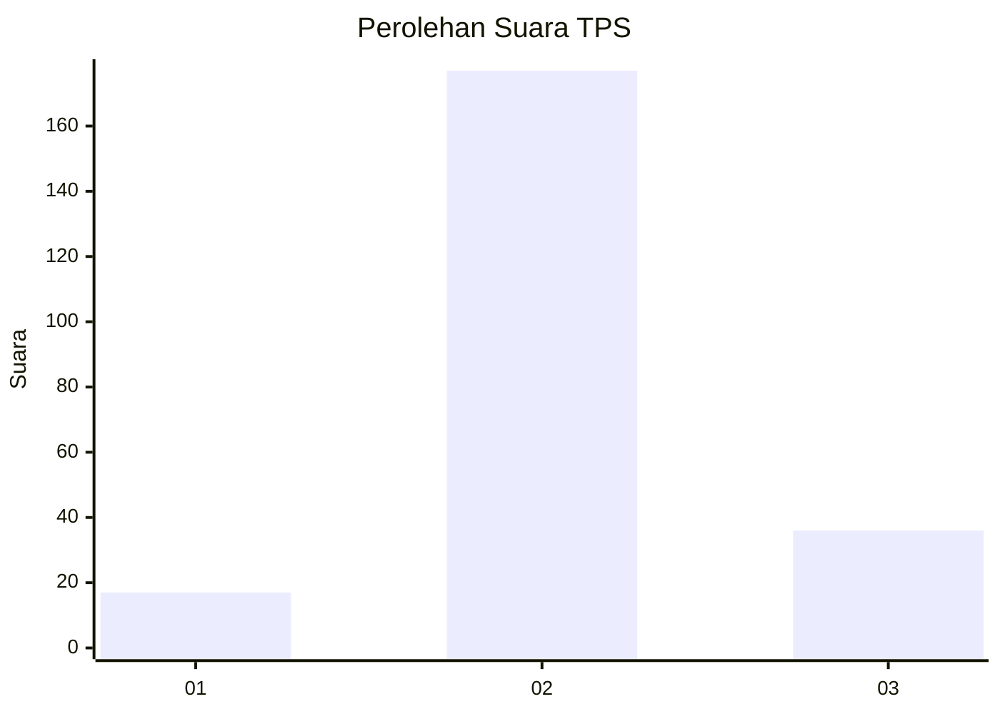
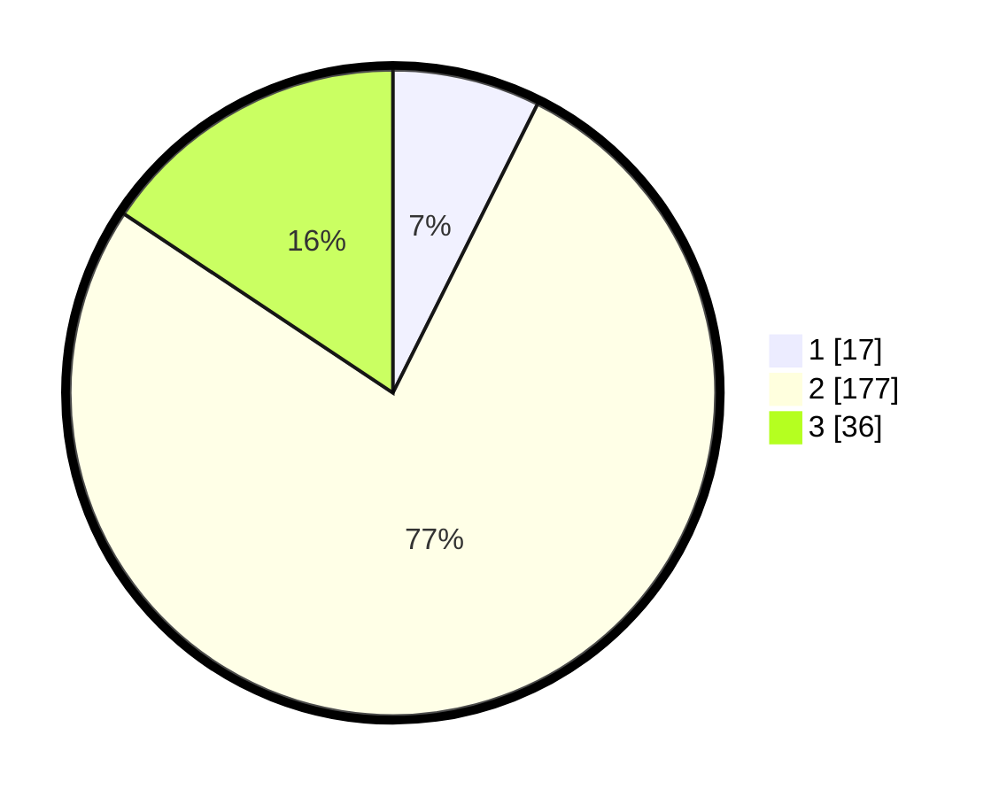

# Hasil

## Grafik

## Tabel

| No. | Nama Paslon    | Suara | Suara (raw) | Persentase |
|:--- |:-------------- | -----:| -----------:| ----------:|
| 1   | ANIES MUHAIMIN | 17    | [17][p-1]   | 7,39       |
| 2   | PRABOWO GIBRAN | 177   | [177][p-2]  | 76,96      |
| 3   | GANJAR MAHFUD  | 36    | [36][p-3]   | 15,65      |

[p-1]: https://github.com/gigit-pemilu/pemilu-2024-34-di-yogyakarta/blob/main/pilpres/hitung-suara/sub/34-di-yogyakarta/sub/03-gunungkidul/sub/01-wonosari/sub/2012-mulo/sub/010-tps/sub/paslon-1.txt
[p-2]: https://github.com/gigit-pemilu/pemilu-2024-34-di-yogyakarta/blob/main/pilpres/hitung-suara/sub/34-di-yogyakarta/sub/03-gunungkidul/sub/01-wonosari/sub/2012-mulo/sub/010-tps/sub/paslon-2.txt
[p-3]: https://github.com/gigit-pemilu/pemilu-2024-34-di-yogyakarta/blob/main/pilpres/hitung-suara/sub/34-di-yogyakarta/sub/03-gunungkidul/sub/01-wonosari/sub/2012-mulo/sub/010-tps/sub/paslon-3.txt

## Foto C Plano

https://sirekap-obj-formc.kpu.go.id/da80/pemilu/ppwp/34/03/01/20/12/3403012012010-20240214-141034--c7f8795f-e80d-405e-b543-a59d85c9b58e.jpg

https://sirekap-obj-formc.kpu.go.id/da80/pemilu/ppwp/34/03/01/20/12/3403012012010-20240214-141216--d02c2899-5354-418c-aa93-4f19c1568614.jpg

https://sirekap-obj-formc.kpu.go.id/da80/pemilu/ppwp/34/03/01/20/12/3403012012010-20240214-141406--e5a4de73-35f8-4d7e-bb4e-14e049920af7.jpg

## Metadata

| Key        | Value               |
| ---------- | ------------------- |
| Time Stamp | 2024-02-15 15:00:29 |

