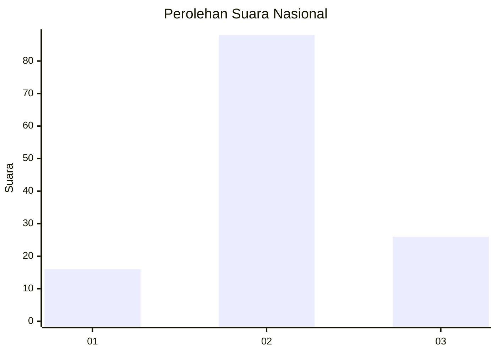
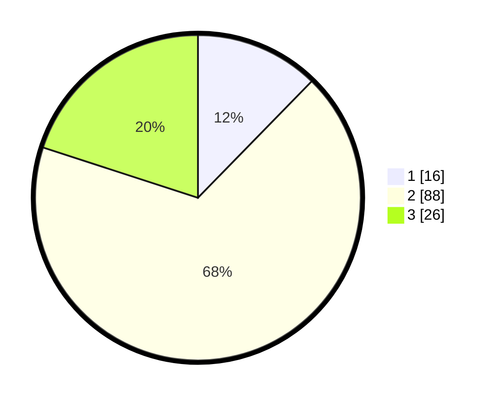

# Hasil

## Grafik

## Tabel

| No. | Nama Paslon    | Suara | Suara (raw) | Persentase |
|:--- |:-------------- | -----:| -----------:| ----------:|
| 1   | ANIES MUHAIMIN | 16    | [16][p-1]   | 12,31      |
| 2   | PRABOWO GIBRAN | 88    | [88][p-2]   | 67,69      |
| 3   | GANJAR MAHFUD  | 26    | [26][p-3]   | 20,00      |

[p-1]: https://github.com/gigit-pemilu/pemilu-2024/blob/main/pilpres/hitung-suara/sub/34-di-yogyakarta/sub/03-gunungkidul/sub/02-nglipar/sub/2001-natah/sub/001-tps/sub/paslon-1.txt
[p-2]: https://github.com/gigit-pemilu/pemilu-2024/blob/main/pilpres/hitung-suara/sub/34-di-yogyakarta/sub/03-gunungkidul/sub/02-nglipar/sub/2001-natah/sub/001-tps/sub/paslon-2.txt
[p-3]: https://github.com/gigit-pemilu/pemilu-2024/blob/main/pilpres/hitung-suara/sub/34-di-yogyakarta/sub/03-gunungkidul/sub/02-nglipar/sub/2001-natah/sub/001-tps/sub/paslon-3.txt

## Foto C Plano

https://sirekap-obj-formc.kpu.go.id/6f2a/pemilu/ppwp/34/03/02/20/01/3403022001001-20240216-052209--098bf78a-3d0e-4bd4-a790-7b026504f173.jpg

https://sirekap-obj-formc.kpu.go.id/6f2a/pemilu/ppwp/34/03/02/20/01/3403022001001-20240216-052220--6cb19fe8-45fc-4cd8-9fbf-c4f02e11b5d4.jpg

https://sirekap-obj-formc.kpu.go.id/6f2a/pemilu/ppwp/34/03/02/20/01/3403022001001-20240216-052216--09274090-7c2c-46cf-9cba-71514739c729.jpg

## Metadata

| Key        | Value               |
| ---------- | ------------------- |
| Time Stamp | 2024-02-17 10:30:03 |

## DATA PEMILIH TETAP

Jumlah pemilih dalam DPT: **157**.
 * L: **73**.
 * P: **84**.

## DATA PENGGUNA HAK PILIH

Jumlah pengguna hak pilih dalam DPT: **129**.
 * L: **60**.
 * P: **69**.

Jumlah pengguna hak pilih dalam DPTb: **3**.
 * L: **1**.
 * P: **2**.

Jumlah pengguna hak pilih dalam DPK: **0**.
 * L: **0**.
 * P: **0**.

Jumlah pengguna hak pilih: **132**.
 * L: **61**.
 * P: **71**.

## JUMLAH SUARA SAH DAN TIDAK SAH

JUMLAH SELURUH SUARA SAH: **130**.

JUMLAH SUARA TIDAK SAH: **2**.

JUMLAH SELURUH SUARA SAH DAN SUARA TIDAK SAH: **132**.

