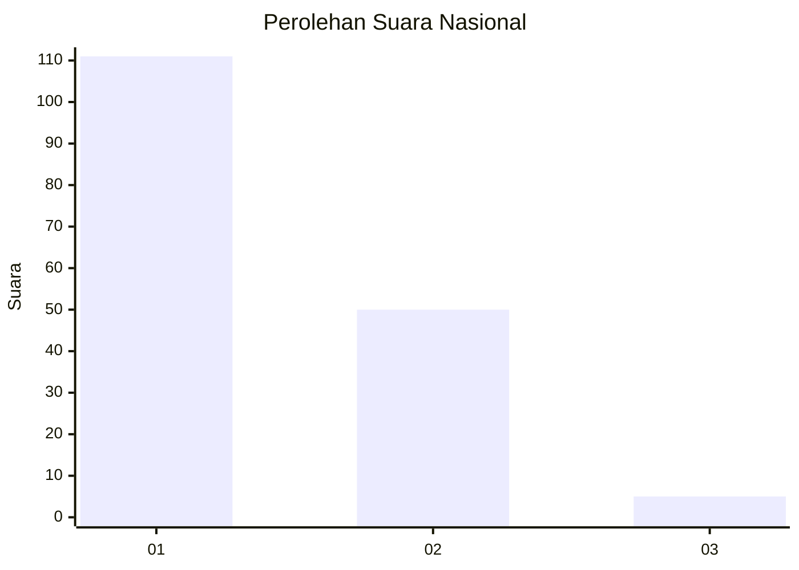
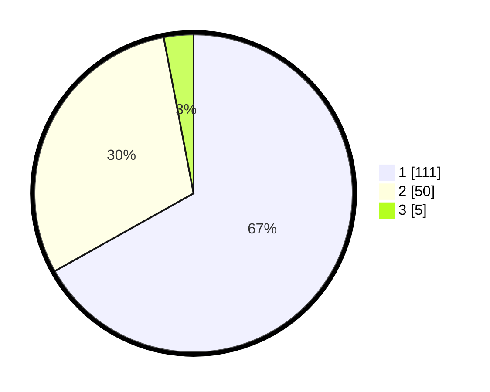

# Hasil

## Grafik

## Tabel

| No. | Nama Paslon    | Suara | Suara (raw) | Persentase |
|:--- |:-------------- | -----:| -----------:| ----------:|
| 1   | ANIES MUHAIMIN | 111   | [111][p-1]  | 66,87      |
| 2   | PRABOWO GIBRAN | 50    | [50][p-2]   | 30,12      |
| 3   | GANJAR MAHFUD  | 5     | [5][p-3]    | 3,01       |

[p-1]: https://github.com/gigit-pemilu/pemilu-2024/blob/main/pilpres/hitung-suara/sub/34-di-yogyakarta/sub/03-gunungkidul/sub/02-nglipar/sub/2001-natah/sub/003-tps/sub/paslon-1.txt
[p-2]: https://github.com/gigit-pemilu/pemilu-2024/blob/main/pilpres/hitung-suara/sub/34-di-yogyakarta/sub/03-gunungkidul/sub/02-nglipar/sub/2001-natah/sub/003-tps/sub/paslon-2.txt
[p-3]: https://github.com/gigit-pemilu/pemilu-2024/blob/main/pilpres/hitung-suara/sub/34-di-yogyakarta/sub/03-gunungkidul/sub/02-nglipar/sub/2001-natah/sub/003-tps/sub/paslon-3.txt

## Foto C Plano

https://sirekap-obj-formc.kpu.go.id/0489/pemilu/ppwp/34/03/02/20/01/3403022001003-20240216-025225--9aa6e807-e302-4a68-8541-22121cd82ca3.jpg

https://sirekap-obj-formc.kpu.go.id/0489/pemilu/ppwp/34/03/02/20/01/3403022001003-20240216-025227--a21b6d63-8ded-452a-bf66-a973dd753b1c.jpg

https://sirekap-obj-formc.kpu.go.id/0489/pemilu/ppwp/34/03/02/20/01/3403022001003-20240216-025226--87d4449d-ef72-4243-a6cc-bae92253bf52.jpg

## Metadata

| Key        | Value               |
| ---------- | ------------------- |
| Time Stamp | 2024-02-21 19:00:00 |

## DATA PEMILIH TETAP

Jumlah pemilih dalam DPT: **158**.
 * L: **79**.
 * P: **79**.

## DATA PENGGUNA HAK PILIH

Jumlah pengguna hak pilih dalam DPT: **135**.
 * L: **64**.
 * P: **71**.

Jumlah pengguna hak pilih dalam DPTb: **0**.
 * L: **0**.
 * P: **0**.

Jumlah pengguna hak pilih dalam DPK: **0**.
 * L: **0**.
 * P: **0**.

Jumlah pengguna hak pilih: **135**.
 * L: **64**.
 * P: **71**.

## JUMLAH SUARA SAH DAN TIDAK SAH

JUMLAH SELURUH SUARA SAH: **132**.

JUMLAH SUARA TIDAK SAH: **3**.

JUMLAH SELURUH SUARA SAH DAN SUARA TIDAK SAH: **135**.

