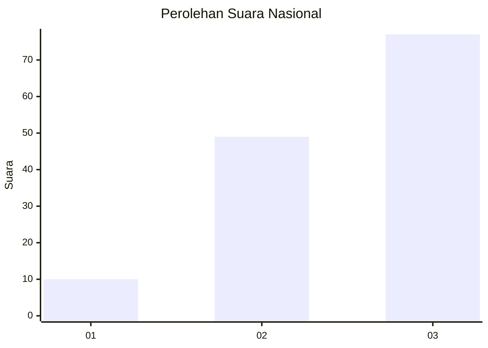
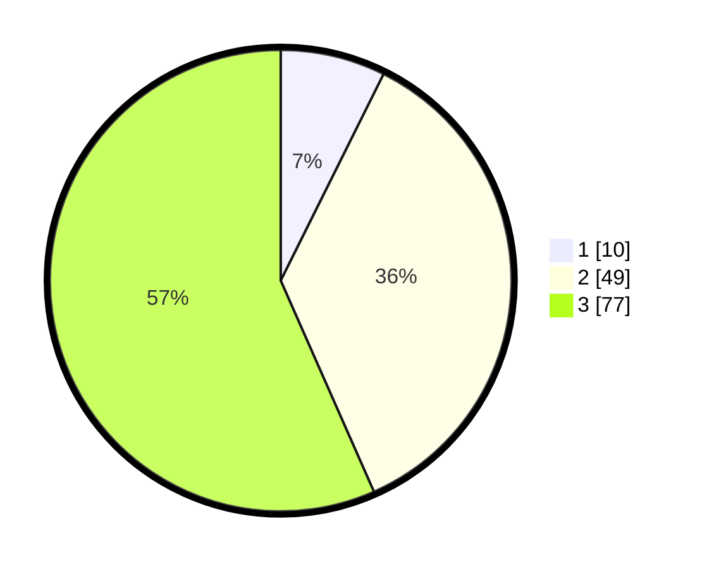

# Hasil

## Grafik

## Tabel

| No. | Nama Paslon    | Suara | Suara (raw) | Persentase |
|:--- |:-------------- | -----:| -----------:| ----------:|
| 1   | ANIES MUHAIMIN | 10    | [10][p-1]   | 7,35       |
| 2   | PRABOWO GIBRAN | 49    | [49][p-2]   | 36,03      |
| 3   | GANJAR MAHFUD  | 77    | [77][p-3]   | 56,62      |

[p-1]: https://github.com/gigit-pemilu/pemilu-2024/blob/main/pilpres/hitung-suara/sub/34-di-yogyakarta/sub/03-gunungkidul/sub/02-nglipar/sub/2001-natah/sub/004-tps/sub/paslon-1.txt
[p-2]: https://github.com/gigit-pemilu/pemilu-2024/blob/main/pilpres/hitung-suara/sub/34-di-yogyakarta/sub/03-gunungkidul/sub/02-nglipar/sub/2001-natah/sub/004-tps/sub/paslon-2.txt
[p-3]: https://github.com/gigit-pemilu/pemilu-2024/blob/main/pilpres/hitung-suara/sub/34-di-yogyakarta/sub/03-gunungkidul/sub/02-nglipar/sub/2001-natah/sub/004-tps/sub/paslon-3.txt

## Foto C Plano

https://sirekap-obj-formc.kpu.go.id/dfa3/pemilu/ppwp/34/03/02/20/01/3403022001004-20240216-211130--80819a35-bce4-44d6-8a96-c1446897b931.jpg

https://sirekap-obj-formc.kpu.go.id/dfa3/pemilu/ppwp/34/03/02/20/01/3403022001004-20240216-211131--c27b2ec2-98f6-48e0-ae83-2c3259829d34.jpg

https://sirekap-obj-formc.kpu.go.id/dfa3/pemilu/ppwp/34/03/02/20/01/3403022001004-20240216-211131--f0127fef-96c2-4419-8898-ac35b8178539.jpg

## Metadata

| Key        | Value               |
| ---------- | ------------------- |
| Time Stamp | 2024-02-17 10:30:03 |

## DATA PEMILIH TETAP

Jumlah pemilih dalam DPT: **170**.
 * L: **85**.
 * P: **85**.

## DATA PENGGUNA HAK PILIH

Jumlah pengguna hak pilih dalam DPT: **139**.
 * L: **68**.
 * P: **71**.

Jumlah pengguna hak pilih dalam DPTb: **1**.
 * L: **0**.
 * P: **1**.

Jumlah pengguna hak pilih dalam DPK: **0**.
 * L: **0**.
 * P: **0**.

Jumlah pengguna hak pilih: **140**.
 * L: **68**.
 * P: **72**.

## JUMLAH SUARA SAH DAN TIDAK SAH

JUMLAH SELURUH SUARA SAH: **136**.

JUMLAH SUARA TIDAK SAH: **4**.

JUMLAH SELURUH SUARA SAH DAN SUARA TIDAK SAH: **140**.

