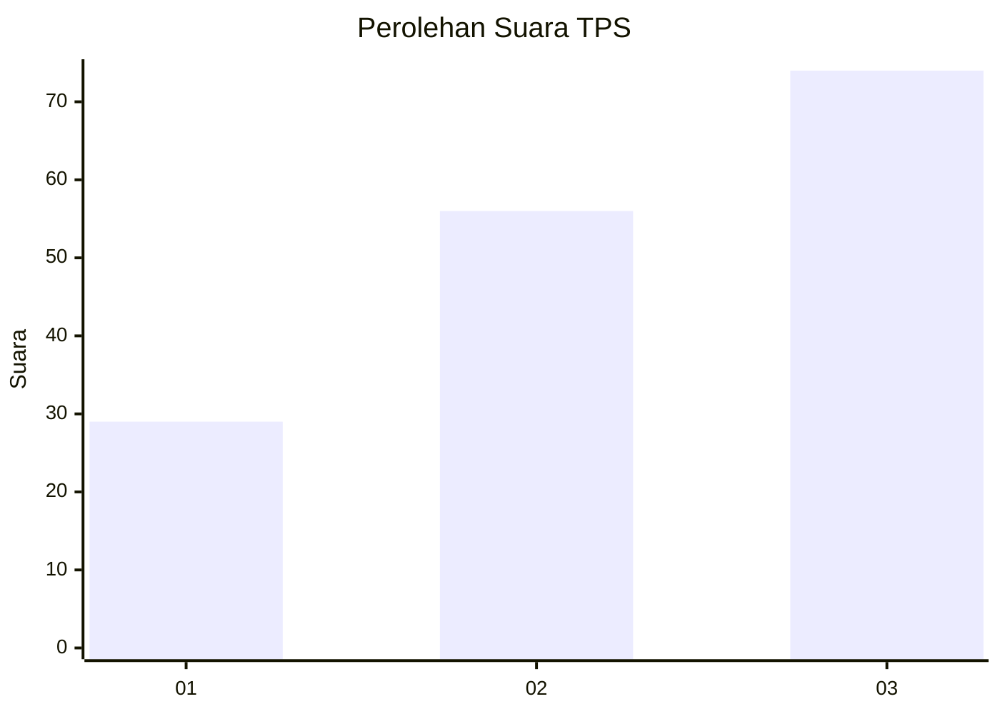
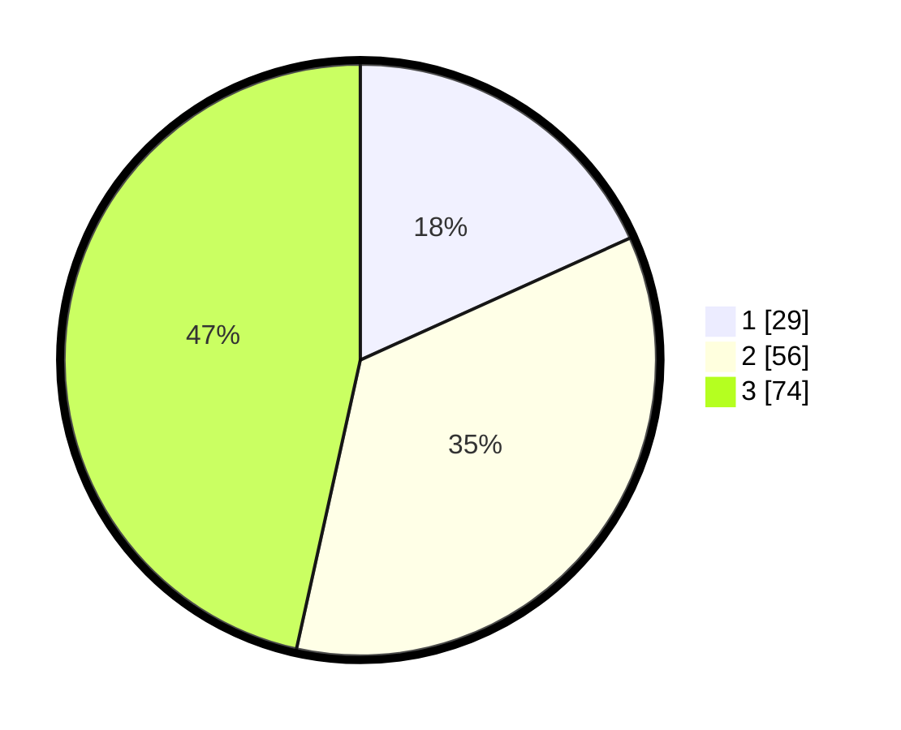

# Hasil

## Grafik

## Tabel

| No. | Nama Paslon    | Suara | Suara (raw) | Persentase |
|:--- |:-------------- | -----:| -----------:| ----------:|
| 1   | ANIES MUHAIMIN | 29    | [29][p-1]   | 18,24      |
| 2   | PRABOWO GIBRAN | 56    | [56][p-2]   | 35,22      |
| 3   | GANJAR MAHFUD  | 74    | [74][p-3]   | 46,54      |

[p-1]: https://github.com/gigit-pemilu/pemilu-2024-34-di-yogyakarta/blob/main/pilpres/hitung-suara/sub/34-di-yogyakarta/sub/03-gunungkidul/sub/02-nglipar/sub/2001-natah/sub/011-tps/sub/paslon-1.txt
[p-2]: https://github.com/gigit-pemilu/pemilu-2024-34-di-yogyakarta/blob/main/pilpres/hitung-suara/sub/34-di-yogyakarta/sub/03-gunungkidul/sub/02-nglipar/sub/2001-natah/sub/011-tps/sub/paslon-2.txt
[p-3]: https://github.com/gigit-pemilu/pemilu-2024-34-di-yogyakarta/blob/main/pilpres/hitung-suara/sub/34-di-yogyakarta/sub/03-gunungkidul/sub/02-nglipar/sub/2001-natah/sub/011-tps/sub/paslon-3.txt

## Foto C Plano

https://sirekap-obj-formc.kpu.go.id/bac9/pemilu/ppwp/34/03/02/20/01/3403022001011-20240216-040458--0b52952b-1637-4f4e-bf9b-9f1f8ebc6c23.jpg

https://sirekap-obj-formc.kpu.go.id/bac9/pemilu/ppwp/34/03/02/20/01/3403022001011-20240216-040510--1ebc31c3-25e2-4d1c-bcc3-2a4fa0bc61e7.jpg

https://sirekap-obj-formc.kpu.go.id/bac9/pemilu/ppwp/34/03/02/20/01/3403022001011-20240216-040506--7e1a7639-e80c-45c0-9f6b-f91aff3f296a.jpg

## Metadata

| Key        | Value               |
| ---------- | ------------------- |
| Time Stamp | 2024-02-17 10:30:03 |

## DATA PEMILIH TETAP

Jumlah pemilih dalam DPT: **226**.
 * L: **113**.
 * P: **113**.

## DATA PENGGUNA HAK PILIH

Jumlah pengguna hak pilih dalam DPT: **180**.
 * L: **88**.
 * P: **92**.

Jumlah pengguna hak pilih dalam DPTb: **3**.
 * L: **1**.
 * P: **2**.

Jumlah pengguna hak pilih dalam DPK: **0**.
 * L: **0**.
 * P: **0**.

Jumlah pengguna hak pilih: **183**.
 * L: **89**.
 * P: **94**.

## JUMLAH SUARA SAH DAN TIDAK SAH

JUMLAH SELURUH SUARA SAH: **159**.

JUMLAH SUARA TIDAK SAH: **24**.

JUMLAH SELURUH SUARA SAH DAN SUARA TIDAK SAH: **183**.

