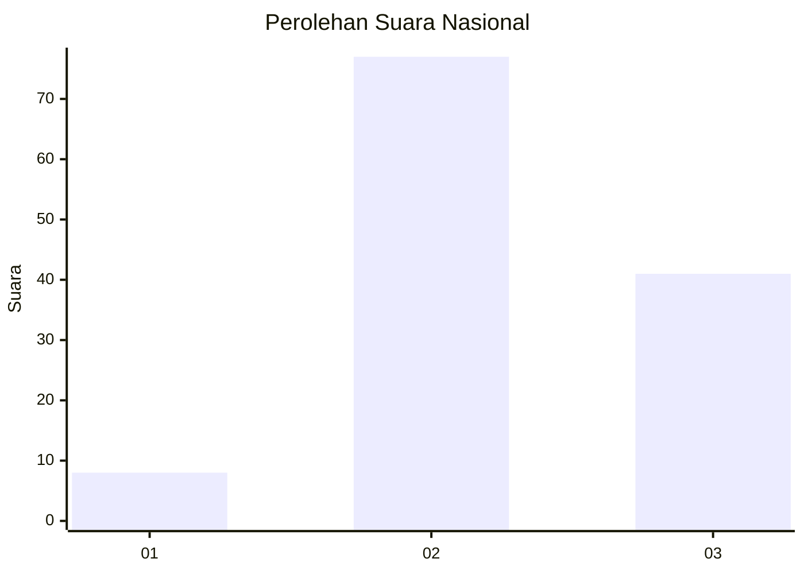
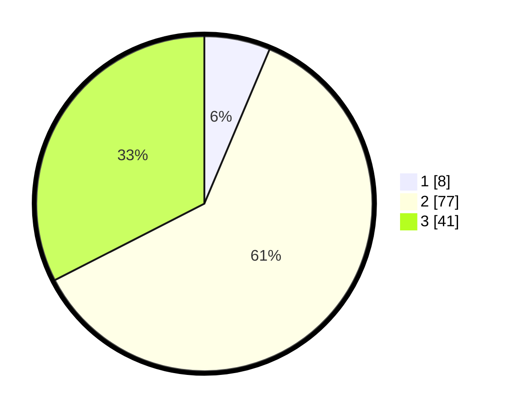

# Hasil

## Grafik

## Tabel

| No. | Nama Paslon    | Suara | Suara (raw) | Persentase |
|:--- |:-------------- | -----:| -----------:| ----------:|
| 1   | ANIES MUHAIMIN | 8     | [8][p-1]    | 6,35       |
| 2   | PRABOWO GIBRAN | 77    | [77][p-2]   | 61,11      |
| 3   | GANJAR MAHFUD  | 41    | [41][p-3]   | 32,54      |

[p-1]: https://github.com/gigit-pemilu/pemilu-2024/blob/main/pilpres/hitung-suara/sub/34-di-yogyakarta/sub/03-gunungkidul/sub/02-nglipar/sub/2002-pilangrejo/sub/005-tps/sub/paslon-1.txt
[p-2]: https://github.com/gigit-pemilu/pemilu-2024/blob/main/pilpres/hitung-suara/sub/34-di-yogyakarta/sub/03-gunungkidul/sub/02-nglipar/sub/2002-pilangrejo/sub/005-tps/sub/paslon-2.txt
[p-3]: https://github.com/gigit-pemilu/pemilu-2024/blob/main/pilpres/hitung-suara/sub/34-di-yogyakarta/sub/03-gunungkidul/sub/02-nglipar/sub/2002-pilangrejo/sub/005-tps/sub/paslon-3.txt

## Foto C Plano

https://sirekap-obj-formc.kpu.go.id/03fe/pemilu/ppwp/34/03/02/20/02/3403022002005-20240214-211817--16eb451b-7be0-4a11-9532-1ddfe3232397.jpg

https://sirekap-obj-formc.kpu.go.id/03fe/pemilu/ppwp/34/03/02/20/02/3403022002005-20240214-212018--80e76f86-f14a-4a7f-b55a-f1a42c8d8d77.jpg

https://sirekap-obj-formc.kpu.go.id/03fe/pemilu/ppwp/34/03/02/20/02/3403022002005-20240214-212052--519d518d-e89a-48a6-a9f3-d59cd3d343d2.jpg

## Metadata

| Key        | Value               |
| ---------- | ------------------- |
| Time Stamp | 2024-02-17 19:30:00 |

