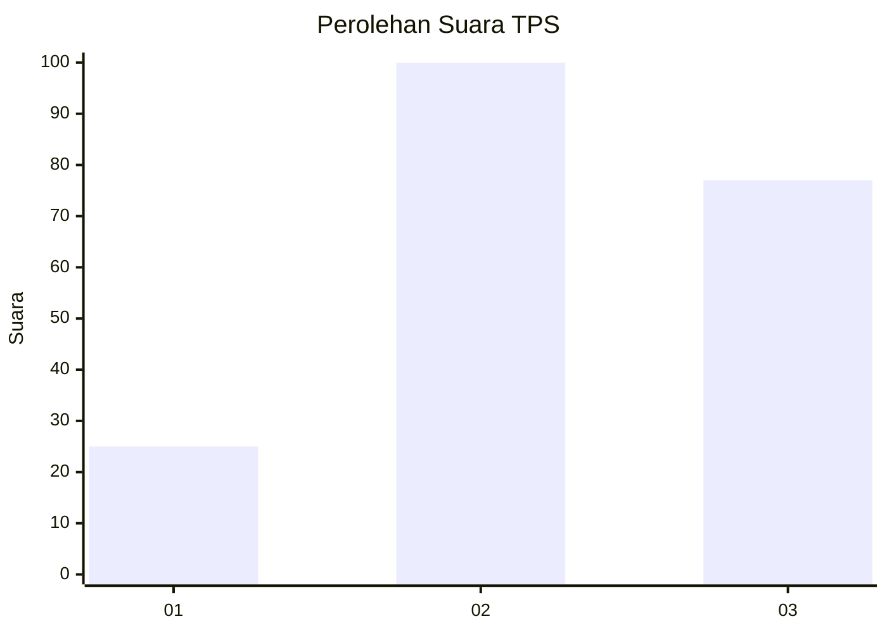
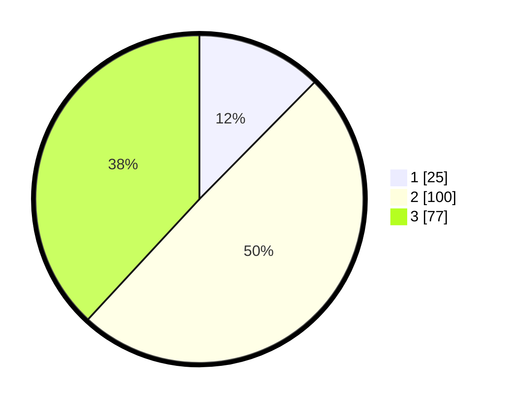

# Hasil

## Grafik

## Tabel

| No. | Nama Paslon    | Suara | Suara (raw) | Persentase |
|:--- |:-------------- | -----:| -----------:| ----------:|
| 1   | ANIES MUHAIMIN | 25    | [25][p-1]   | 12,38      |
| 2   | PRABOWO GIBRAN | 100   | [100][p-2]  | 49,50      |
| 3   | GANJAR MAHFUD  | 77    | [77][p-3]   | 38,12      |

[p-1]: https://github.com/gigit-pemilu/pemilu-2024-34-di-yogyakarta/blob/main/pilpres/hitung-suara/sub/34-di-yogyakarta/sub/03-gunungkidul/sub/02-nglipar/sub/2002-pilangrejo/sub/012-tps/sub/paslon-1.txt
[p-2]: https://github.com/gigit-pemilu/pemilu-2024-34-di-yogyakarta/blob/main/pilpres/hitung-suara/sub/34-di-yogyakarta/sub/03-gunungkidul/sub/02-nglipar/sub/2002-pilangrejo/sub/012-tps/sub/paslon-2.txt
[p-3]: https://github.com/gigit-pemilu/pemilu-2024-34-di-yogyakarta/blob/main/pilpres/hitung-suara/sub/34-di-yogyakarta/sub/03-gunungkidul/sub/02-nglipar/sub/2002-pilangrejo/sub/012-tps/sub/paslon-3.txt

## Foto C Plano

https://sirekap-obj-formc.kpu.go.id/bdab/pemilu/ppwp/34/03/02/20/02/3403022002012-20240214-230332--aabc35a3-a385-4e2b-be28-800b83914ae9.jpg

https://sirekap-obj-formc.kpu.go.id/bdab/pemilu/ppwp/34/03/02/20/02/3403022002012-20240214-225058--ccc80d37-12b9-4e23-99ae-3c3a0abe4ea3.jpg

https://sirekap-obj-formc.kpu.go.id/bdab/pemilu/ppwp/34/03/02/20/02/3403022002012-20240215-052437--c444d7cb-2a98-4927-b14b-13488837e797.jpg

## Metadata

| Key        | Value               |
| ---------- | ------------------- |
| Time Stamp | 2024-02-15 16:00:26 |

