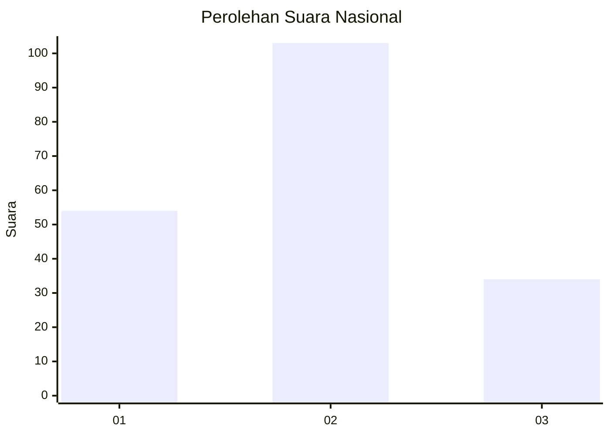
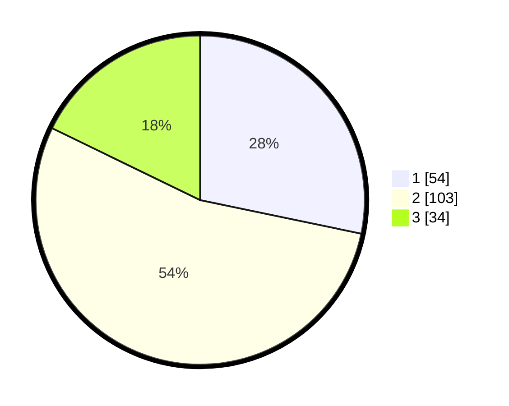

# Hasil

## Grafik

## Tabel

| No. | Nama Paslon    | Suara | Suara (raw) | Persentase |
|:--- |:-------------- | -----:| -----------:| ----------:|
| 1   | ANIES MUHAIMIN | 54    | [54][p-1]   | 28,27      |
| 2   | PRABOWO GIBRAN | 103   | [103][p-2]  | 53,93      |
| 3   | GANJAR MAHFUD  | 34    | [34][p-3]   | 17,80      |

[p-1]: https://github.com/gigit-pemilu/pemilu-2024/blob/main/pilpres/hitung-suara/sub/34-di-yogyakarta/sub/03-gunungkidul/sub/02-nglipar/sub/2003-kedungpoh/sub/002-tps/sub/paslon-1.txt
[p-2]: https://github.com/gigit-pemilu/pemilu-2024/blob/main/pilpres/hitung-suara/sub/34-di-yogyakarta/sub/03-gunungkidul/sub/02-nglipar/sub/2003-kedungpoh/sub/002-tps/sub/paslon-2.txt
[p-3]: https://github.com/gigit-pemilu/pemilu-2024/blob/main/pilpres/hitung-suara/sub/34-di-yogyakarta/sub/03-gunungkidul/sub/02-nglipar/sub/2003-kedungpoh/sub/002-tps/sub/paslon-3.txt

## Foto C Plano

https://sirekap-obj-formc.kpu.go.id/0af3/pemilu/ppwp/34/03/02/20/03/3403022003002-20240214-234824--f3c66d54-a52e-4216-9b22-f180c02abc48.jpg

https://sirekap-obj-formc.kpu.go.id/0af3/pemilu/ppwp/34/03/02/20/03/3403022003002-20240215-034801--85e074eb-9494-483c-9ffb-8f783f183de9.jpg

https://sirekap-obj-formc.kpu.go.id/0af3/pemilu/ppwp/34/03/02/20/03/3403022003002-20240214-215656--984d9433-f309-4b40-85d0-627931521b2c.jpg

## Metadata

| Key        | Value               |
| ---------- | ------------------- |
| Time Stamp | 2024-02-17 19:30:00 |

