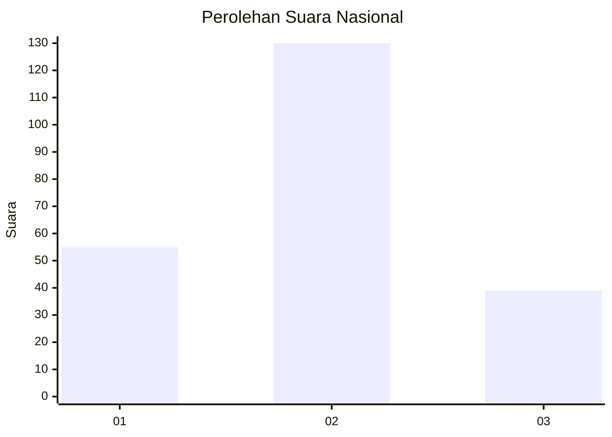
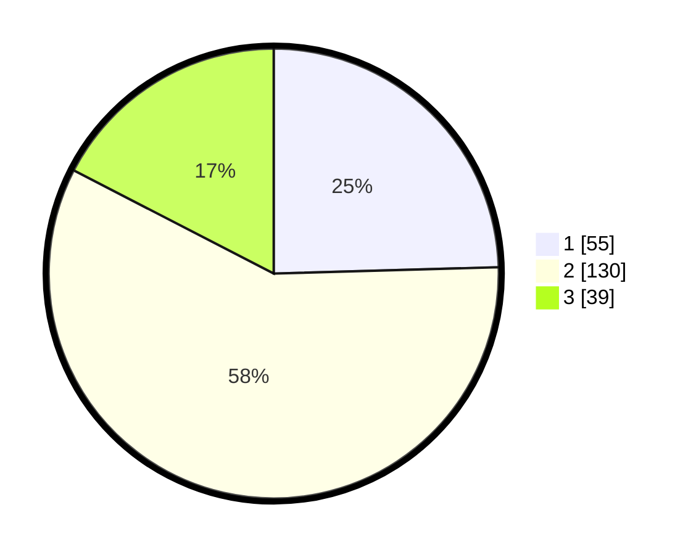

# Hasil

## Grafik

## Tabel

| No. | Nama Paslon    | Suara | Suara (raw) | Persentase |
|:--- |:-------------- | -----:| -----------:| ----------:|
| 1   | ANIES MUHAIMIN | 55    | [55][p-1]   | 24,55      |
| 2   | PRABOWO GIBRAN | 130   | [130][p-2]  | 58,04      |
| 3   | GANJAR MAHFUD  | 39    | [39][p-3]   | 17,41      |

[p-1]: https://github.com/gigit-pemilu/pemilu-2024/blob/main/pilpres/hitung-suara/sub/34-di-yogyakarta/sub/03-gunungkidul/sub/02-nglipar/sub/2003-kedungpoh/sub/004-tps/sub/paslon-1.txt
[p-2]: https://github.com/gigit-pemilu/pemilu-2024/blob/main/pilpres/hitung-suara/sub/34-di-yogyakarta/sub/03-gunungkidul/sub/02-nglipar/sub/2003-kedungpoh/sub/004-tps/sub/paslon-2.txt
[p-3]: https://github.com/gigit-pemilu/pemilu-2024/blob/main/pilpres/hitung-suara/sub/34-di-yogyakarta/sub/03-gunungkidul/sub/02-nglipar/sub/2003-kedungpoh/sub/004-tps/sub/paslon-3.txt

## Foto C Plano

https://sirekap-obj-formc.kpu.go.id/5a55/pemilu/ppwp/34/03/02/20/03/3403022003004-20240215-024104--af595eec-3253-443d-bd15-8bfe87ad36ce.jpg

https://sirekap-obj-formc.kpu.go.id/5a55/pemilu/ppwp/34/03/02/20/03/3403022003004-20240215-032033--cd1a1d42-3906-448a-aa5e-a2ba43641201.jpg

https://sirekap-obj-formc.kpu.go.id/5a55/pemilu/ppwp/34/03/02/20/03/3403022003004-20240215-023649--d036ff86-f020-4bca-a416-fff8a0e52f88.jpg

## Metadata

| Key        | Value               |
| ---------- | ------------------- |
| Time Stamp | 2024-02-17 19:30:00 |

