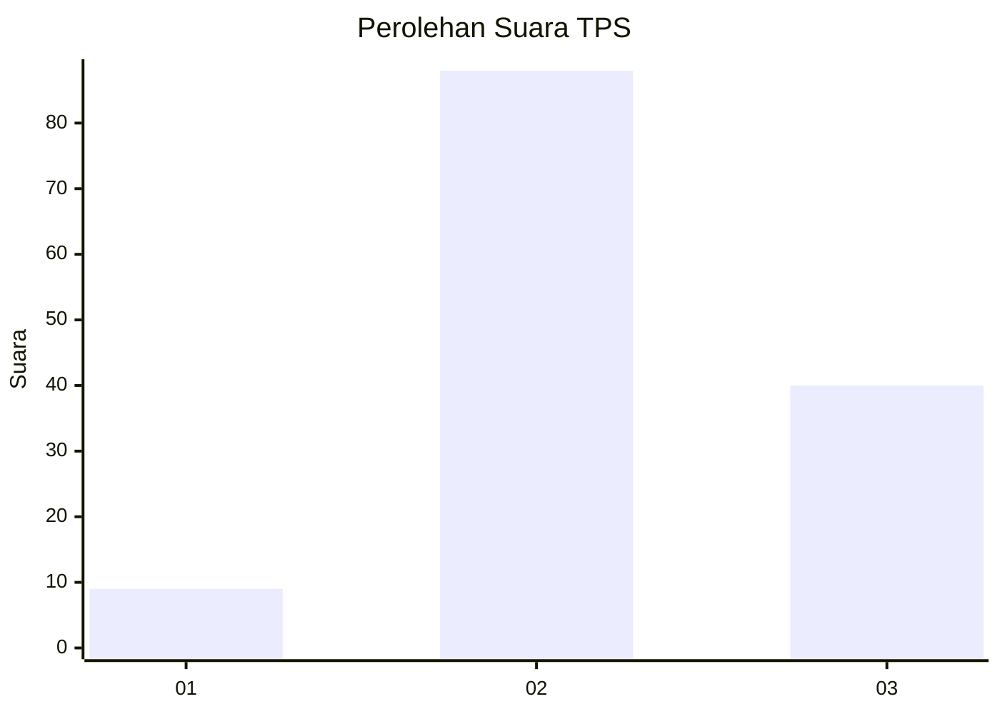
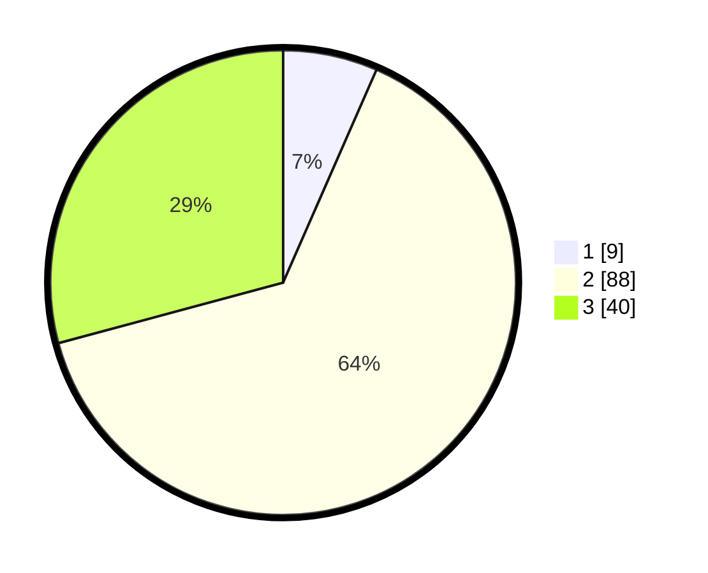

# Hasil

## Grafik

## Tabel

| No. | Nama Paslon    | Suara | Suara (raw) | Persentase |
|:--- |:-------------- | -----:| -----------:| ----------:|
| 1   | ANIES MUHAIMIN | 9     | [9][p-1]    | 6,57       |
| 2   | PRABOWO GIBRAN | 88    | [88][p-2]   | 64,23      |
| 3   | GANJAR MAHFUD  | 40    | [40][p-3]   | 29,20      |

[p-1]: https://github.com/gigit-pemilu/pemilu-2024-34-di-yogyakarta/blob/main/pilpres/hitung-suara/sub/34-di-yogyakarta/sub/03-gunungkidul/sub/02-nglipar/sub/2003-kedungpoh/sub/009-tps/sub/paslon-1.txt
[p-2]: https://github.com/gigit-pemilu/pemilu-2024-34-di-yogyakarta/blob/main/pilpres/hitung-suara/sub/34-di-yogyakarta/sub/03-gunungkidul/sub/02-nglipar/sub/2003-kedungpoh/sub/009-tps/sub/paslon-2.txt
[p-3]: https://github.com/gigit-pemilu/pemilu-2024-34-di-yogyakarta/blob/main/pilpres/hitung-suara/sub/34-di-yogyakarta/sub/03-gunungkidul/sub/02-nglipar/sub/2003-kedungpoh/sub/009-tps/sub/paslon-3.txt

## Foto C Plano

https://sirekap-obj-formc.kpu.go.id/74df/pemilu/ppwp/34/03/02/20/03/3403022003009-20240215-113420--8e9be2e0-91e8-41f5-9e59-60c9bbe26887.jpg

https://sirekap-obj-formc.kpu.go.id/74df/pemilu/ppwp/34/03/02/20/03/3403022003009-20240215-113553--d6d0ba80-bb82-4a67-bcf3-9bb28ff27ead.jpg

https://sirekap-obj-formc.kpu.go.id/74df/pemilu/ppwp/34/03/02/20/03/3403022003009-20240215-113710--1c5d2c06-3fa5-4363-8bb0-a8e138db59c5.jpg

## Metadata

| Key        | Value               |
| ---------- | ------------------- |
| Time Stamp | 2024-02-15 17:00:25 |

