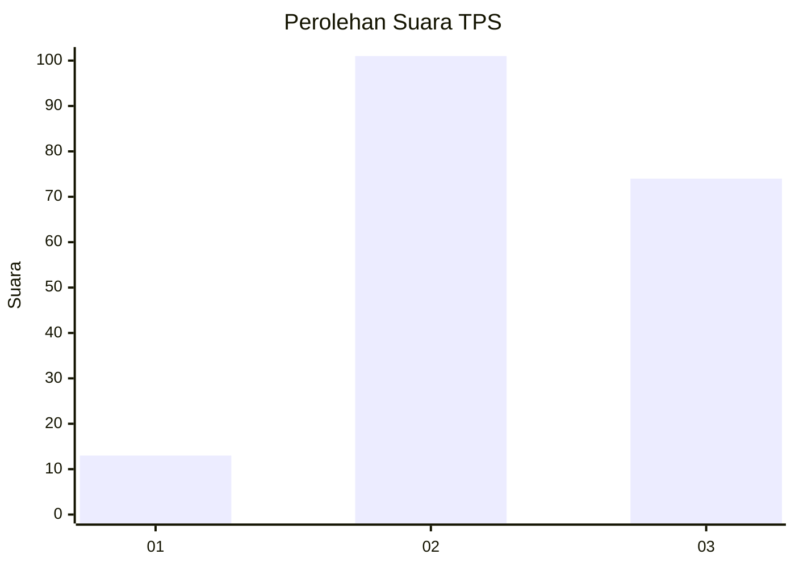
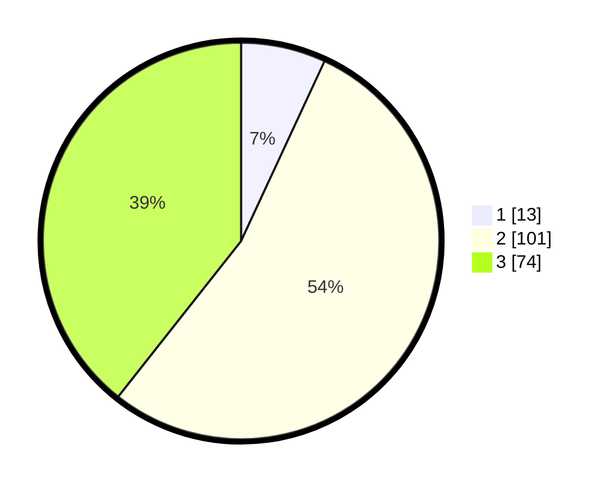

# Hasil

## Grafik

## Tabel

| No. | Nama Paslon    | Suara | Suara (raw) | Persentase |
|:--- |:-------------- | -----:| -----------:| ----------:|
| 1   | ANIES MUHAIMIN | 13    | [13][p-1]   | 6,91       |
| 2   | PRABOWO GIBRAN | 101   | [101][p-2]  | 53,72      |
| 3   | GANJAR MAHFUD  | 74    | [74][p-3]   | 39,36      |

[p-1]: https://github.com/gigit-pemilu/pemilu-2024-34-di-yogyakarta/blob/main/pilpres/hitung-suara/sub/34-di-yogyakarta/sub/03-gunungkidul/sub/02-nglipar/sub/2003-kedungpoh/sub/013-tps/sub/paslon-1.txt
[p-2]: https://github.com/gigit-pemilu/pemilu-2024-34-di-yogyakarta/blob/main/pilpres/hitung-suara/sub/34-di-yogyakarta/sub/03-gunungkidul/sub/02-nglipar/sub/2003-kedungpoh/sub/013-tps/sub/paslon-2.txt
[p-3]: https://github.com/gigit-pemilu/pemilu-2024-34-di-yogyakarta/blob/main/pilpres/hitung-suara/sub/34-di-yogyakarta/sub/03-gunungkidul/sub/02-nglipar/sub/2003-kedungpoh/sub/013-tps/sub/paslon-3.txt

## Foto C Plano

https://sirekap-obj-formc.kpu.go.id/f2c4/pemilu/ppwp/34/03/02/20/03/3403022003013-20240215-024231--b5b6ad26-7985-40fa-a1e9-cb159745b999.jpg

https://sirekap-obj-formc.kpu.go.id/f2c4/pemilu/ppwp/34/03/02/20/03/3403022003013-20240215-024459--9a327e8e-226b-40f4-ba0b-cbb86713653f.jpg

https://sirekap-obj-formc.kpu.go.id/f2c4/pemilu/ppwp/34/03/02/20/03/3403022003013-20240215-024603--f3e16b93-cff3-48f0-993c-ac43acf2f545.jpg

## Metadata

| Key        | Value               |
| ---------- | ------------------- |
| Time Stamp | 2024-02-19 06:16:00 |

