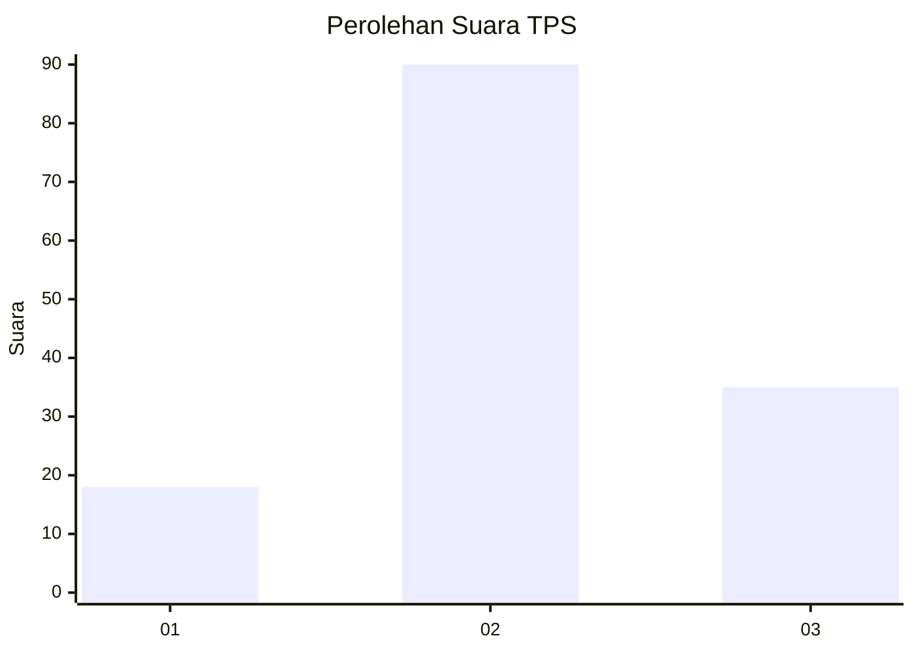
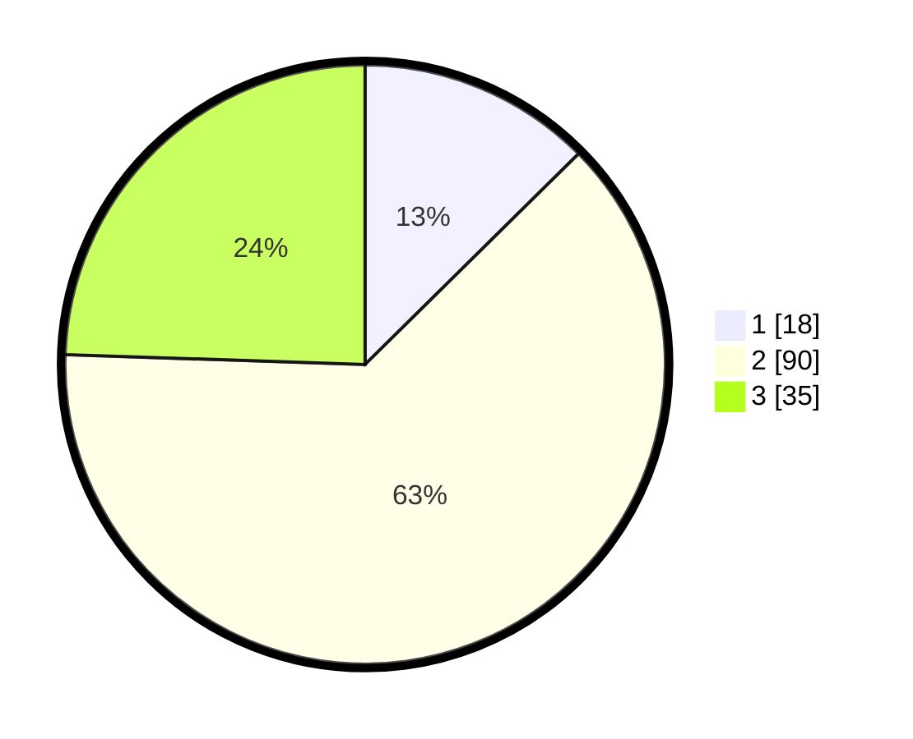

# Hasil

## Grafik

## Tabel

| No. | Nama Paslon    | Suara | Suara (raw) | Persentase |
|:--- |:-------------- | -----:| -----------:| ----------:|
| 1   | ANIES MUHAIMIN | 18    | [18][p-1]   | 12,59      |
| 2   | PRABOWO GIBRAN | 90    | [90][p-2]   | 62,94      |
| 3   | GANJAR MAHFUD  | 35    | [35][p-3]   | 24,48      |

[p-1]: https://github.com/gigit-pemilu/pemilu-2024-34-di-yogyakarta/blob/main/pilpres/hitung-suara/sub/34-di-yogyakarta/sub/03-gunungkidul/sub/02-nglipar/sub/2004-pengkol/sub/007-tps/sub/paslon-1.txt
[p-2]: https://github.com/gigit-pemilu/pemilu-2024-34-di-yogyakarta/blob/main/pilpres/hitung-suara/sub/34-di-yogyakarta/sub/03-gunungkidul/sub/02-nglipar/sub/2004-pengkol/sub/007-tps/sub/paslon-2.txt
[p-3]: https://github.com/gigit-pemilu/pemilu-2024-34-di-yogyakarta/blob/main/pilpres/hitung-suara/sub/34-di-yogyakarta/sub/03-gunungkidul/sub/02-nglipar/sub/2004-pengkol/sub/007-tps/sub/paslon-3.txt

## Foto C Plano

https://sirekap-obj-formc.kpu.go.id/ba61/pemilu/ppwp/34/03/02/20/04/3403022004007-20240214-225420--6a5e0313-6115-4638-9bfc-af61a18addf5.jpg

https://sirekap-obj-formc.kpu.go.id/ba61/pemilu/ppwp/34/03/02/20/04/3403022004007-20240215-054130--39409b63-00ce-4df9-b23c-ec5974eec787.jpg

https://sirekap-obj-formc.kpu.go.id/ba61/pemilu/ppwp/34/03/02/20/04/3403022004007-20240214-225610--11575ac6-b063-4987-a104-4ac1be73f3ee.jpg

## Metadata

| Key        | Value               |
| ---------- | ------------------- |
| Time Stamp | 2024-02-17 19:30:00 |

