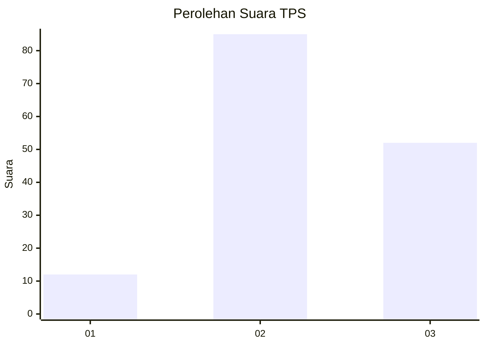
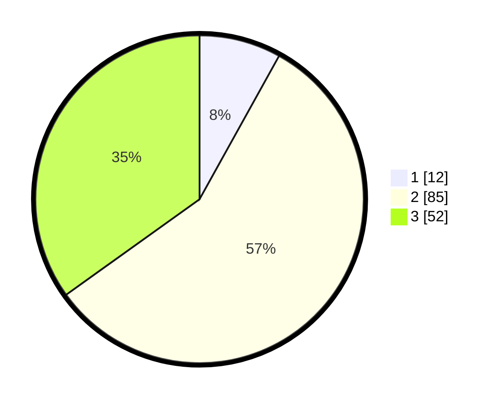

# Hasil

## Grafik

## Tabel

| No. | Nama Paslon    | Suara | Suara (raw) | Persentase |
|:--- |:-------------- | -----:| -----------:| ----------:|
| 1   | ANIES MUHAIMIN | 12    | [12][p-1]   | 8,05       |
| 2   | PRABOWO GIBRAN | 85    | [85][p-2]   | 57,05      |
| 3   | GANJAR MAHFUD  | 52    | [52][p-3]   | 34,90      |

[p-1]: https://github.com/gigit-pemilu/pemilu-2024-34-di-yogyakarta/blob/main/pilpres/hitung-suara/sub/34-di-yogyakarta/sub/03-gunungkidul/sub/02-nglipar/sub/2004-pengkol/sub/011-tps/sub/paslon-1.txt
[p-2]: https://github.com/gigit-pemilu/pemilu-2024-34-di-yogyakarta/blob/main/pilpres/hitung-suara/sub/34-di-yogyakarta/sub/03-gunungkidul/sub/02-nglipar/sub/2004-pengkol/sub/011-tps/sub/paslon-2.txt
[p-3]: https://github.com/gigit-pemilu/pemilu-2024-34-di-yogyakarta/blob/main/pilpres/hitung-suara/sub/34-di-yogyakarta/sub/03-gunungkidul/sub/02-nglipar/sub/2004-pengkol/sub/011-tps/sub/paslon-3.txt

## Foto C Plano

https://sirekap-obj-formc.kpu.go.id/c85a/pemilu/ppwp/34/03/02/20/04/3403022004011-20240214-203546--fb51bf4c-0b53-44fc-9211-d389b5846c05.jpg

https://sirekap-obj-formc.kpu.go.id/c85a/pemilu/ppwp/34/03/02/20/04/3403022004011-20240214-203725--d463d451-364d-44a8-bd58-2bd0539bebfb.jpg

https://sirekap-obj-formc.kpu.go.id/c85a/pemilu/ppwp/34/03/02/20/04/3403022004011-20240214-204720--59de0e68-43d4-4518-b612-b07506053bd9.jpg

## Metadata

| Key        | Value               |
| ---------- | ------------------- |
| Time Stamp | 2024-02-17 19:30:00 |

