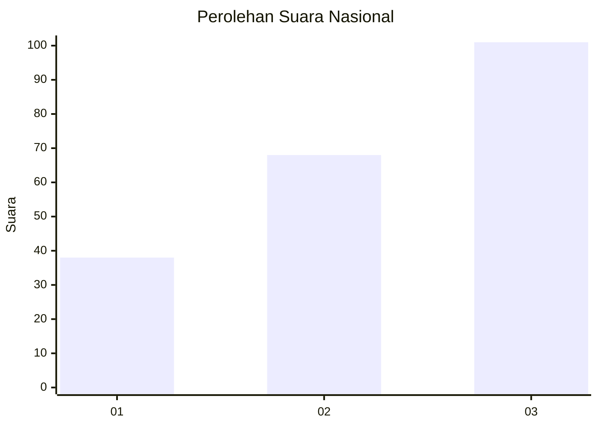
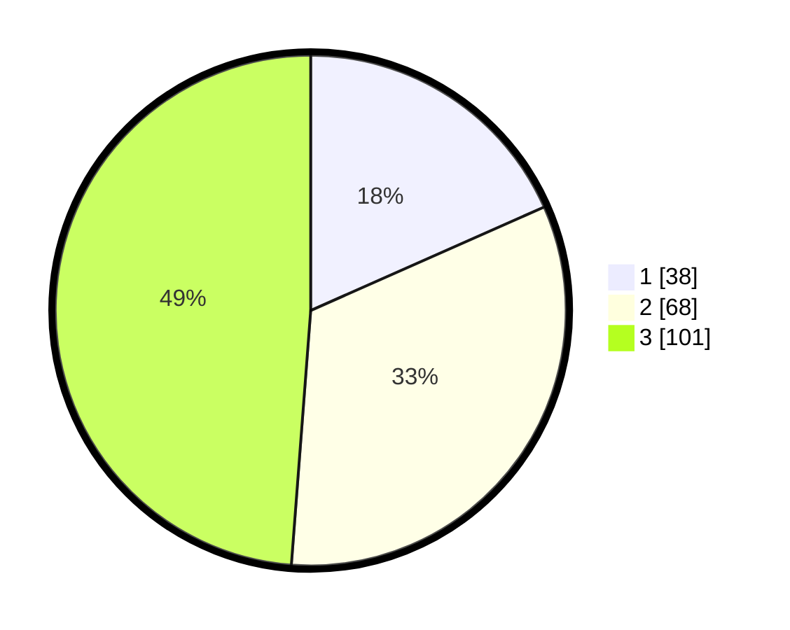

# Hasil

## Grafik

## Tabel

| No. | Nama Paslon    | Suara | Suara (raw) | Persentase |
|:--- |:-------------- | -----:| -----------:| ----------:|
| 1   | ANIES MUHAIMIN | 38    | [38][p-1]   | 18,36      |
| 2   | PRABOWO GIBRAN | 68    | [68][p-2]   | 32,85      |
| 3   | GANJAR MAHFUD  | 101   | [101][p-3]  | 48,79      |

[p-1]: https://github.com/gigit-pemilu/pemilu-2024/blob/main/pilpres/hitung-suara/sub/34-di-yogyakarta/sub/03-gunungkidul/sub/02-nglipar/sub/2004-pengkol/sub/012-tps/sub/paslon-1.txt
[p-2]: https://github.com/gigit-pemilu/pemilu-2024/blob/main/pilpres/hitung-suara/sub/34-di-yogyakarta/sub/03-gunungkidul/sub/02-nglipar/sub/2004-pengkol/sub/012-tps/sub/paslon-2.txt
[p-3]: https://github.com/gigit-pemilu/pemilu-2024/blob/main/pilpres/hitung-suara/sub/34-di-yogyakarta/sub/03-gunungkidul/sub/02-nglipar/sub/2004-pengkol/sub/012-tps/sub/paslon-3.txt

## Foto C Plano

https://sirekap-obj-formc.kpu.go.id/b6c9/pemilu/ppwp/34/03/02/20/04/3403022004012-20240214-213436--83859ccf-10e2-4c41-b8b6-3c51aa910a82.jpg

https://sirekap-obj-formc.kpu.go.id/b6c9/pemilu/ppwp/34/03/02/20/04/3403022004012-20240214-213503--df5b6e8a-0761-471d-beb5-1132c0e5233e.jpg

https://sirekap-obj-formc.kpu.go.id/b6c9/pemilu/ppwp/34/03/02/20/04/3403022004012-20240214-213557--87b1d80f-812d-4776-841b-62974fc5366e.jpg

## Metadata

| Key        | Value               |
| ---------- | ------------------- |
| Time Stamp | 2024-02-17 19:30:00 |

