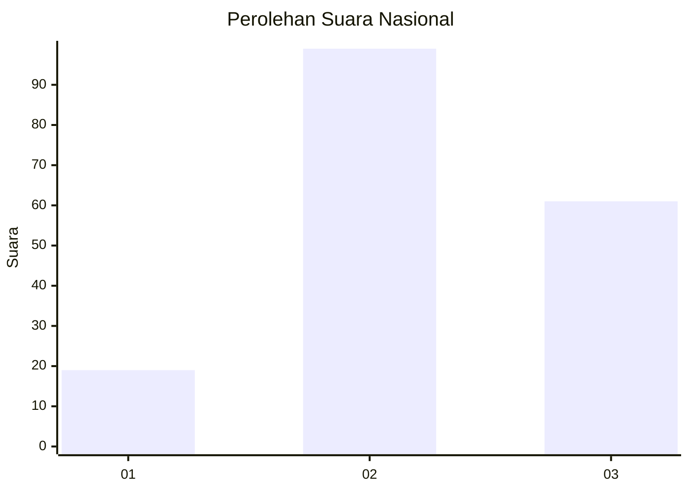
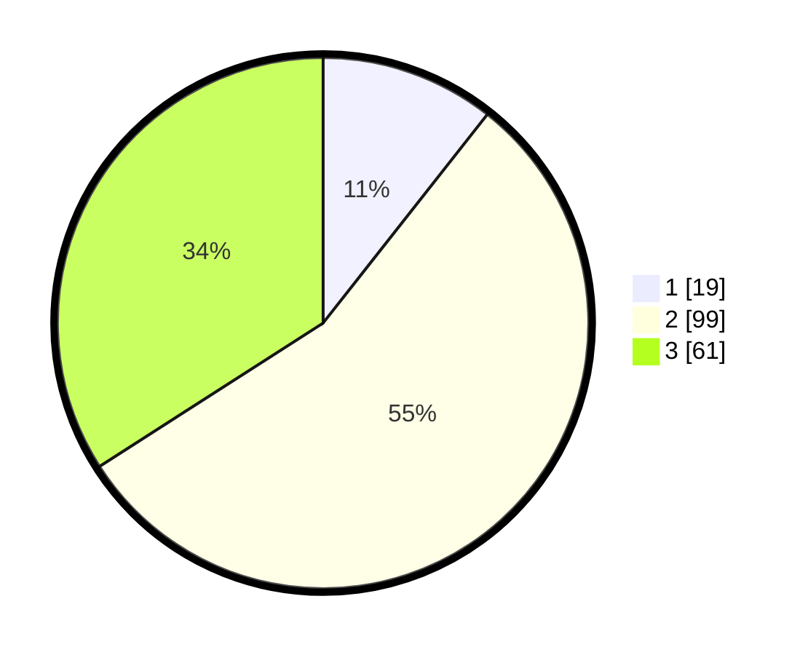

# Hasil

## Grafik

## Tabel

| No. | Nama Paslon    | Suara | Suara (raw) | Persentase |
|:--- |:-------------- | -----:| -----------:| ----------:|
| 1   | ANIES MUHAIMIN | 19    | [19][p-1]   | 10,61      |
| 2   | PRABOWO GIBRAN | 99    | [99][p-2]   | 55,31      |
| 3   | GANJAR MAHFUD  | 61    | [61][p-3]   | 34,08      |

[p-1]: https://github.com/gigit-pemilu/pemilu-2024/blob/main/pilpres/hitung-suara/sub/34-di-yogyakarta/sub/03-gunungkidul/sub/02-nglipar/sub/2004-pengkol/sub/014-tps/sub/paslon-1.txt
[p-2]: https://github.com/gigit-pemilu/pemilu-2024/blob/main/pilpres/hitung-suara/sub/34-di-yogyakarta/sub/03-gunungkidul/sub/02-nglipar/sub/2004-pengkol/sub/014-tps/sub/paslon-2.txt
[p-3]: https://github.com/gigit-pemilu/pemilu-2024/blob/main/pilpres/hitung-suara/sub/34-di-yogyakarta/sub/03-gunungkidul/sub/02-nglipar/sub/2004-pengkol/sub/014-tps/sub/paslon-3.txt

## Foto C Plano

https://sirekap-obj-formc.kpu.go.id/5ee1/pemilu/ppwp/34/03/02/20/04/3403022004014-20240214-225339--1100ee43-f114-4b98-8315-9fa5e75f30c4.jpg

https://sirekap-obj-formc.kpu.go.id/5ee1/pemilu/ppwp/34/03/02/20/04/3403022004014-20240214-225538--0877b493-f2e2-473a-9c59-0cc3367e81f1.jpg

https://sirekap-obj-formc.kpu.go.id/5ee1/pemilu/ppwp/34/03/02/20/04/3403022004014-20240214-225719--eaf6e56b-6c7a-4203-89d3-1f0f5fe719ee.jpg

## Metadata

| Key        | Value               |
| ---------- | ------------------- |
| Time Stamp | 2024-02-19 06:16:00 |

