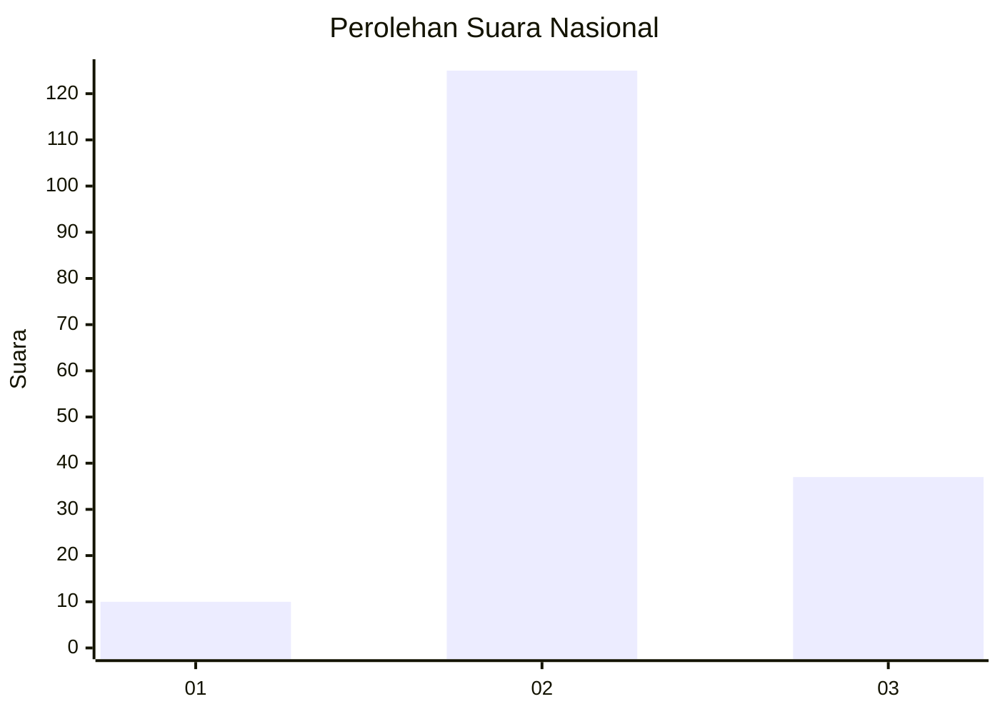

# Hasil

## Grafik

## Tabel

| No. | Nama Paslon    | Suara | Suara (raw) | Persentase |
|:--- |:-------------- | -----:| -----------:| ----------:|
| 1   | ANIES MUHAIMIN | 10    | [10][p-1]   | 5,81       |
| 2   | PRABOWO GIBRAN | 125   | [125][p-2]  | 72,67      |
| 3   | GANJAR MAHFUD  | 37    | [37][p-3]   | 21,51      |

[p-1]: https://github.com/gigit-pemilu/pemilu-2024/blob/main/pilpres/hitung-suara/sub/34-di-yogyakarta/sub/03-gunungkidul/sub/02-nglipar/sub/2005-kedungkeris/sub/003-tps/sub/paslon-1.txt
[p-2]: https://github.com/gigit-pemilu/pemilu-2024/blob/main/pilpres/hitung-suara/sub/34-di-yogyakarta/sub/03-gunungkidul/sub/02-nglipar/sub/2005-kedungkeris/sub/003-tps/sub/paslon-2.txt
[p-3]: https://github.com/gigit-pemilu/pemilu-2024/blob/main/pilpres/hitung-suara/sub/34-di-yogyakarta/sub/03-gunungkidul/sub/02-nglipar/sub/2005-kedungkeris/sub/003-tps/sub/paslon-3.txt

## Foto C Plano

https://sirekap-obj-formc.kpu.go.id/3b26/pemilu/ppwp/34/03/02/20/05/3403022005003-20240214-141555--8224e70c-d04c-4e43-b9e2-2f61212bba4d.jpg

https://sirekap-obj-formc.kpu.go.id/3b26/pemilu/ppwp/34/03/02/20/05/3403022005003-20240215-004310--97493947-bcbf-43bd-9793-7f98b14b9ed3.jpg

https://sirekap-obj-formc.kpu.go.id/3b26/pemilu/ppwp/34/03/02/20/05/3403022005003-20240215-004336--df095833-ab54-430b-b3e5-0087ea71a4f2.jpg

## Metadata

| Key        | Value               |
| ---------- | ------------------- |
| Time Stamp | 2024-02-19 06:16:00 |

