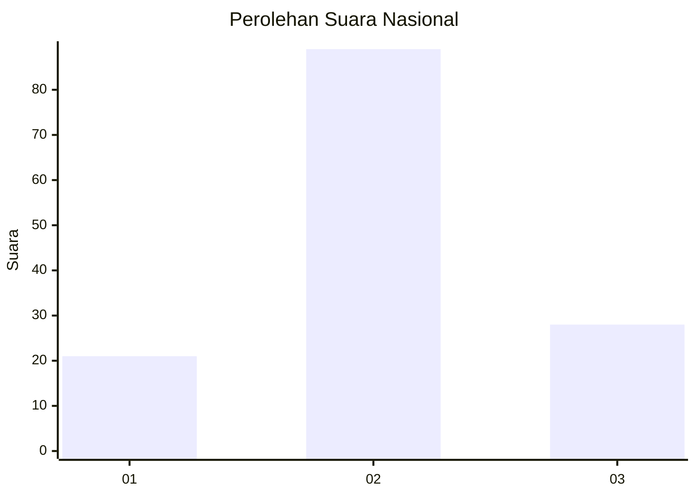
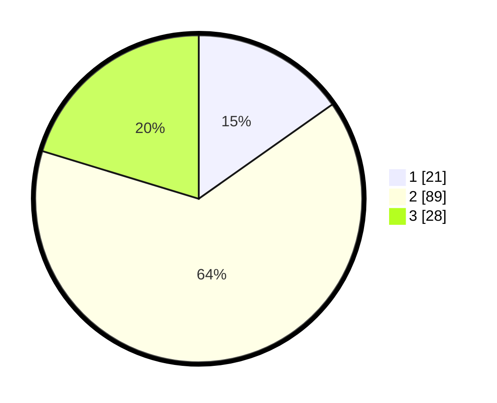

# Hasil

## Grafik

## Tabel

| No. | Nama Paslon    | Suara | Suara (raw) | Persentase |
|:--- |:-------------- | -----:| -----------:| ----------:|
| 1   | ANIES MUHAIMIN | 21    | [21][p-1]   | 15,22      |
| 2   | PRABOWO GIBRAN | 89    | [89][p-2]   | 64,49      |
| 3   | GANJAR MAHFUD  | 28    | [28][p-3]   | 20,29      |

[p-1]: https://github.com/gigit-pemilu/pemilu-2024/blob/main/pilpres/hitung-suara/sub/34-di-yogyakarta/sub/03-gunungkidul/sub/02-nglipar/sub/2005-kedungkeris/sub/006-tps/sub/paslon-1.txt
[p-2]: https://github.com/gigit-pemilu/pemilu-2024/blob/main/pilpres/hitung-suara/sub/34-di-yogyakarta/sub/03-gunungkidul/sub/02-nglipar/sub/2005-kedungkeris/sub/006-tps/sub/paslon-2.txt
[p-3]: https://github.com/gigit-pemilu/pemilu-2024/blob/main/pilpres/hitung-suara/sub/34-di-yogyakarta/sub/03-gunungkidul/sub/02-nglipar/sub/2005-kedungkeris/sub/006-tps/sub/paslon-3.txt

## Foto C Plano

https://sirekap-obj-formc.kpu.go.id/0347/pemilu/ppwp/34/03/02/20/05/3403022005006-20240215-011246--0975f12d-a185-4667-adb8-60c6ff18dbdb.jpg

https://sirekap-obj-formc.kpu.go.id/0347/pemilu/ppwp/34/03/02/20/05/3403022005006-20240215-010833--563e5b7b-c0e8-49e6-a493-8171da4dd21e.jpg

https://sirekap-obj-formc.kpu.go.id/0347/pemilu/ppwp/34/03/02/20/05/3403022005006-20240215-011111--0e847f21-cfa4-4509-8c91-894f21778e50.jpg

## Metadata

| Key        | Value               |
| ---------- | ------------------- |
| Time Stamp | 2024-02-17 19:30:00 |

