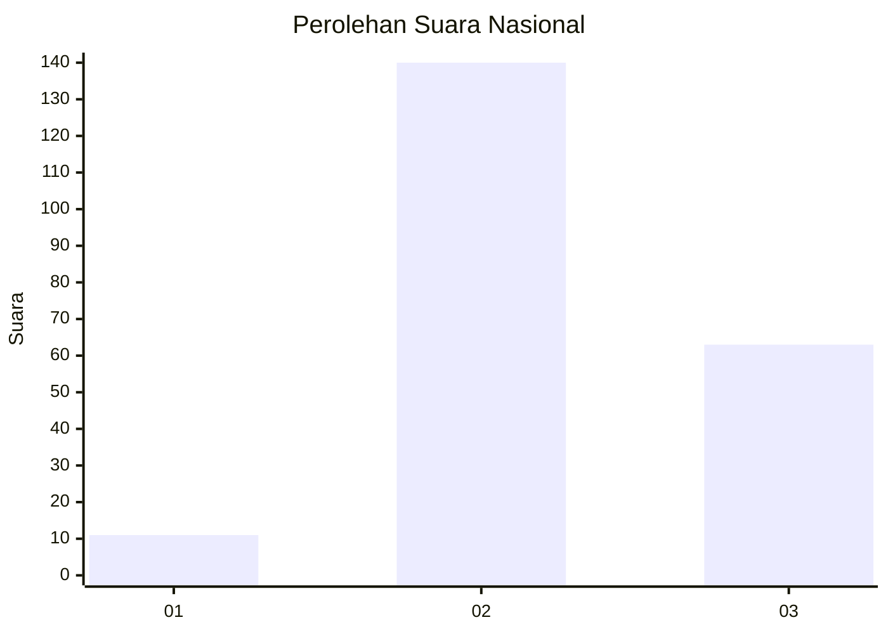

# Hasil

## Grafik

## Tabel

| No. | Nama Paslon    | Suara | Suara (raw) | Persentase |
|:--- |:-------------- | -----:| -----------:| ----------:|
| 1   | ANIES MUHAIMIN | 11    | [11][p-1]   | 5,14       |
| 2   | PRABOWO GIBRAN | 140   | [140][p-2]  | 65,42      |
| 3   | GANJAR MAHFUD  | 63    | [63][p-3]   | 29,44      |

[p-1]: https://github.com/gigit-pemilu/pemilu-2024/blob/main/pilpres/hitung-suara/sub/34-di-yogyakarta/sub/03-gunungkidul/sub/02-nglipar/sub/2005-kedungkeris/sub/017-tps/sub/paslon-1.txt
[p-2]: https://github.com/gigit-pemilu/pemilu-2024/blob/main/pilpres/hitung-suara/sub/34-di-yogyakarta/sub/03-gunungkidul/sub/02-nglipar/sub/2005-kedungkeris/sub/017-tps/sub/paslon-2.txt
[p-3]: https://github.com/gigit-pemilu/pemilu-2024/blob/main/pilpres/hitung-suara/sub/34-di-yogyakarta/sub/03-gunungkidul/sub/02-nglipar/sub/2005-kedungkeris/sub/017-tps/sub/paslon-3.txt

## Foto C Plano

https://sirekap-obj-formc.kpu.go.id/56d0/pemilu/ppwp/34/03/02/20/05/3403022005017-20240215-004357--64e6164a-1040-4c92-b3ee-a77260744ce2.jpg

https://sirekap-obj-formc.kpu.go.id/56d0/pemilu/ppwp/34/03/02/20/05/3403022005017-20240215-005035--8fb5c633-1aa2-44c3-a7c5-5b2eeca2983d.jpg

https://sirekap-obj-formc.kpu.go.id/56d0/pemilu/ppwp/34/03/02/20/05/3403022005017-20240215-005259--361b8aec-9c38-4c94-8512-d081b8c6414f.jpg

## Metadata

| Key        | Value               |
| ---------- | ------------------- |
| Time Stamp | 2024-02-16 08:00:28 |

