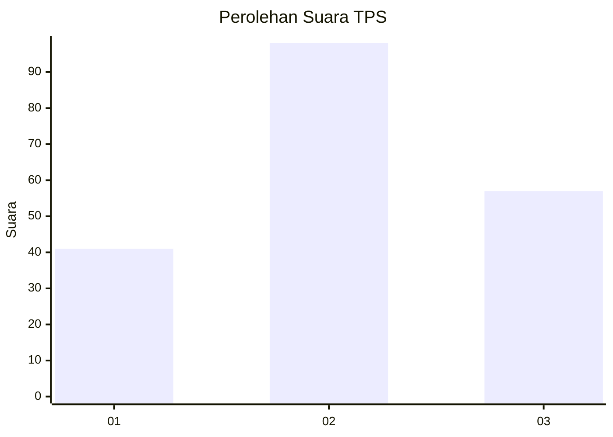
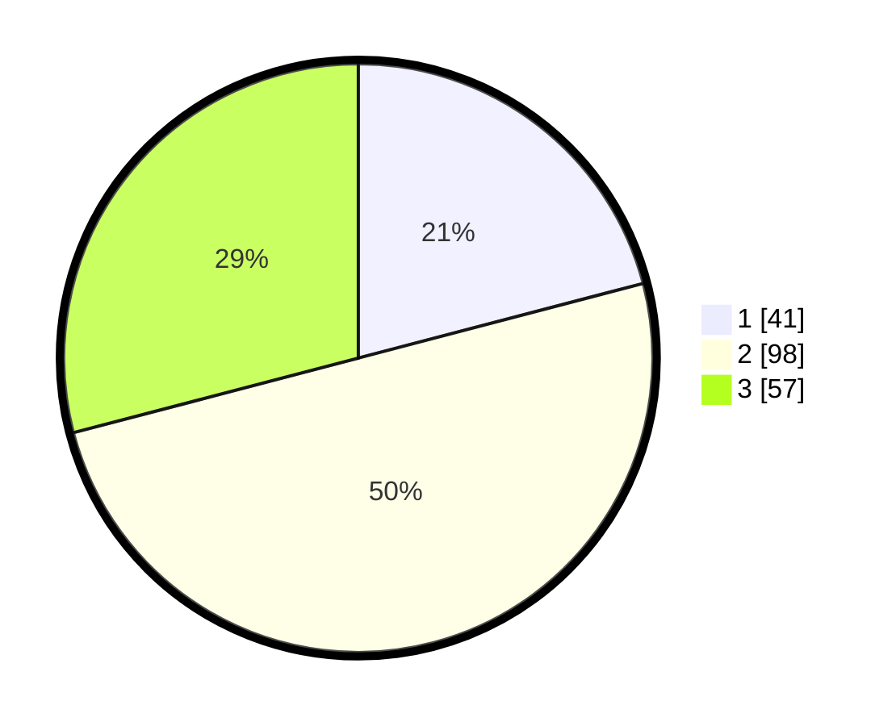

# Hasil

## Grafik

## Tabel

| No. | Nama Paslon    | Suara | Suara (raw) | Persentase |
|:--- |:-------------- | -----:| -----------:| ----------:|
| 1   | ANIES MUHAIMIN | 41    | [41][p-1]   | 20,92      |
| 2   | PRABOWO GIBRAN | 98    | [98][p-2]   | 50,00      |
| 3   | GANJAR MAHFUD  | 57    | [57][p-3]   | 29,08      |

[p-1]: https://github.com/gigit-pemilu/pemilu-2024-34-di-yogyakarta/blob/main/pilpres/hitung-suara/sub/34-di-yogyakarta/sub/03-gunungkidul/sub/02-nglipar/sub/2006-nglipar/sub/006-tps/sub/paslon-1.txt
[p-2]: https://github.com/gigit-pemilu/pemilu-2024-34-di-yogyakarta/blob/main/pilpres/hitung-suara/sub/34-di-yogyakarta/sub/03-gunungkidul/sub/02-nglipar/sub/2006-nglipar/sub/006-tps/sub/paslon-2.txt
[p-3]: https://github.com/gigit-pemilu/pemilu-2024-34-di-yogyakarta/blob/main/pilpres/hitung-suara/sub/34-di-yogyakarta/sub/03-gunungkidul/sub/02-nglipar/sub/2006-nglipar/sub/006-tps/sub/paslon-3.txt

## Foto C Plano

https://sirekap-obj-formc.kpu.go.id/43fe/pemilu/ppwp/34/03/02/20/06/3403022006006-20240214-184548--e9f6a3f3-3565-4dc4-aa60-811d1d4ce7f5.jpg

https://sirekap-obj-formc.kpu.go.id/43fe/pemilu/ppwp/34/03/02/20/06/3403022006006-20240214-184551--dee88fae-ceca-4e5c-bf41-49dbb46a312e.jpg

https://sirekap-obj-formc.kpu.go.id/43fe/pemilu/ppwp/34/03/02/20/06/3403022006006-20240214-184549--b50d1be5-5e39-4d3b-b260-a606523fc6f2.jpg

## Metadata

| Key        | Value               |
| ---------- | ------------------- |
| Time Stamp | 2024-02-15 15:00:29 |

## DATA PEMILIH TETAP

Jumlah pemilih dalam DPT: **216**.
 * L: **114**.
 * P: **102**.

## DATA PENGGUNA HAK PILIH

Jumlah pengguna hak pilih dalam DPT: **187**.
 * L: **96**.
 * P: **91**.

Jumlah pengguna hak pilih dalam DPTb: **12**.
 * L: **6**.
 * P: **6**.

Jumlah pengguna hak pilih dalam DPK: **0**.
 * L: **0**.
 * P: **0**.

Jumlah pengguna hak pilih: **199**.
 * L: **102**.
 * P: **97**.

## JUMLAH SUARA SAH DAN TIDAK SAH

JUMLAH SELURUH SUARA SAH: **196**.

JUMLAH SUARA TIDAK SAH: **3**.

JUMLAH SELURUH SUARA SAH DAN SUARA TIDAK SAH: **199**.

