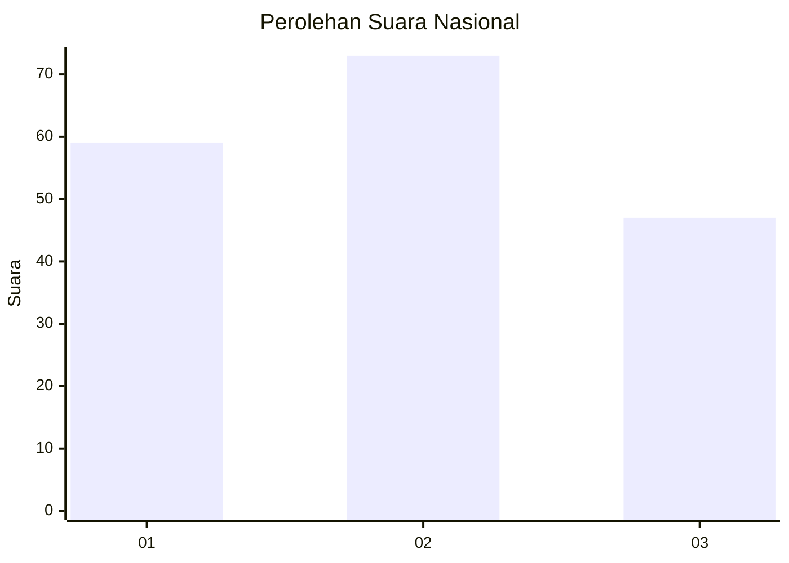
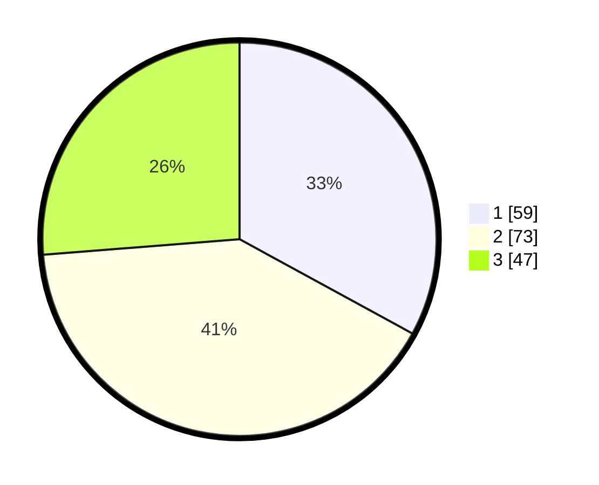

# Hasil

## Grafik

## Tabel

| No. | Nama Paslon    | Suara | Suara (raw) | Persentase |
|:--- |:-------------- | -----:| -----------:| ----------:|
| 1   | ANIES MUHAIMIN | 59    | [59][p-1]   | 32,96      |
| 2   | PRABOWO GIBRAN | 73    | [73][p-2]   | 40,78      |
| 3   | GANJAR MAHFUD  | 47    | [47][p-3]   | 26,26      |

[p-1]: https://github.com/gigit-pemilu/pemilu-2024/blob/main/pilpres/hitung-suara/sub/34-di-yogyakarta/sub/03-gunungkidul/sub/02-nglipar/sub/2006-nglipar/sub/008-tps/sub/paslon-1.txt
[p-2]: https://github.com/gigit-pemilu/pemilu-2024/blob/main/pilpres/hitung-suara/sub/34-di-yogyakarta/sub/03-gunungkidul/sub/02-nglipar/sub/2006-nglipar/sub/008-tps/sub/paslon-2.txt
[p-3]: https://github.com/gigit-pemilu/pemilu-2024/blob/main/pilpres/hitung-suara/sub/34-di-yogyakarta/sub/03-gunungkidul/sub/02-nglipar/sub/2006-nglipar/sub/008-tps/sub/paslon-3.txt

## Foto C Plano

https://sirekap-obj-formc.kpu.go.id/8595/pemilu/ppwp/34/03/02/20/06/3403022006008-20240216-122026--8c6fafad-8581-4b28-b977-72d9a731f67b.jpg

https://sirekap-obj-formc.kpu.go.id/8595/pemilu/ppwp/34/03/02/20/06/3403022006008-20240216-122032--9de033b6-a469-47fc-8359-f55b39f92869.jpg

https://sirekap-obj-formc.kpu.go.id/8595/pemilu/ppwp/34/03/02/20/06/3403022006008-20240216-122027--39e80f23-4a13-4aa4-924e-1d7b121e97ee.jpg

## Metadata

| Key        | Value               |
| ---------- | ------------------- |
| Time Stamp | 2024-02-17 11:30:03 |

## DATA PEMILIH TETAP

Jumlah pemilih dalam DPT: **208**.
 * L: **109**.
 * P: **99**.

## DATA PENGGUNA HAK PILIH

Jumlah pengguna hak pilih dalam DPT: **173**.
 * L: **88**.
 * P: **85**.

Jumlah pengguna hak pilih dalam DPTb: **12**.
 * L: **9**.
 * P: **3**.

Jumlah pengguna hak pilih dalam DPK: **1**.
 * L: **0**.
 * P: **1**.

Jumlah pengguna hak pilih: **186**.
 * L: **97**.
 * P: **89**.

## JUMLAH SUARA SAH DAN TIDAK SAH

JUMLAH SELURUH SUARA SAH: **179**.

JUMLAH SUARA TIDAK SAH: **7**.

JUMLAH SELURUH SUARA SAH DAN SUARA TIDAK SAH: **186**.

