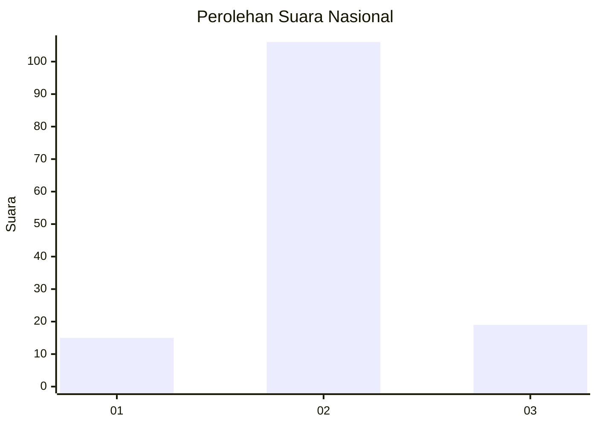
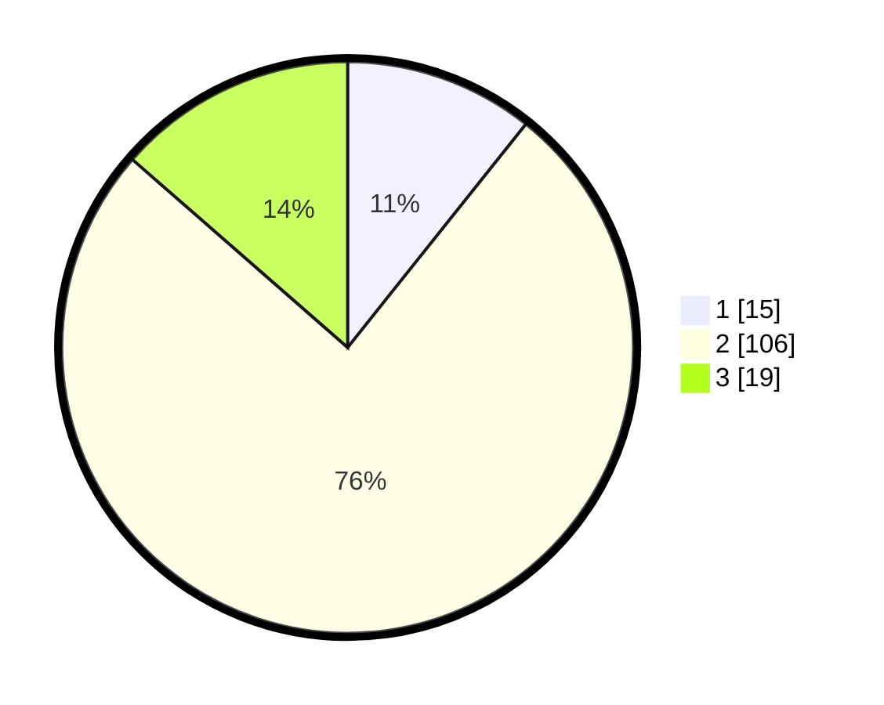

# Hasil

## Grafik

## Tabel

| No. | Nama Paslon    | Suara | Suara (raw) | Persentase |
|:--- |:-------------- | -----:| -----------:| ----------:|
| 1   | ANIES MUHAIMIN | 15    | [15][p-1]   | 10,71      |
| 2   | PRABOWO GIBRAN | 106   | [106][p-2]  | 75,71      |
| 3   | GANJAR MAHFUD  | 19    | [19][p-3]   | 13,57      |

[p-1]: https://github.com/gigit-pemilu/pemilu-2024/blob/main/pilpres/hitung-suara/sub/34-di-yogyakarta/sub/03-gunungkidul/sub/02-nglipar/sub/2007-katongan/sub/008-tps/sub/paslon-1.txt
[p-2]: https://github.com/gigit-pemilu/pemilu-2024/blob/main/pilpres/hitung-suara/sub/34-di-yogyakarta/sub/03-gunungkidul/sub/02-nglipar/sub/2007-katongan/sub/008-tps/sub/paslon-2.txt
[p-3]: https://github.com/gigit-pemilu/pemilu-2024/blob/main/pilpres/hitung-suara/sub/34-di-yogyakarta/sub/03-gunungkidul/sub/02-nglipar/sub/2007-katongan/sub/008-tps/sub/paslon-3.txt

## Foto C Plano

https://sirekap-obj-formc.kpu.go.id/7054/pemilu/ppwp/34/03/02/20/07/3403022007008-20240214-141842--fa3b08cd-f692-4a54-828a-1728d6f4beea.jpg

https://sirekap-obj-formc.kpu.go.id/7054/pemilu/ppwp/34/03/02/20/07/3403022007008-20240215-012652--ff746ad3-4c8d-48e2-9909-c6512fb9eebe.jpg

## Metadata

| Key        | Value               |
| ---------- | ------------------- |
| Time Stamp | 2024-02-15 07:00:44 |

