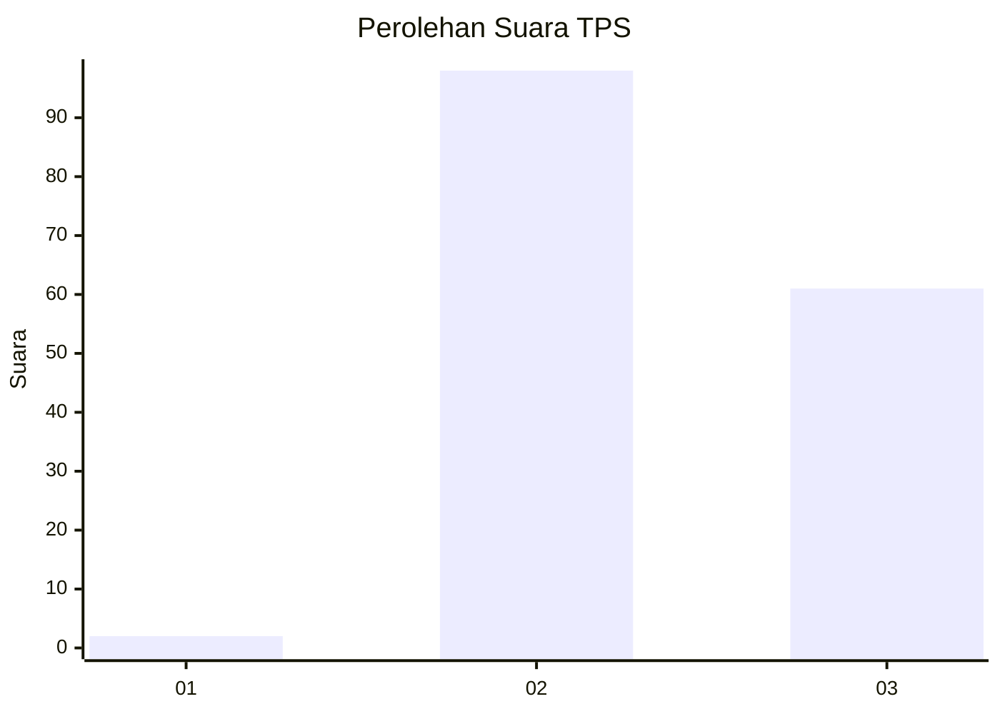
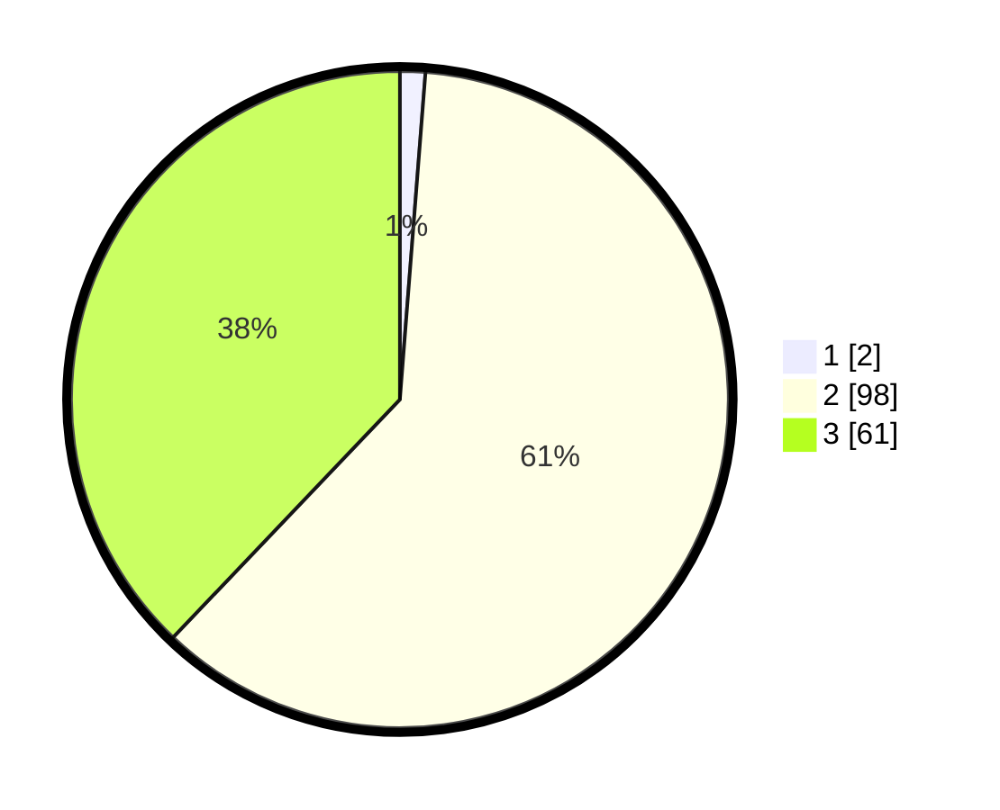

# Hasil

## Grafik

## Tabel

| No. | Nama Paslon    | Suara | Suara (raw) | Persentase |
|:--- |:-------------- | -----:| -----------:| ----------:|
| 1   | ANIES MUHAIMIN | 2     | [2][p-1]    | 1,24       |
| 2   | PRABOWO GIBRAN | 98    | [98][p-2]   | 60,87      |
| 3   | GANJAR MAHFUD  | 61    | [61][p-3]   | 37,89      |

[p-1]: https://github.com/gigit-pemilu/pemilu-2024-34-di-yogyakarta/blob/main/pilpres/hitung-suara/sub/34-di-yogyakarta/sub/03-gunungkidul/sub/02-nglipar/sub/2007-katongan/sub/009-tps/sub/paslon-1.txt
[p-2]: https://github.com/gigit-pemilu/pemilu-2024-34-di-yogyakarta/blob/main/pilpres/hitung-suara/sub/34-di-yogyakarta/sub/03-gunungkidul/sub/02-nglipar/sub/2007-katongan/sub/009-tps/sub/paslon-2.txt
[p-3]: https://github.com/gigit-pemilu/pemilu-2024-34-di-yogyakarta/blob/main/pilpres/hitung-suara/sub/34-di-yogyakarta/sub/03-gunungkidul/sub/02-nglipar/sub/2007-katongan/sub/009-tps/sub/paslon-3.txt

## Foto C Plano

https://sirekap-obj-formc.kpu.go.id/d6e1/pemilu/ppwp/34/03/02/20/07/3403022007009-20240214-222111--0dce7ff7-e154-4fd5-b0e5-395c4ab002ff.jpg

https://sirekap-obj-formc.kpu.go.id/d6e1/pemilu/ppwp/34/03/02/20/07/3403022007009-20240215-015909--1135b77f-a53c-4aeb-82dd-ce275f9d9127.jpg

https://sirekap-obj-formc.kpu.go.id/d6e1/pemilu/ppwp/34/03/02/20/07/3403022007009-20240215-015937--e192b476-bc43-4050-a57d-dc4e8f5e9f9b.jpg

## Metadata

| Key        | Value               |
| ---------- | ------------------- |
| Time Stamp | 2024-02-17 19:30:00 |

