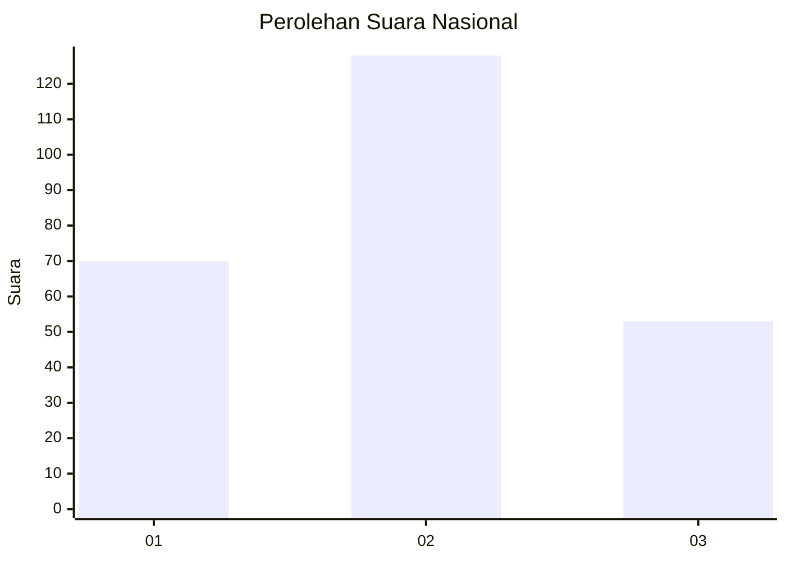
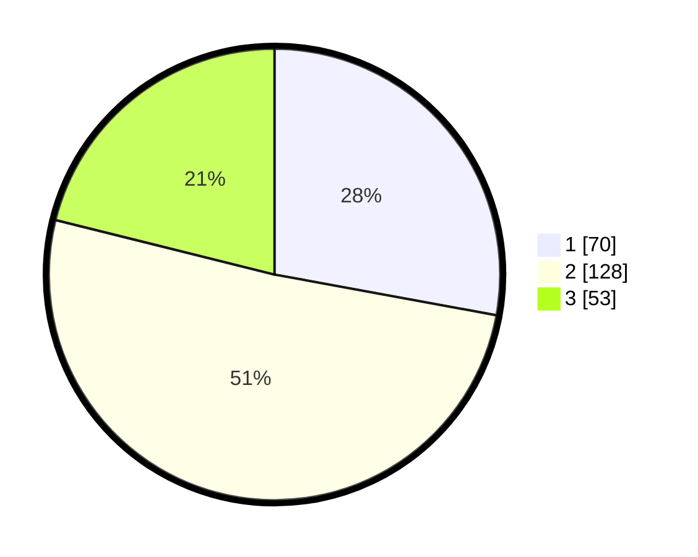

# Hasil

## Grafik

## Tabel

| No. | Nama Paslon    | Suara | Suara (raw) | Persentase |
|:--- |:-------------- | -----:| -----------:| ----------:|
| 1   | ANIES MUHAIMIN | 70    | [70][p-1]   | 27,89      |
| 2   | PRABOWO GIBRAN | 128   | [128][p-2]  | 51,00      |
| 3   | GANJAR MAHFUD  | 53    | [53][p-3]   | 21,12      |

[p-1]: https://github.com/gigit-pemilu/pemilu-2024/blob/main/pilpres/hitung-suara/sub/34-di-yogyakarta/sub/03-gunungkidul/sub/02-nglipar/sub/2007-katongan/sub/013-tps/sub/paslon-1.txt
[p-2]: https://github.com/gigit-pemilu/pemilu-2024/blob/main/pilpres/hitung-suara/sub/34-di-yogyakarta/sub/03-gunungkidul/sub/02-nglipar/sub/2007-katongan/sub/013-tps/sub/paslon-2.txt
[p-3]: https://github.com/gigit-pemilu/pemilu-2024/blob/main/pilpres/hitung-suara/sub/34-di-yogyakarta/sub/03-gunungkidul/sub/02-nglipar/sub/2007-katongan/sub/013-tps/sub/paslon-3.txt

## Foto C Plano

https://sirekap-obj-formc.kpu.go.id/0eac/pemilu/ppwp/34/03/02/20/07/3403022007013-20240215-023551--d80745a0-1f12-4987-bd30-328bc84d53ba.jpg

https://sirekap-obj-formc.kpu.go.id/0eac/pemilu/ppwp/34/03/02/20/07/3403022007013-20240215-021553--e13948fb-2b58-4c66-af3c-c94dceca7d4a.jpg

https://sirekap-obj-formc.kpu.go.id/0eac/pemilu/ppwp/34/03/02/20/07/3403022007013-20240215-023730--7c159f81-f1d0-4b05-a652-986596b5c2f6.jpg

## Metadata

| Key        | Value               |
| ---------- | ------------------- |
| Time Stamp | 2024-02-17 19:30:00 |

