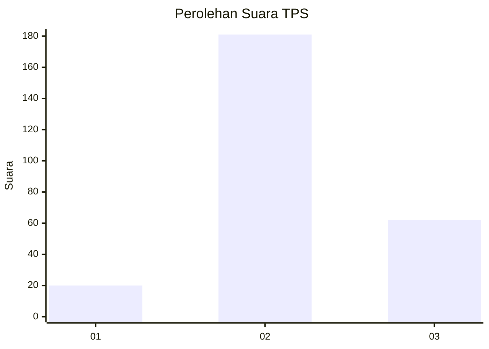
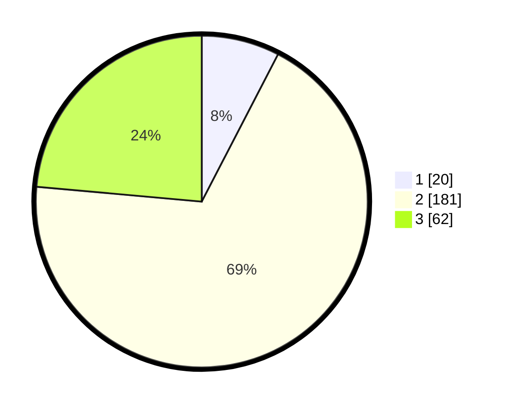

# Hasil

## Grafik

## Tabel

| No. | Nama Paslon    | Suara | Suara (raw) | Persentase |
|:--- |:-------------- | -----:| -----------:| ----------:|
| 1   | ANIES MUHAIMIN | 20    | [20][p-1]   | 7,60       |
| 2   | PRABOWO GIBRAN | 181   | [181][p-2]  | 68,82      |
| 3   | GANJAR MAHFUD  | 62    | [62][p-3]   | 23,57      |

[p-1]: https://github.com/gigit-pemilu/pemilu-2024-34-di-yogyakarta/blob/main/pilpres/hitung-suara/sub/34-di-yogyakarta/sub/03-gunungkidul/sub/02-nglipar/sub/2007-katongan/sub/014-tps/sub/paslon-1.txt
[p-2]: https://github.com/gigit-pemilu/pemilu-2024-34-di-yogyakarta/blob/main/pilpres/hitung-suara/sub/34-di-yogyakarta/sub/03-gunungkidul/sub/02-nglipar/sub/2007-katongan/sub/014-tps/sub/paslon-2.txt
[p-3]: https://github.com/gigit-pemilu/pemilu-2024-34-di-yogyakarta/blob/main/pilpres/hitung-suara/sub/34-di-yogyakarta/sub/03-gunungkidul/sub/02-nglipar/sub/2007-katongan/sub/014-tps/sub/paslon-3.txt

## Foto C Plano

https://sirekap-obj-formc.kpu.go.id/e226/pemilu/ppwp/34/03/02/20/07/3403022007014-20240214-224247--950f1104-48b5-4623-88e7-087ba20ef4eb.jpg

https://sirekap-obj-formc.kpu.go.id/e226/pemilu/ppwp/34/03/02/20/07/3403022007014-20240214-224310--4958c7db-b87f-434e-ac2f-8d893b1d50f6.jpg

https://sirekap-obj-formc.kpu.go.id/e226/pemilu/ppwp/34/03/02/20/07/3403022007014-20240214-224332--41e20f65-6f49-4d5f-9600-16cf96ad26f6.jpg

## Metadata

| Key        | Value               |
| ---------- | ------------------- |
| Time Stamp | 2024-02-17 19:30:00 |

