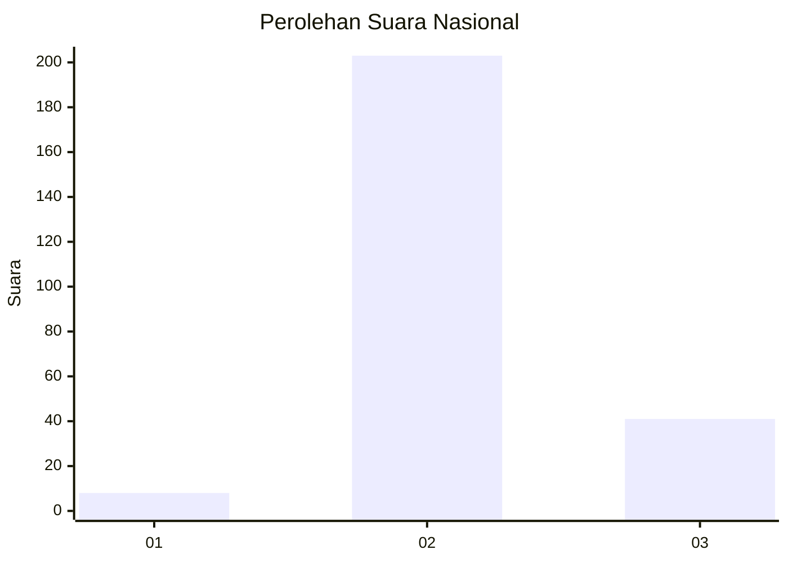
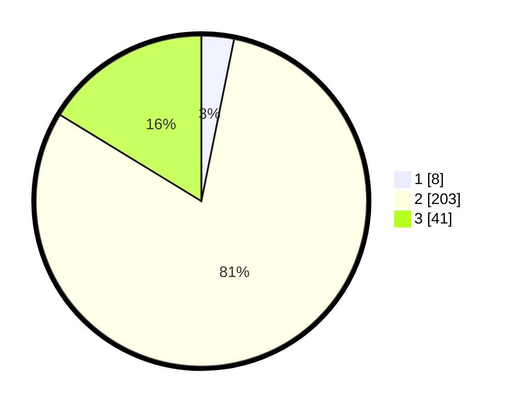

# Hasil

## Grafik

## Tabel

| No. | Nama Paslon    | Suara | Suara (raw) | Persentase |
|:--- |:-------------- | -----:| -----------:| ----------:|
| 1   | ANIES MUHAIMIN | 8     | [8][p-1]    | 3,17       |
| 2   | PRABOWO GIBRAN | 203   | [203][p-2]  | 80,56      |
| 3   | GANJAR MAHFUD  | 41    | [41][p-3]   | 16,27      |

[p-1]: https://github.com/gigit-pemilu/pemilu-2024/blob/main/pilpres/hitung-suara/sub/34-di-yogyakarta/sub/03-gunungkidul/sub/03-playen/sub/2001-banyusoco/sub/001-tps/sub/paslon-1.txt
[p-2]: https://github.com/gigit-pemilu/pemilu-2024/blob/main/pilpres/hitung-suara/sub/34-di-yogyakarta/sub/03-gunungkidul/sub/03-playen/sub/2001-banyusoco/sub/001-tps/sub/paslon-2.txt
[p-3]: https://github.com/gigit-pemilu/pemilu-2024/blob/main/pilpres/hitung-suara/sub/34-di-yogyakarta/sub/03-gunungkidul/sub/03-playen/sub/2001-banyusoco/sub/001-tps/sub/paslon-3.txt

## Foto C Plano

https://sirekap-obj-formc.kpu.go.id/fead/pemilu/ppwp/34/03/03/20/01/3403032001001-20240216-141200--11ea5fb1-ec1a-46cf-8656-301b6b0af865.jpg

https://sirekap-obj-formc.kpu.go.id/fead/pemilu/ppwp/34/03/03/20/01/3403032001001-20240216-141202--eb5c18dc-fcfa-415e-a287-99717c6ad5dc.jpg

https://sirekap-obj-formc.kpu.go.id/fead/pemilu/ppwp/34/03/03/20/01/3403032001001-20240216-141201--f882bf9f-376b-40fc-8381-95951da838fc.jpg

## Metadata

| Key        | Value               |
| ---------- | ------------------- |
| Time Stamp | 2024-02-16 16:25:10 |

## DATA PEMILIH TETAP

Jumlah pemilih dalam DPT: **289**.
 * L: **136**.
 * P: **153**.

## DATA PENGGUNA HAK PILIH

Jumlah pengguna hak pilih dalam DPT: **249**.
 * L: **113**.
 * P: **136**.

Jumlah pengguna hak pilih dalam DPTb: **0**.
 * L: **0**.
 * P: **0**.

Jumlah pengguna hak pilih dalam DPK: **4**.
 * L: **2**.
 * P: **2**.

Jumlah pengguna hak pilih: **253**.
 * L: **115**.
 * P: **138**.

## JUMLAH SUARA SAH DAN TIDAK SAH

JUMLAH SELURUH SUARA SAH: **252**.

JUMLAH SUARA TIDAK SAH: **1**.

JUMLAH SELURUH SUARA SAH DAN SUARA TIDAK SAH: **253**.

