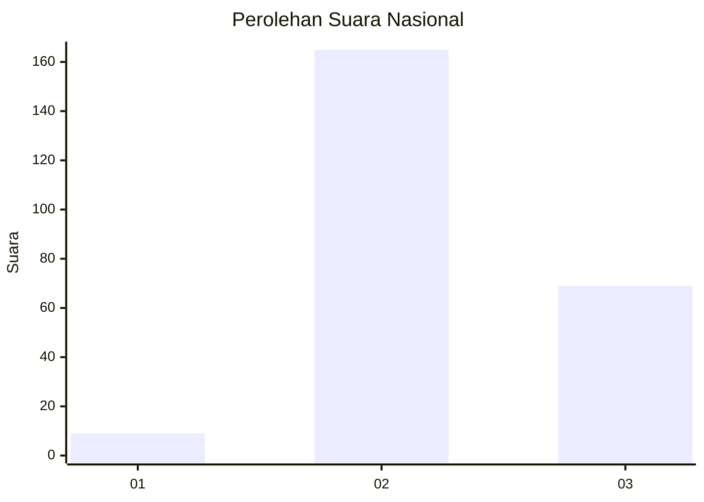
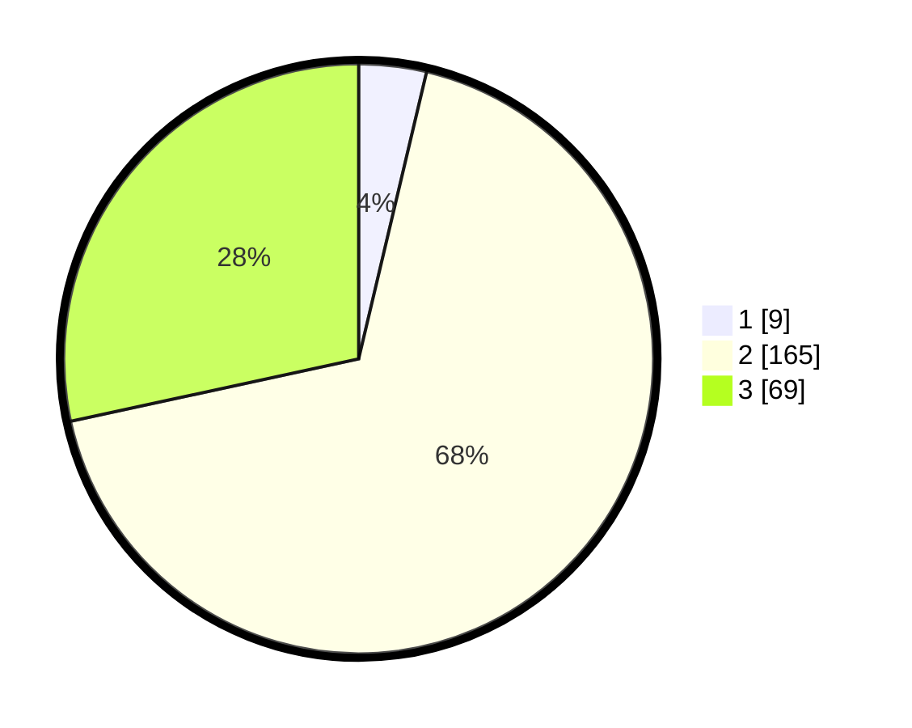

# Hasil

## Grafik

## Tabel

| No. | Nama Paslon    | Suara | Suara (raw) | Persentase |
|:--- |:-------------- | -----:| -----------:| ----------:|
| 1   | ANIES MUHAIMIN | 9     | [9][p-1]    | 3,70       |
| 2   | PRABOWO GIBRAN | 165   | [165][p-2]  | 67,90      |
| 3   | GANJAR MAHFUD  | 69    | [69][p-3]   | 28,40      |

[p-1]: https://github.com/gigit-pemilu/pemilu-2024/blob/main/pilpres/hitung-suara/sub/34-di-yogyakarta/sub/03-gunungkidul/sub/03-playen/sub/2001-banyusoco/sub/002-tps/sub/paslon-1.txt
[p-2]: https://github.com/gigit-pemilu/pemilu-2024/blob/main/pilpres/hitung-suara/sub/34-di-yogyakarta/sub/03-gunungkidul/sub/03-playen/sub/2001-banyusoco/sub/002-tps/sub/paslon-2.txt
[p-3]: https://github.com/gigit-pemilu/pemilu-2024/blob/main/pilpres/hitung-suara/sub/34-di-yogyakarta/sub/03-gunungkidul/sub/03-playen/sub/2001-banyusoco/sub/002-tps/sub/paslon-3.txt

## Foto C Plano

https://sirekap-obj-formc.kpu.go.id/ba41/pemilu/ppwp/34/03/03/20/01/3403032001002-20240216-132517--c9c0612c-c194-4a14-815a-be173cbea16e.jpg

https://sirekap-obj-formc.kpu.go.id/ba41/pemilu/ppwp/34/03/03/20/01/3403032001002-20240216-132518--00bee74e-7b33-4b66-aeeb-0a3f3ab26157.jpg

https://sirekap-obj-formc.kpu.go.id/ba41/pemilu/ppwp/34/03/03/20/01/3403032001002-20240216-132517--a47a6d55-dfdf-48a0-a846-60e229c5ed75.jpg

## Metadata

| Key        | Value               |
| ---------- | ------------------- |
| Time Stamp | 2024-02-16 16:25:10 |

## DATA PEMILIH TETAP

Jumlah pemilih dalam DPT: **293**.
 * L: **141**.
 * P: **152**.

## DATA PENGGUNA HAK PILIH

Jumlah pengguna hak pilih dalam DPT: **247**.
 * L: **117**.
 * P: **130**.

Jumlah pengguna hak pilih dalam DPTb: **0**.
 * L: **0**.
 * P: **0**.

Jumlah pengguna hak pilih dalam DPK: **3**.
 * L: **1**.
 * P: **2**.

Jumlah pengguna hak pilih: **250**.
 * L: **118**.
 * P: **132**.

## JUMLAH SUARA SAH DAN TIDAK SAH

JUMLAH SELURUH SUARA SAH: **243**.

JUMLAH SUARA TIDAK SAH: **7**.

JUMLAH SELURUH SUARA SAH DAN SUARA TIDAK SAH: **250**.

