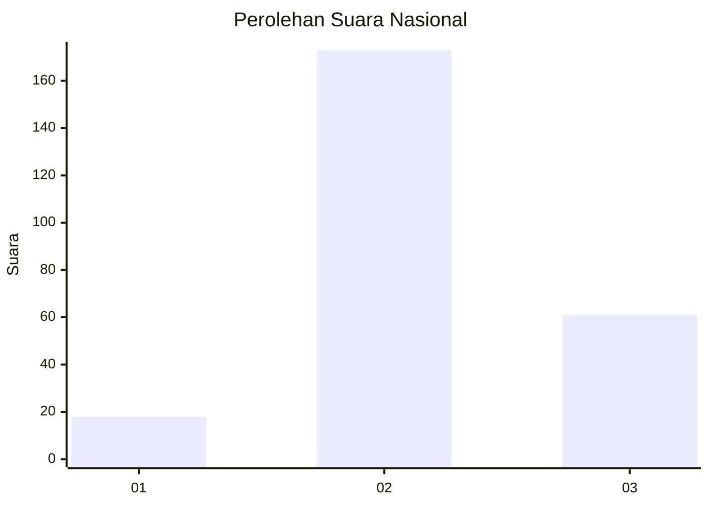
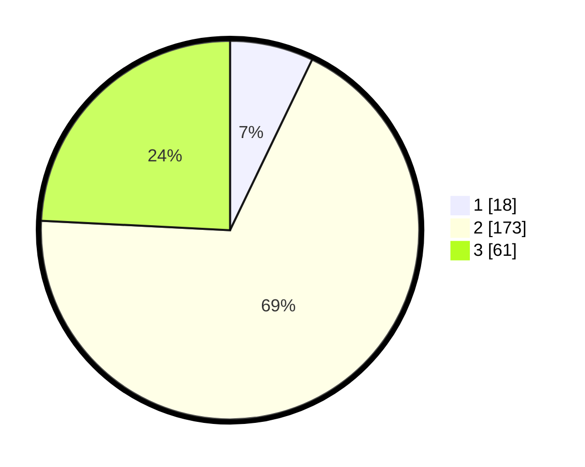

# Hasil

## Grafik

## Tabel

| No. | Nama Paslon    | Suara | Suara (raw) | Persentase |
|:--- |:-------------- | -----:| -----------:| ----------:|
| 1   | ANIES MUHAIMIN | 18    | [18][p-1]   | 7,14       |
| 2   | PRABOWO GIBRAN | 173   | [173][p-2]  | 68,65      |
| 3   | GANJAR MAHFUD  | 61    | [61][p-3]   | 24,21      |

[p-1]: https://github.com/gigit-pemilu/pemilu-2024/blob/main/pilpres/hitung-suara/sub/34-di-yogyakarta/sub/03-gunungkidul/sub/03-playen/sub/2001-banyusoco/sub/003-tps/sub/paslon-1.txt
[p-2]: https://github.com/gigit-pemilu/pemilu-2024/blob/main/pilpres/hitung-suara/sub/34-di-yogyakarta/sub/03-gunungkidul/sub/03-playen/sub/2001-banyusoco/sub/003-tps/sub/paslon-2.txt
[p-3]: https://github.com/gigit-pemilu/pemilu-2024/blob/main/pilpres/hitung-suara/sub/34-di-yogyakarta/sub/03-gunungkidul/sub/03-playen/sub/2001-banyusoco/sub/003-tps/sub/paslon-3.txt

## Foto C Plano

https://sirekap-obj-formc.kpu.go.id/075f/pemilu/ppwp/34/03/03/20/01/3403032001003-20240216-134933--f411bb17-9862-4561-ab7c-2fadd588814b.jpg

https://sirekap-obj-formc.kpu.go.id/075f/pemilu/ppwp/34/03/03/20/01/3403032001003-20240216-134934--f47a9171-153a-420b-8cf6-318f16276c80.jpg

https://sirekap-obj-formc.kpu.go.id/075f/pemilu/ppwp/34/03/03/20/01/3403032001003-20240216-134934--afac2c2b-d24c-408f-882f-89c98ed0b7a6.jpg

## Metadata

| Key        | Value               |
| ---------- | ------------------- |
| Time Stamp | 2024-02-16 16:25:10 |

## DATA PEMILIH TETAP

Jumlah pemilih dalam DPT: **290**.
 * L: **145**.
 * P: **145**.

## DATA PENGGUNA HAK PILIH

Jumlah pengguna hak pilih dalam DPT: **252**.
 * L: **125**.
 * P: **127**.

Jumlah pengguna hak pilih dalam DPTb: **0**.
 * L: **0**.
 * P: **0**.

Jumlah pengguna hak pilih dalam DPK: **3**.
 * L: **1**.
 * P: **2**.

Jumlah pengguna hak pilih: **255**.
 * L: **126**.
 * P: **129**.

## JUMLAH SUARA SAH DAN TIDAK SAH

JUMLAH SELURUH SUARA SAH: **252**.

JUMLAH SUARA TIDAK SAH: **3**.

JUMLAH SELURUH SUARA SAH DAN SUARA TIDAK SAH: **255**.

