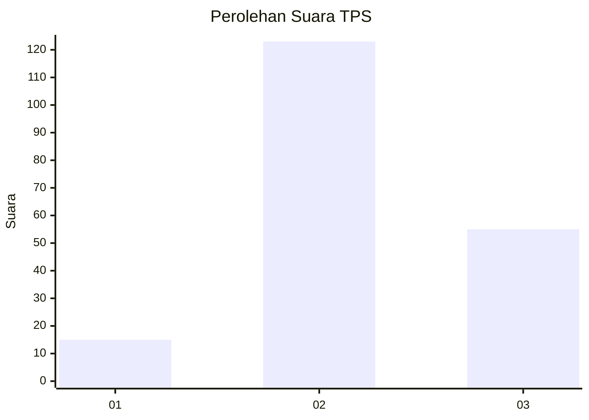
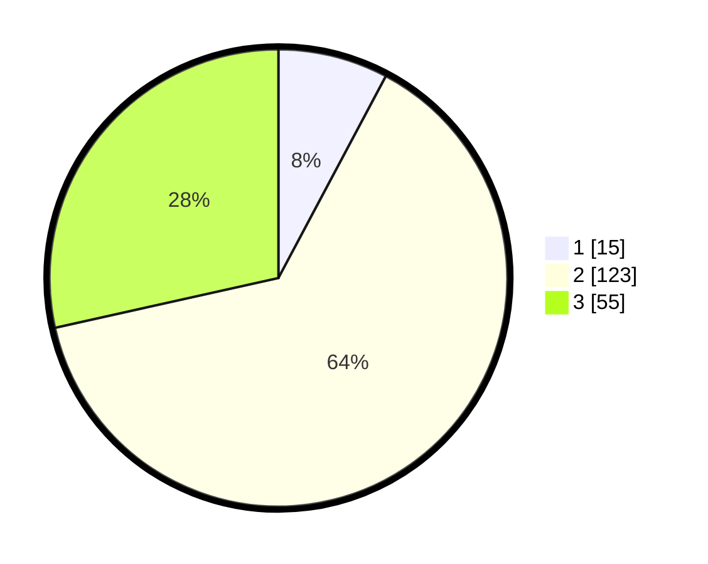

# Hasil

## Grafik

## Tabel

| No. | Nama Paslon    | Suara | Suara (raw) | Persentase |
|:--- |:-------------- | -----:| -----------:| ----------:|
| 1   | ANIES MUHAIMIN | 15    | [15][p-1]   | 7,77       |
| 2   | PRABOWO GIBRAN | 123   | [123][p-2]  | 63,73      |
| 3   | GANJAR MAHFUD  | 55    | [55][p-3]   | 28,50      |

[p-1]: https://github.com/gigit-pemilu/pemilu-2024-34-di-yogyakarta/blob/main/pilpres/hitung-suara/sub/34-di-yogyakarta/sub/03-gunungkidul/sub/03-playen/sub/2001-banyusoco/sub/004-tps/sub/paslon-1.txt
[p-2]: https://github.com/gigit-pemilu/pemilu-2024-34-di-yogyakarta/blob/main/pilpres/hitung-suara/sub/34-di-yogyakarta/sub/03-gunungkidul/sub/03-playen/sub/2001-banyusoco/sub/004-tps/sub/paslon-2.txt
[p-3]: https://github.com/gigit-pemilu/pemilu-2024-34-di-yogyakarta/blob/main/pilpres/hitung-suara/sub/34-di-yogyakarta/sub/03-gunungkidul/sub/03-playen/sub/2001-banyusoco/sub/004-tps/sub/paslon-3.txt

## Foto C Plano

https://sirekap-obj-formc.kpu.go.id/2fb6/pemilu/ppwp/34/03/03/20/01/3403032001004-20240216-092914--6b30f2d1-38de-49b8-89a6-afb9823ee7e7.jpg

https://sirekap-obj-formc.kpu.go.id/2fb6/pemilu/ppwp/34/03/03/20/01/3403032001004-20240216-092919--0bbf600f-b5c6-495d-8ec0-7f4b4d27584f.jpg

https://sirekap-obj-formc.kpu.go.id/2fb6/pemilu/ppwp/34/03/03/20/01/3403032001004-20240216-092917--66968989-8ee9-4b53-998d-98064cc79af9.jpg

## Metadata

| Key        | Value               |
| ---------- | ------------------- |
| Time Stamp | 2024-02-16 11:00:29 |

## DATA PEMILIH TETAP

Jumlah pemilih dalam DPT: **241**.
 * L: **112**.
 * P: **129**.

## DATA PENGGUNA HAK PILIH

Jumlah pengguna hak pilih dalam DPT: **196**.
 * L: **86**.
 * P: **110**.

Jumlah pengguna hak pilih dalam DPTb: **0**.
 * L: **0**.
 * P: **0**.

Jumlah pengguna hak pilih dalam DPK: **2**.
 * L: **0**.
 * P: **2**.

Jumlah pengguna hak pilih: **198**.
 * L: **86**.
 * P: **112**.

## JUMLAH SUARA SAH DAN TIDAK SAH

JUMLAH SELURUH SUARA SAH: **193**.

JUMLAH SUARA TIDAK SAH: **5**.

JUMLAH SELURUH SUARA SAH DAN SUARA TIDAK SAH: **198**.

