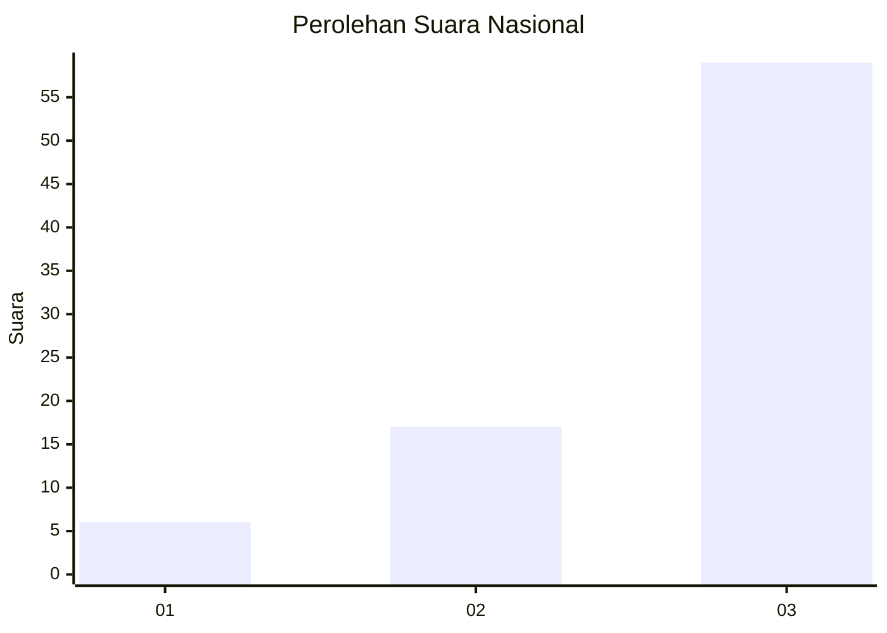
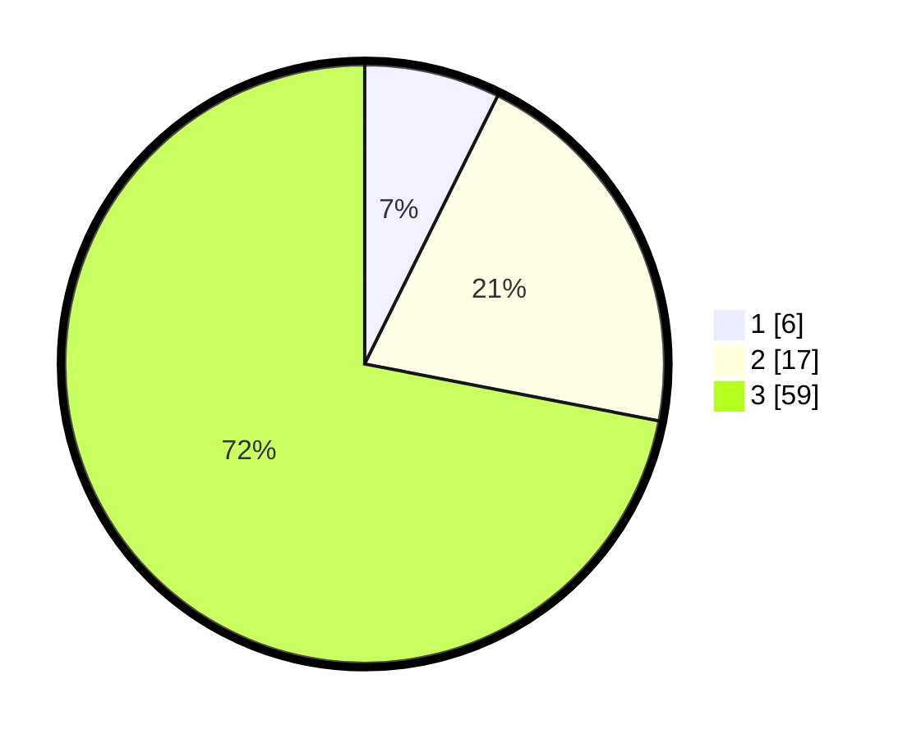

# Hasil

## Grafik

## Tabel

| No. | Nama Paslon    | Suara | Suara (raw) | Persentase |
|:--- |:-------------- | -----:| -----------:| ----------:|
| 1   | ANIES MUHAIMIN | 6     | [6][p-1]    | 7,32       |
| 2   | PRABOWO GIBRAN | 17    | [17][p-2]   | 20,73      |
| 3   | GANJAR MAHFUD  | 59    | [59][p-3]   | 71,95      |

[p-1]: https://github.com/gigit-pemilu/pemilu-2024/blob/main/pilpres/hitung-suara/sub/34-di-yogyakarta/sub/03-gunungkidul/sub/03-playen/sub/2002-plembutan/sub/016-tps/sub/paslon-1.txt
[p-2]: https://github.com/gigit-pemilu/pemilu-2024/blob/main/pilpres/hitung-suara/sub/34-di-yogyakarta/sub/03-gunungkidul/sub/03-playen/sub/2002-plembutan/sub/016-tps/sub/paslon-2.txt
[p-3]: https://github.com/gigit-pemilu/pemilu-2024/blob/main/pilpres/hitung-suara/sub/34-di-yogyakarta/sub/03-gunungkidul/sub/03-playen/sub/2002-plembutan/sub/016-tps/sub/paslon-3.txt

## Foto C Plano

https://sirekap-obj-formc.kpu.go.id/12b9/pemilu/ppwp/34/03/03/20/02/3403032002016-20240215-220533--91dc6538-72a9-46bd-9db9-9d93295f9b71.jpg

https://sirekap-obj-formc.kpu.go.id/12b9/pemilu/ppwp/34/03/03/20/02/3403032002016-20240215-220536--dfb0d3d0-a432-441a-ac7c-e6b03d9be041.jpg

https://sirekap-obj-formc.kpu.go.id/12b9/pemilu/ppwp/34/03/03/20/02/3403032002016-20240215-220534--94b37645-7ec2-4789-b6ad-4265f59f09a4.jpg

## Metadata

| Key        | Value               |
| ---------- | ------------------- |
| Time Stamp | 2024-02-16 16:25:10 |

## DATA PEMILIH TETAP

Jumlah pemilih dalam DPT: **93**.
 * L: **40**.
 * P: **53**.

## DATA PENGGUNA HAK PILIH

Jumlah pengguna hak pilih dalam DPT: **83**.
 * L: **34**.
 * P: **49**.

Jumlah pengguna hak pilih dalam DPTb: **0**.
 * L: **0**.
 * P: **0**.

Jumlah pengguna hak pilih dalam DPK: **0**.
 * L: **0**.
 * P: **0**.

Jumlah pengguna hak pilih: **83**.
 * L: **34**.
 * P: **49**.

## JUMLAH SUARA SAH DAN TIDAK SAH

JUMLAH SELURUH SUARA SAH: **82**.

JUMLAH SUARA TIDAK SAH: **1**.

JUMLAH SELURUH SUARA SAH DAN SUARA TIDAK SAH: **83**.

