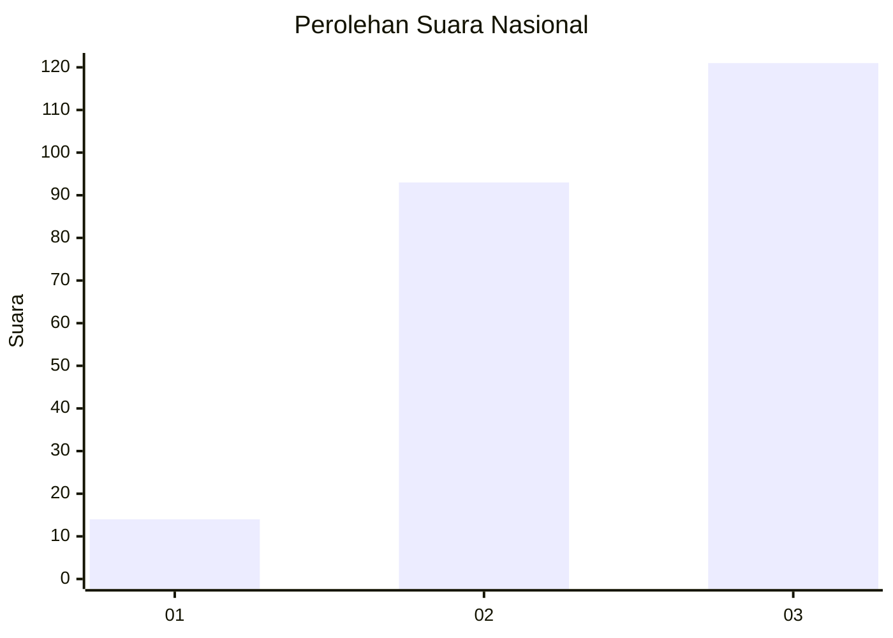
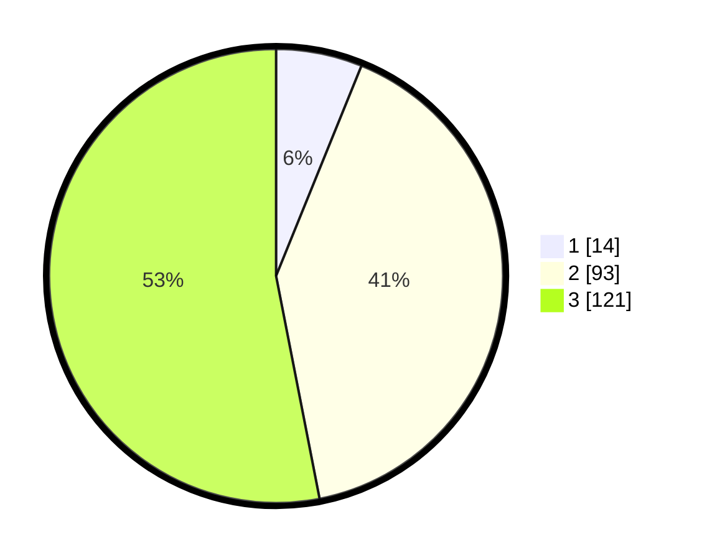

# Hasil

## Grafik

## Tabel

| No. | Nama Paslon    | Suara | Suara (raw) | Persentase |
|:--- |:-------------- | -----:| -----------:| ----------:|
| 1   | ANIES MUHAIMIN | 14    | [14][p-1]   | 6,14       |
| 2   | PRABOWO GIBRAN | 93    | [93][p-2]   | 40,79      |
| 3   | GANJAR MAHFUD  | 121   | [121][p-3]  | 53,07      |

[p-1]: https://github.com/gigit-pemilu/pemilu-2024/blob/main/pilpres/hitung-suara/sub/34-di-yogyakarta/sub/03-gunungkidul/sub/03-playen/sub/2003-bleberan/sub/004-tps/sub/paslon-1.txt
[p-2]: https://github.com/gigit-pemilu/pemilu-2024/blob/main/pilpres/hitung-suara/sub/34-di-yogyakarta/sub/03-gunungkidul/sub/03-playen/sub/2003-bleberan/sub/004-tps/sub/paslon-2.txt
[p-3]: https://github.com/gigit-pemilu/pemilu-2024/blob/main/pilpres/hitung-suara/sub/34-di-yogyakarta/sub/03-gunungkidul/sub/03-playen/sub/2003-bleberan/sub/004-tps/sub/paslon-3.txt

## Foto C Plano

https://sirekap-obj-formc.kpu.go.id/cc92/pemilu/ppwp/34/03/03/20/03/3403032003004-20240216-083152--fbad0356-4d0b-4a57-9db1-118f02326e08.jpg

https://sirekap-obj-formc.kpu.go.id/cc92/pemilu/ppwp/34/03/03/20/03/3403032003004-20240216-083205--866a0d36-6f96-4ba3-b6b6-0e55c3142671.jpg

https://sirekap-obj-formc.kpu.go.id/cc92/pemilu/ppwp/34/03/03/20/03/3403032003004-20240216-083213--3b9d4166-dbda-491d-99b3-d2e704b65364.jpg

## Metadata

| Key        | Value               |
| ---------- | ------------------- |
| Time Stamp | 2024-02-17 19:30:00 |

