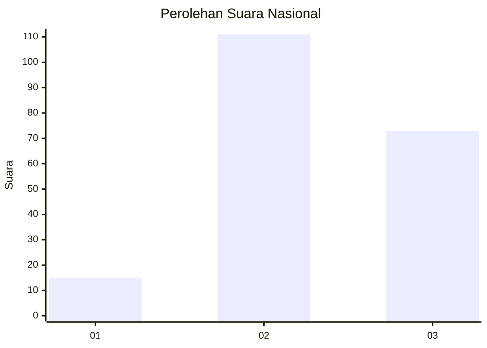
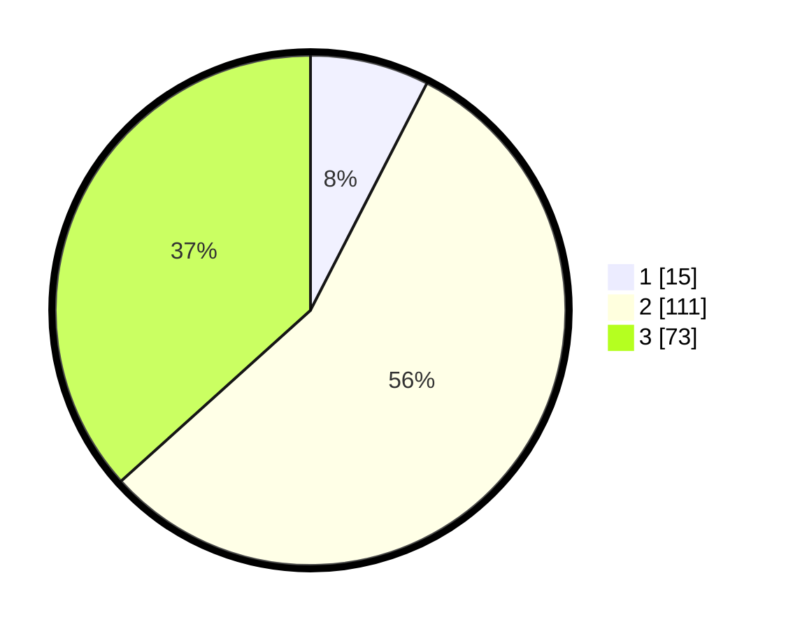

# Hasil

## Grafik

## Tabel

| No. | Nama Paslon    | Suara | Suara (raw) | Persentase |
|:--- |:-------------- | -----:| -----------:| ----------:|
| 1   | ANIES MUHAIMIN | 15    | [15][p-1]   | 7,54       |
| 2   | PRABOWO GIBRAN | 111   | [111][p-2]  | 55,78      |
| 3   | GANJAR MAHFUD  | 73    | [73][p-3]   | 36,68      |

[p-1]: https://github.com/gigit-pemilu/pemilu-2024/blob/main/pilpres/hitung-suara/sub/34-di-yogyakarta/sub/03-gunungkidul/sub/03-playen/sub/2003-bleberan/sub/017-tps/sub/paslon-1.txt
[p-2]: https://github.com/gigit-pemilu/pemilu-2024/blob/main/pilpres/hitung-suara/sub/34-di-yogyakarta/sub/03-gunungkidul/sub/03-playen/sub/2003-bleberan/sub/017-tps/sub/paslon-2.txt
[p-3]: https://github.com/gigit-pemilu/pemilu-2024/blob/main/pilpres/hitung-suara/sub/34-di-yogyakarta/sub/03-gunungkidul/sub/03-playen/sub/2003-bleberan/sub/017-tps/sub/paslon-3.txt

## Foto C Plano

https://sirekap-obj-formc.kpu.go.id/ef4b/pemilu/ppwp/34/03/03/20/03/3403032003017-20240218-114818--d2027a2d-5582-4c08-9a35-f21bfa920cfa.jpg

https://sirekap-obj-formc.kpu.go.id/ef4b/pemilu/ppwp/34/03/03/20/03/3403032003017-20240216-180954--7f1b8152-ebb7-4555-a215-d1a6b5d41190.jpg

https://sirekap-obj-formc.kpu.go.id/ef4b/pemilu/ppwp/34/03/03/20/03/3403032003017-20240216-192301--311c11a5-790b-4300-9e8b-a45213f45acd.jpg

## Metadata

| Key        | Value               |
| ---------- | ------------------- |
| Time Stamp | 2024-02-19 06:16:00 |

