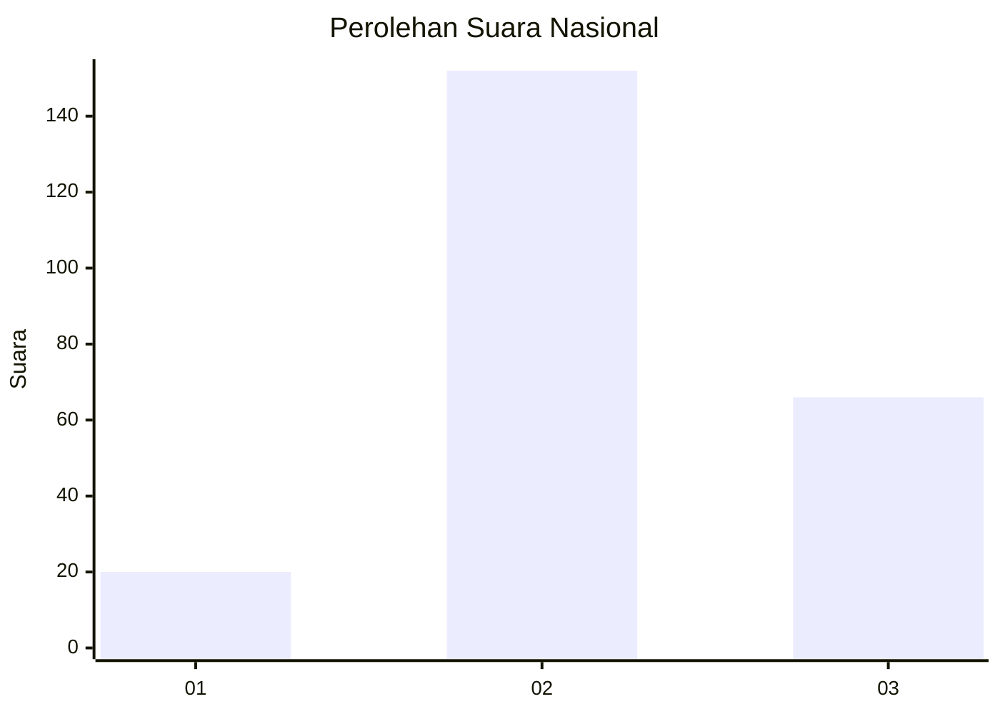
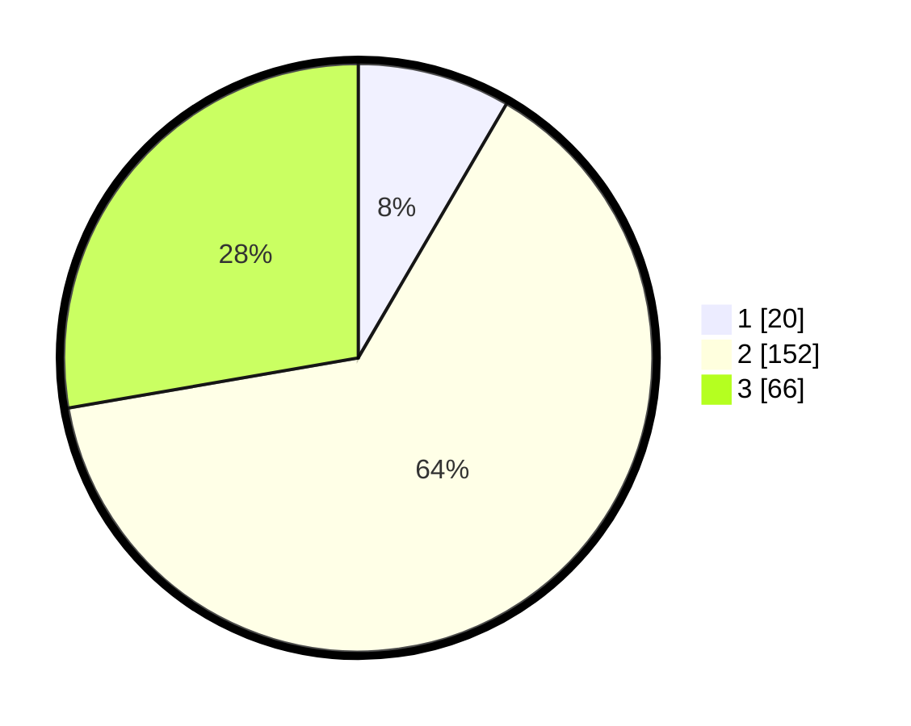

# Hasil

## Grafik

## Tabel

| No. | Nama Paslon    | Suara | Suara (raw) | Persentase |
|:--- |:-------------- | -----:| -----------:| ----------:|
| 1   | ANIES MUHAIMIN | 20    | [20][p-1]   | 8,40       |
| 2   | PRABOWO GIBRAN | 152   | [152][p-2]  | 63,87      |
| 3   | GANJAR MAHFUD  | 66    | [66][p-3]   | 27,73      |

[p-1]: https://github.com/gigit-pemilu/pemilu-2024/blob/main/pilpres/hitung-suara/sub/34-di-yogyakarta/sub/03-gunungkidul/sub/03-playen/sub/2004-getas/sub/004-tps/sub/paslon-1.txt
[p-2]: https://github.com/gigit-pemilu/pemilu-2024/blob/main/pilpres/hitung-suara/sub/34-di-yogyakarta/sub/03-gunungkidul/sub/03-playen/sub/2004-getas/sub/004-tps/sub/paslon-2.txt
[p-3]: https://github.com/gigit-pemilu/pemilu-2024/blob/main/pilpres/hitung-suara/sub/34-di-yogyakarta/sub/03-gunungkidul/sub/03-playen/sub/2004-getas/sub/004-tps/sub/paslon-3.txt

## Foto C Plano

https://sirekap-obj-formc.kpu.go.id/d794/pemilu/ppwp/34/03/03/20/04/3403032004004-20240215-222405--74213908-bacd-4254-a668-d00ecd187939.jpg

https://sirekap-obj-formc.kpu.go.id/d794/pemilu/ppwp/34/03/03/20/04/3403032004004-20240215-044048--fe1fdc4b-ba64-4828-8df5-7e81ed3aaf2d.jpg

https://sirekap-obj-formc.kpu.go.id/d794/pemilu/ppwp/34/03/03/20/04/3403032004004-20240215-044057--8a0b4486-97de-49ea-849f-eac69ea079c7.jpg

## Metadata

| Key        | Value               |
| ---------- | ------------------- |
| Time Stamp | 2024-02-15 22:30:27 |

